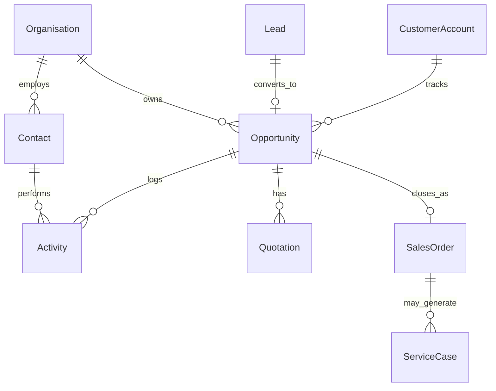
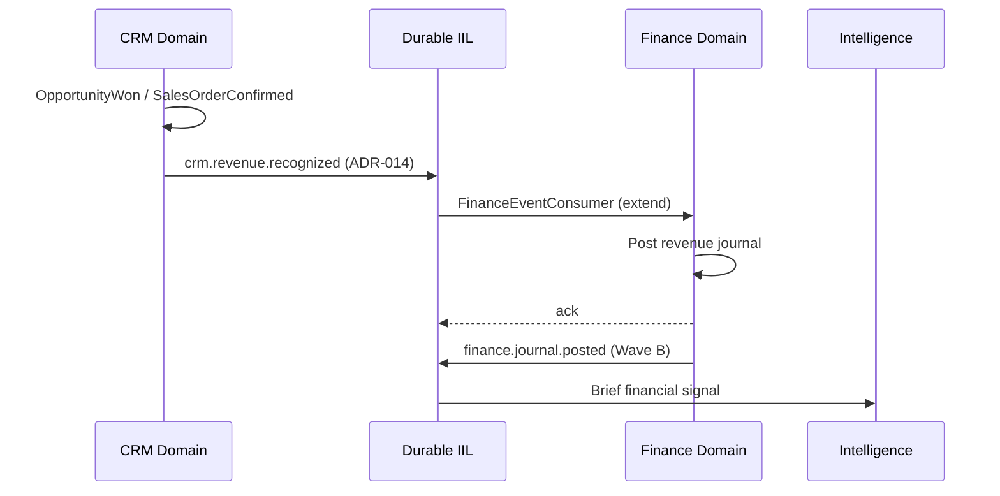
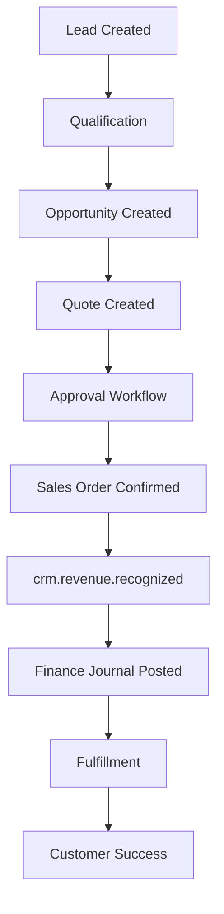

# CRM Reference Domain Architecture

**Document ID:** CRM-REF-ARCH-001  
**Mission:** P-008 Phase II — CRM Domain Convergence & Reference Architecture  
**Program:** P-008 — Customer Relationship & Revenue Platform  
**Version:** 1.0  
**Status:** Ratified — Constitutional CRM Blueprint  
**Classification:** Enterprise Architecture · CRM Domain · Governance  
**Authority:** CRM Domain Lead · Chief Enterprise Architect · Architecture Review Board  
**Effective Date:** 4 August 2026  
**Planning Horizon:** 2026–2029  
**Architecture Baseline:** v2.0 Multi-Domain Baseline ([P-016.6](../00_Governance/P-016.6-Architecture-Baseline.md) @ `25932be`)

**Constitutional References:** [P-014.1 Domain Strategy](../00_Governance/P-014.1-Enterprise-Domain-Strategy.md) · [P-014.2 Capability Matrix](../00_Governance/P-014.2-Enterprise-Capability-Matrix.md) · [P-014.3 Integration Architecture](../00_Governance/P-014.3-Enterprise-Integration-Architecture.md) · [P-014.4 Reference Architecture](../00_Governance/P-014.4-Enterprise-Reference-Architecture.md) · [ES-HCM-001](../HCM/Engineering/ES-HCM-001_Enterprise_HCM_Engineering_Specification.md) *(replication template)* · [Finance Gate 5 Certification](../Finance/Certification/Finance-Gate5-Certification-Report.md)

**ADR Compliance:** [ADR-013](../11_Governance/ADR/ADR-013-Durable-Intelligent-Integration-Layer.md) · [ADR-014](../11_Governance/ADR/ADR-014-Cross-Domain-Event-Contracts.md) · [ADR-015](../11_Governance/ADR/ADR-015-Domain-Service-Boundaries.md) · [ADR-020](../11_Governance/ADR/ADR-020-Versioning-and-Domain-Compatibility.md)

**Scope:** Architecture only — no production code · no implementation authorization  
**Audience:** CRM engineering · platform engineering · certification · ARB

> **Constitutional statement:** This document is the **blueprint for every future CRM engineering mission**. CRM Phase II converges the certified P-008.1–P-008.8 workspace into ORION's **second Reference Domain**, matching HCM architectural discipline exactly.

---

## 15. Executive Summary

CRM Phase II defines the architecture to transform ORION CRM from a **certified multi-facade workspace** (P-008.8 CONDITIONAL GO) into a **full Reference Domain** aligned with the Enterprise Architecture Constitution (P-014.1–P-014.4).

| Assessment | Verdict |
|------------|---------|
| **P-008 Phase II architecture mission** | **GO** |
| **Constitutional alignment (P-014 · ADR-013–015 · ADR-020)** | **GO** |
| **CRM as second Reference Domain (architecture)** | **GO** |
| **CRM Gate 5 implementation authorization** | **CONDITIONAL GO** — facade convergence · PlatformStore · RBAC · canonical events |
| **Production CRM authorization** | **NO-GO** — Phase III/IV not complete |

**Current gap summary:** Multiple facades · in-memory repository · `CustomEvent` payloads · no REST RBAC · no ADR-014 canonical Finance publishers · no PlatformStore persistence.

**Target:** Single `crmFacade` · PlatformStore PostgreSQL · fail-closed RBAC · ADR-014 event catalogue · certified CRM → Finance revenue chain · Gate 6 integration certification.

---

## 1. CRM Vision

### 1.1 Mission

CRM is ORION's **authoritative commercial relationship domain** — the single source of truth for accounts, opportunities, pipeline, and revenue events consumed by Finance, Intelligence, and downstream operational domains.

### 1.2 Objectives

| # | Objective | Success Measure |
|---|-----------|-----------------|
| **O1** | **Reference domain convergence** | HCM replication checklist 100% at Gate 4 |
| **O2** | **Authoritative persistence** | PlatformStore PostgreSQL · restart survival |
| **O3** | **Finance integration** | `crm.revenue.recognized` certified chain |
| **O4** | **Fail-closed security** | Permission catalog · all REST routes protected |
| **O5** | **Canonical events** | ADR-014 registry · no `CustomEvent` for cross-domain |
| **O6** | **Executive intelligence** | Authoritative Brief signals from certified events |
| **O7** | **Gate 6 certification** | Multi-domain GO alongside Finance + HCM |

### 1.3 Business Capabilities

| Capability | Owner | v1.0 State | Phase II Target |
|------------|-------|------------|-----------------|
| Universal party & organization | CRM | ✅ P-008.1 | Reference aggregate |
| Lead & opportunity management | CRM | ✅ P-008.2 | Reference aggregate |
| Agreements · quotes · contracts | CRM | ✅ P-008.3 | Reference aggregate |
| Activities & tasks | CRM | ◐ P-008.4 planned | Bounded context |
| Commercial intelligence | CRM (read) | ✅ P-008.5 | Projection from events |
| Customer analytics | CRM (read) | ✅ P-008.6 | Projection from events |
| Executive dashboard | CRM + Intelligence | ✅ P-008.7 | Authoritative signals |
| Revenue recognition events | CRM → Finance | ❌ Not implemented | Canonical publish |

### 1.4 Enterprise Positioning

| Dimension | P-008 Phase I (v1.0) | P-008 Phase II (Architecture) | P-008 Phase III–IV (Target) |
|-----------|----------------------|----------------------------|----------------------------|
| **Architecture class** | Certified workspace | Reference domain blueprint | Reference domain implemented |
| **Persistence** | In-memory placeholder | PlatformStore specified | PostgreSQL certified |
| **Integration** | Brief provider · CustomEvent | ADR-014 catalogue defined | Finance chain certified |
| **Facade** | 7 sub-facades | Convergence plan | Single `crmFacade` |
| **Commercial bundle** | Workspace only | Architecture for HCM+Finance+CRM | Gate 6 GO |

**Positioning:** CRM completes the **HCM + Finance + CRM design partner bundle** — CRM owns commercial truth; Finance owns monetary truth; HCM owns workforce truth.

---

## 2. CRM Domain Model

### 2.1 Aggregate Catalog

| Aggregate | Root Entity | Bounded Context | Authoritative |
|-----------|-------------|-----------------|-------------|
| **Account** | `CustomerAccount` | Customer Management | ✅ CRM |
| **Contact** | `Contact` / `Person` | Customer Management | ✅ CRM |
| **Organization** | `Organisation` | Customer Management | ✅ CRM |
| **Lead** | `Lead` | Sales · Pipeline | ✅ CRM |
| **Opportunity** | `Opportunity` | Sales · Pipeline | ✅ CRM |
| **Quote** | `Quotation` | Sales · Pricing | ✅ CRM |
| **Activity** | `Activity` | Activities | ✅ CRM |
| **Task** | `Task` | Activities | ✅ CRM |
| **Interaction** | `Interaction` | Activities | ✅ CRM |
| **Sales Order** | `SalesOrder` | Sales | ✅ CRM |
| **Case** | `ServiceCase` | Customer Service | ✅ CRM |
| **Agreement** | `Contract` · `Proposal` | Sales · Pricing | ✅ CRM |
| **Attachment** | `Attachment` | Shared (via Document Svc) | ◐ CRM metadata · Platform storage |
| **Note** | `Note` | Shared | ✅ CRM |

### 2.2 Entity Relationship Overview



### 2.3 v1.0 → Reference Model Gap

| Area | Current (`lib/crm/`) | Target Reference |
|------|-------------------|------------------|
| Customer | `CrmCustomersService` · seed data | `CustomerAccount` aggregate · repository |
| Party | `CrmPartyFacade` | Merged into unified facade |
| Commercial | `CrmCommercialFacade` · dual datasets | Single opportunity aggregate |
| Agreements | `CrmAgreementsFacade` | Quote/contract aggregates |
| Intelligence | 10 rule-based services | Read-only projections + AI platform |

---

## 3. Bounded Contexts

| Context | Aggregates | Public Facade Surface | Integration Role |
|---------|------------|----------------------|------------------|
| **Sales** | Lead · Opportunity · Quote · SalesOrder | `crmFacade.sales.*` | Publish revenue events → Finance |
| **Customer Management** | Account · Contact · Organisation | `crmFacade.customers.*` | Master commercial party data |
| **Activities** | Activity · Task · Interaction | `crmFacade.activities.*` | Workflow triggers · audit |
| **Customer Service** | Case · Note | `crmFacade.service.*` | Service SLA · escalation |
| **Pipeline** | Pipeline stage · forecast snapshots | `crmFacade.pipeline.*` | Read models · reporting |
| **Forecasting** | Forecast · benchmark | `crmFacade.forecasting.*` | Read-only · AI input |
| **Pricing** | Quotation · rate agreements | `crmFacade.pricing.*` | Agreement → SalesOrder chain |

**Convergence rule:** Phase III collapses seven sub-facades (`CrmPartyFacade`, `CrmCommercialFacade`, etc.) into **`crmFacade`** with context-namespaced methods — matching `hcmFacade` pattern.

---

## 4. Authoritative Data Ownership

### 4.1 Owned Aggregates (CRM Authoritative)

| Aggregate | CRM Owns | Never Owned By |
|-----------|----------|----------------|
| Lead · Opportunity · Quote · SalesOrder | ✅ | Finance · Marketing |
| Account · Contact · Organisation | ✅ | HCM (employee ≠ customer) |
| Activity · Task · Case | ✅ | Workflow engine (owns state machine only) |
| Revenue recognition **events** | ✅ (publish) | Finance (owns journal) |
| GL · journal entries | — | ✅ Finance only |

### 4.2 Published Events (Outbound)

| Event | Trigger | Consumer |
|-------|---------|----------|
| `crm.lead.created` | Lead capture | Intelligence · Marketing |
| `crm.lead.qualified` | Qualification complete | Intelligence · Sales workflow |
| `crm.opportunity.created` | Opportunity opened | Intelligence |
| `crm.opportunity.closed` | Won/lost | Finance · Intelligence |
| `crm.quote.created` | Quote issued | Intelligence |
| `crm.customer.created` | Account created | Intelligence · Search |
| `crm.customer.updated` | Account changed | Intelligence |
| `crm.salesorder.confirmed` | Order confirmed | Finance · Inventory *(future)* |
| `crm.revenue.recognized` | Revenue event | **Finance** (priority) |
| `crm.case.opened` · `crm.case.closed` | Case lifecycle | Intelligence · Service |

### 4.3 Consumed Events (Inbound)

| Event | Publisher | CRM Use |
|-------|-----------|---------|
| `finance.period.closed` | Finance | Lock revenue reporting period |
| `hcm.workforce.cost.recorded` | HCM | Optional — project/opportunity cost correlation |
| `marketing.campaign.responded` | Marketing *(future)* | Lead attribution |

### 4.4 Read Models (Non-Authoritative)

| Read Model | Source | Owner |
|------------|--------|-------|
| Pipeline dashboard | CRM aggregates + projections | CRM query service |
| Revenue forecast | Opportunity projections + AI | CRM forecasting (read) |
| Customer health score | Activity + opportunity signals | CRM intelligence (read) |
| Executive Brief CRM tiles | IIL event projections | Intelligence platform |
| Trial balance / ledger | Finance events | Finance (CRM reads via query API only) |

---

## 5. Reference Architecture

CRM MUST replicate the [HCM reference pattern](../00_Governance/P-014.4-Enterprise-Reference-Architecture.md#3-reference-domain-pattern) and [Finance integration hub pattern](../Finance/Certification/Finance-Gate5-Certification-Report.md).

### 5.1 Target Layer Stack

```mermaid
flowchart TB
  subgraph presentation [Presentation]
    CRMUI[CRM Workspace UI]
  end

  subgraph api [API Layer]
    ROUTES[/api/crm/*]
    CTX[getCrmApiContext]
    RBAC[crm-permission-catalog]
  end

  subgraph domain [Domain Layer]
    FAC[crmFacade]
    SVC[Application Services]
    REPO[Repositories]
    PUB[CrmCanonicalEventPublisher]
  end

  subgraph platform [Platform Layer]
    IIL[Durable IIL]
    WF[Workflow Engine]
    AUD[Audit]
    AI[AI Platform]
  end

  subgraph persistence [Persistence]
    PS[PlatformStore]
    PER[CrmEntityPersister]
  end

  CRMUI --> ROUTES
  ROUTES --> CTX --> RBAC --> FAC
  FAC --> SVC --> REPO --> PS
  SVC --> PUB --> IIL
  SVC --> WF
  SVC --> AUD
  AI -.->|read only| SVC
```

### 5.2 Reference Component Map

| Layer | HCM Reference | CRM Target | Current Gap |
|-------|---------------|------------|-------------|
| **Facade** | `hcmFacade` | `crmFacade` | 7 sub-facades |
| **API context** | `getHcmApiContext` | `getCrmApiContext` | Not implemented |
| **RBAC** | `hcm-permission-catalog` | `crm-permission-catalog` | Metadata only |
| **Repository** | `HcmRepository` → PlatformStore | `CrmRepository` → PlatformStore | `InMemoryCrmRepository` |
| **Persister** | `HcmEntityPersister` | `CrmEntityPersister` | Not implemented |
| **Events** | `HcmCanonicalFinancePublisher` | `CrmCanonicalFinancePublisher` | `CustomEvent` only |
| **Consumer ACL** | N/A (publisher) | `CrmInboundProcessor` *(future)* | Not needed initially |
| **Workflow** | 13 HCM triggers | CRM approval triggers | Partial |
| **Certification** | RC1 · GA-001 | Gate 6 target | P-008.8 workspace cert only |

### 5.3 Target Package Structure

```
lib/crm/
├── index.ts                      ← crmFacade ONLY public export
├── CrmFacade.ts                  ← unified orchestration
├── api/
│   ├── crm-api-context.ts        ← fail-closed context
│   └── crm-permission-catalog.ts ← route permissions
├── services/                     ← application services by context
├── repositories/                 ← PlatformStore-backed
├── models/                       ← domain entities
├── events/
│   ├── crm-event-catalog.ts      ← ADR-014 catalogue
│   └── CrmCanonicalEventPublisher.ts
├── persistence/
│   └── CrmEntityPersister.ts
├── integration/                  ← inbound processors (future)
└── mappers/                      ← view models (presentation)
```

### 5.4 Call Chain (Mandatory)

```
HTTP → getCrmApiContext → RBAC check → crmFacade → Service → Repository → PlatformStore
                                                              ↓
                                                    CrmCanonicalEventPublisher → IIL
```

---

## 6. Enterprise Integration

Per [P-014.3](../00_Governance/P-014.3-Enterprise-Integration-Architecture.md) · Finance hub law.

### 6.1 CRM Integration Matrix

| Domain | Direction | Pattern | Priority Event | Phase |
|--------|-----------|---------|----------------|-------|
| **Finance** | CRM → Finance | IIL async | `crm.revenue.recognized` · `crm.opportunity.closed` | **P0 — Gate 6** |
| **Finance** | CRM → Finance | Query (read) | Ledger balance lookup via Finance facade | P1 |
| **HCM** | HCM → CRM | None authoritative | Optional contact sync (future) | P2 |
| **Hospitality** | Hospitality → CRM | IIL | Guest → Account link events | P2 |
| **Projects** | CRM → Projects | IIL | Opportunity → project link | P2 |
| **Inventory** | CRM → Inventory | IIL | `crm.salesorder.confirmed` | P2 |
| **Procurement** | None direct | — | — | — |
| **Marketing** | Marketing → CRM | IIL | Campaign → lead attribution | P2 |
| **Intelligence** | CRM → Intelligence | IIL subscribe | All `crm.*` catalogue events | P0 |
| **Executive Dashboard** | CRM → Intelligence | Projection | Brief provider (authoritative) | P0 |

### 6.2 Finance Integration (Priority)



**Rule:** CRM MUST NOT write Finance journals directly. Revenue flows through canonical events only.

---

## 7. Canonical Events

All cross-domain CRM events MUST comply with [ADR-014](../11_Governance/ADR/ADR-014-Cross-Domain-Event-Contracts.md) · `eventVersion: 1` per [ADR-020](../11_Governance/ADR/ADR-020-Versioning-and-Domain-Compatibility.md).

### 7.1 Envelope (Required)

| Field | CRM Value Example |
|-------|-------------------|
| `eventType` | `crm.opportunity.closed` |
| `eventVersion` | `1` |
| `idempotencyKey` | `{orgId}:crm:opportunity:{opportunityId}:closed:{outcome}` |
| `orgId` | Tenant scope |
| `entityType` | `opportunity` |
| `entityId` | Opportunity UUID |
| `payload` | Versioned schema body |
| `metadata.classification` | `commercial` · PII flags on contact events |

### 7.2 CRM Event Catalog (Phase II Registered)

| Event Type | Version | Publisher Trigger | Primary Consumer | Status |
|------------|---------|-------------------|------------------|--------|
| `crm.lead.created` | 1 | Lead capture | Intelligence | Planned |
| `crm.lead.qualified` | 1 | Qualification | Intelligence · Workflow | Planned |
| `crm.opportunity.created` | 1 | Opportunity open | Intelligence | Planned |
| `crm.opportunity.closed` | 1 | Won/lost | **Finance** · Intelligence | **P0** |
| `crm.quote.created` | 1 | Quote issued | Intelligence | Planned |
| `crm.customer.created` | 1 | Account create | Intelligence · Search | Planned |
| `crm.customer.updated` | 1 | Account update | Intelligence | Planned |
| `crm.case.opened` | 1 | Case create | Intelligence · Service | Planned |
| `crm.case.closed` | 1 | Case resolve | Intelligence | Planned |
| `crm.salesorder.confirmed` | 1 | Order confirm | **Finance** · Inventory | P1 |
| `crm.revenue.recognized` | 1 | Revenue recognition | **Finance** | **P0** |

### 7.3 Legacy Event Migration

| Legacy (`CustomEvent`) | Target Canonical | Migration |
|------------------------|------------------|-----------|
| `commercialEvent: OpportunityWon` | `crm.opportunity.closed` + `crm.revenue.recognized` | Phase III |
| `partyEvent: OrganisationCreated` | `crm.customer.created` | Phase III |
| `executiveDashboardEvent: *` | Intelligence projections | Phase III |
| `customerIntelligenceEvent: *` | Internal only — not cross-domain | No migration |

---

## 8. Enterprise Workflows

### 8.1 Lead-to-Cash Workflow



| Stage | Domain | Workflow Binding | Event Published |
|-------|--------|------------------|-----------------|
| Lead capture | CRM | — | `crm.lead.created` |
| Qualification | CRM | `crm.lead.qualify` | `crm.lead.qualified` |
| Opportunity | CRM | Stage transitions | `crm.opportunity.created` |
| Quote | CRM | — | `crm.quote.created` |
| Approval | Platform WF | `crm.quote.approve` | — |
| Sales order | CRM | — | `crm.salesorder.confirmed` |
| Revenue | CRM → Finance | — | `crm.revenue.recognized` |
| Fulfillment | Inventory *(future)* | — | `inventory.fulfillment.*` |
| Customer success | CRM Service | Case workflows | `crm.case.*` |

### 8.2 CRM Workflow Matrix

| Workflow | Trigger Entity | Platform Engine | RBAC Permission |
|----------|---------------|-----------------|-----------------|
| Lead qualification | Lead | `crm.lead.qualify` | `crm.lead.qualify` |
| Opportunity stage change | Opportunity | `crm.opportunity.stage` | `crm.opportunity.update` |
| Quote approval | Quotation | `crm.quote.approve` | `crm.quote.approve` |
| Discount approval | Quotation | `crm.quote.discount` | `crm.pricing.approve` |
| Case escalation | ServiceCase | `crm.case.escalate` | `crm.case.escalate` |
| Sales order confirmation | SalesOrder | `crm.order.confirm` | `crm.order.confirm` |

---

## 9. Security

### 9.1 Security Model

CRM adopts the [P-014.4 fail-closed security model](../00_Governance/P-014.4-Enterprise-Reference-Architecture.md#8-security-model) — identical discipline to HCM and Finance.

| Control | Implementation Target |
|---------|----------------------|
| **Authentication** | `getCrmApiContext(request)` — no default context |
| **Authorization** | `crm-permission-catalog.ts` — route-derived permissions |
| **Tenant isolation** | `orgId` on all repository queries |
| **Audit** | Platform audit on create/update/delete · opportunity won |
| **Event security** | ServiceRegistry authorization on IIL publish |
| **PII** | Contact events carry classification metadata |

### 9.2 CRM Roles (Target)

| Role | Scope | Description |
|------|-------|-------------|
| `crm.admin` | Org-wide | Full CRM administration |
| `crm.sales.manager` | Team | Pipeline · forecast · approve quotes |
| `crm.sales.rep` | Own + team read | Leads · opportunities · activities |
| `crm.service.manager` | Service team | Cases · escalation |
| `crm.service.agent` | Assigned cases | Case read/update |
| `crm.readonly` | Org-wide read | Executive · analytics consumers |
| `crm.integration` | System | Event publish service account |

### 9.3 CRM Permission Matrix (Summary)

See **Appendix E** for full matrix. Minimum Gate 5 permissions:

- `crm.lead.read` · `crm.lead.create` · `crm.lead.qualify`
- `crm.opportunity.read` · `crm.opportunity.create` · `crm.opportunity.update` · `crm.opportunity.close`
- `crm.customer.read` · `crm.customer.create` · `crm.customer.update`
- `crm.quote.read` · `crm.quote.create` · `crm.quote.approve`
- `crm.order.confirm`
- `crm.case.read` · `crm.case.create` · `crm.case.update`
- `crm.admin.*`

---

## 10. AI Strategy

Per [P-014.4 §6 AI Platform Pattern](../00_Governance/P-014.4-Enterprise-Reference-Architecture.md#6-ai-platform-pattern) — **read-only by default**.

### 10.1 AI Use Cases

| Use Case | Input | Output | Mutates? |
|----------|-------|--------|----------|
| **Lead scoring** | Lead + activity projections | Score · rank | No |
| **Forecasting** | Pipeline projections | Revenue forecast | No |
| **Customer insights** | Account + activity history | Health narrative | No |
| **Conversation summaries** | Interaction text | Summary | No |
| **Recommendations** | Pipeline + win/loss patterns | Next-best-action | No |
| **Discount suggestion** | Quote context | Suggested discount | No — workflow approval to apply |

### 10.2 CRM AI Matrix

| Capability | Platform Service | CRM Responsibility |
|------------|------------------|-------------------|
| Inference | AI Platform gateway | Provide read-only context |
| Prompts | Prompt Library *(v2.1)* | CRM prompt templates |
| Explainability | Platform | Source citation from CRM aggregates |
| Action | Workflow only | Agent proposes · human approves quote/discount |
| Training data | Governance ADR | No customer PII in training without ADR |

**Prohibition:** CRM intelligence services (`CrmIntelligenceEngine` rule-based) remain **read projections** — LLM inference routes through AI Platform only.

---

## 11. Reporting

| Report | Type | Data Source | Cross-Domain |
|--------|------|-------------|--------------|
| **Pipeline** | Operational | CRM aggregates | Same-domain only |
| **Revenue** | Operational + Finance | CRM + Finance projection | Event-sourced |
| **Conversion** | Analytics | Lead → opportunity funnel | CRM projection |
| **Sales performance** | Operational | CRM activities + opportunities | Same-domain |
| **Customer health** | Intelligence | CRM projection + AI | Read-only |
| **Executive Dashboard** | Executive | Intelligence Brief | IIL event projections |

**Rule:** Cross-domain revenue reports MUST use Finance authoritative ledger projections — not CRM opportunity amounts alone.

---

## 12. Capability Consumption

CRM MUST consume all mandatory platform capabilities per [P-014.2](./P-014.2-Enterprise-Capability-Matrix.md).

### 12.1 CRM Capability Consumption Matrix

| P-014.2 Capability | CRM Requirement | Phase II Status | Phase III Target |
|--------------------|-----------------|-----------------|------------------|
| **Platform Core** | ServiceContext · Result | ✅ Used | ✅ |
| **PlatformStore** | Authoritative persistence | ❌ In-memory | ✅ PostgreSQL |
| **Persistence** | CrmEntityPersister | ❌ | ✅ |
| **Transaction Manager** | Multi-aggregate writes | ❌ | ✅ |
| **Event Bus (IIL)** | Canonical publish | ◐ CustomEvent | ✅ ADR-014 |
| **Workflow Engine** | Approval bindings | ◐ Partial | ✅ |
| **Identity** | orgId · user context | ◐ Partial | ✅ |
| **Authentication** | getCrmApiContext | ❌ | ✅ |
| **Authorization (RBAC)** | Permission catalog | ❌ Metadata only | ✅ |
| **Audit** | Platform audit subscribe | ◐ | ✅ |
| **Notifications** | Workflow notifications | ◐ | ✅ |
| **Search** | Account/opportunity index | ◐ Seed | ✅ v2.1 |
| **Observability** | Health · metrics | ◐ | ✅ |
| **Executive Dashboard** | Brief provider | ✅ P-008.7 | ✅ Authoritative |
| **AI Platform** | Read-only inference | ◐ Rule-based | ✅ Gateway v2.1 |
| **Testing Framework** | Domain test suite | ✅ P-008.8 | ✅ Extended |
| **Certification Framework** | Gate 6 cert | ◐ Workspace cert | ✅ Gate 6 |

---

## 13. Roadmap

### 13.1 Phase II — Architecture *(this mission)*

| Deliverable | Status |
|-------------|--------|
| CRM Reference Domain Architecture (this document) | ✅ |
| Event catalogue specification | ✅ |
| Facade convergence plan | ✅ |
| Integration matrix · permission matrix | ✅ |
| Gate 4 engineering specification outline | ✅ |

**Authorization:** Architecture only — **no implementation**.

### 13.2 Phase III — Implementation

| Mission | Deliverable | Dependency |
|---------|-------------|------------|
| **P-008.9** | Unified `crmFacade` · retire sub-facades | Phase II |
| **P-008.10** | PlatformStore + CrmEntityPersister | ADR-007 |
| **P-008.11** | `crm-permission-catalog` + REST RBAC | ADR-009 |
| **P-008.12** | `CrmCanonicalEventPublisher` · ADR-014 registry | ADR-014 · Finance consumer |
| **P-008.13** | CRM REST API routes (`/api/crm/*`) | P-008.11 |
| **P-008.14** | Workflow trigger bindings | P-010.2 |
| **P-008.15** | Finance revenue chain integration test | Finance Gate 5 · P-009.12 |

### 13.3 Phase IV — Certification

| Mission | Deliverable | Gate |
|---------|-------------|------|
| **P-008.16** | Domain test suite · doc certification | Gate 5 |
| **P-008.17** | CRM → Finance chain certification | Gate 6 |
| **P-008.18** | GA-001 CRM operational scenarios | Gate 6 |
| **P-008.19** | Gate 6 CRM certification report | Gate 6 |
| **P-008.20** | Reference domain sign-off | Gate 7 |

### 13.4 Timeline

| Phase | Target | Verdict Gate |
|-------|--------|--------------|
| Phase II Architecture | Aug 2026 | **GO** (this document) |
| Phase III Implementation | 2026 Q4 – 2027 Q1 | Gate 5 |
| Phase IV Certification | 2027 Q1 | Gate 6 GO |

---

## 14. Engineering Rules

Constitutional laws from [P-014.4 §1.1](../00_Governance/P-014.4-Enterprise-Reference-Architecture.md#11-engineering-laws-constitutional) — **mandatory for CRM**.

| Rule | CRM Application |
|------|-----------------|
| **No cross-domain repositories** | CRM MUST NOT import `@/lib/finance/repositories/*` or any foreign repository |
| **PlatformStore only** | No `InMemoryCrmRepository` in production path after Phase III |
| **Repository discipline** | Repositories access PlatformStore collections only — no direct PG driver |
| **Facade only** | External imports from `@/lib/crm` index · no sub-facade exports after convergence |
| **IIL only** | CRM → Finance via `CrmCanonicalEventPublisher` — not Finance service calls for writes |
| **Canonical contracts only** | No `CustomEvent` with `commercialEvent` payload for cross-domain after Phase III |
| **Fail-closed RBAC** | Every `/api/crm/*` route requires permission |
| **AI read-only** | Intelligence engine does not mutate aggregates |
| **Certification first** | No production authorization without Gate 6 report |

### 14.1 Architecture Review Checklist (Every CRM PR)

- [ ] Imports only `@/lib/crm` from outside domain
- [ ] No Finance/HCM repository imports
- [ ] New events registered in CRM event catalogue
- [ ] Permission added to catalog if new route
- [ ] Tests include doc certification if new ES reference
- [ ] Cross-domain effect via IIL publish only

---

## Appendix A — CRM Capability Matrix

| CRM Capability | Bounded Context | Platform Dependency | Maturity Target |
|----------------|-----------------|---------------------|-----------------|
| Party management | Customer Management | PlatformStore · RBAC | Gate 5 |
| Lead management | Sales | PlatformStore · Workflow · IIL | Gate 5 |
| Opportunity pipeline | Sales · Pipeline | PlatformStore · IIL · Finance | Gate 6 |
| Quote & pricing | Sales · Pricing | PlatformStore · Workflow | Gate 5 |
| Agreement management | Sales | PlatformStore · Documents *(future)* | Gate 5 |
| Activity tracking | Activities | PlatformStore · Audit | Gate 5 |
| Case management | Customer Service | PlatformStore · Workflow | Gate 6 |
| Sales order | Sales | PlatformStore · IIL · Finance | Gate 6 |
| Commercial intelligence | Forecasting | Analytics · AI Platform | Gate 6 |
| Executive dashboard | Cross-cutting | Intelligence · IIL | Gate 6 |

---

## Appendix B — CRM Event Catalog (Full)

| # | Event Type | Ver | Entity | Idempotency Key Pattern |
|---|------------|-----|--------|-------------------------|
| 1 | `crm.lead.created` | 1 | lead | `{orgId}:crm:lead:{leadId}:created` |
| 2 | `crm.lead.qualified` | 1 | lead | `{orgId}:crm:lead:{leadId}:qualified` |
| 3 | `crm.opportunity.created` | 1 | opportunity | `{orgId}:crm:opportunity:{id}:created` |
| 4 | `crm.opportunity.closed` | 1 | opportunity | `{orgId}:crm:opportunity:{id}:closed:{outcome}` |
| 5 | `crm.quote.created` | 1 | quotation | `{orgId}:crm:quote:{id}:created` |
| 6 | `crm.customer.created` | 1 | account | `{orgId}:crm:customer:{id}:created` |
| 7 | `crm.customer.updated` | 1 | account | `{orgId}:crm:customer:{id}:updated:{version}` |
| 8 | `crm.case.opened` | 1 | case | `{orgId}:crm:case:{id}:opened` |
| 9 | `crm.case.closed` | 1 | case | `{orgId}:crm:case:{id}:closed` |
| 10 | `crm.salesorder.confirmed` | 1 | salesorder | `{orgId}:crm:order:{id}:confirmed` |
| 11 | `crm.revenue.recognized` | 1 | opportunity | `{orgId}:crm:revenue:{opportunityId}:{period}` |
| 12 | `crm.activity.recorded` | 1 | activity | `{orgId}:crm:activity:{id}:recorded` |

---

## Appendix C — CRM Integration Matrix (Full)

| Partner Domain | Direction | Mechanism | Events / API | Priority |
|----------------|-----------|-----------|--------------|----------|
| Finance | Outbound | IIL | `crm.revenue.recognized` · `crm.opportunity.closed` | P0 |
| Finance | Inbound | IIL | `finance.period.closed` · `finance.journal.posted` | P1 |
| HCM | — | — | No authoritative cross-read | — |
| Hospitality | Inbound | IIL | Guest-account link *(future)* | P2 |
| Inventory | Outbound | IIL | `crm.salesorder.confirmed` | P2 |
| Marketing | Inbound | IIL | Campaign attribution *(future)* | P2 |
| Projects | Bidirectional | IIL | Opportunity-project link *(future)* | P2 |
| Intelligence | Outbound | IIL | Full `crm.*` catalogue | P0 |
| Platform Workflow | Internal | Platform | Trigger bindings | P0 |
| Document Service | Outbound | Platform | Attachment metadata *(P-010.4)* | P2 |

---

## Appendix D — CRM Repository Map

| Repository | Aggregates | PlatformStore Collection | Phase |
|------------|------------|--------------------------|-------|
| `CrmAccountRepository` | CustomerAccount | `crm_accounts` | III |
| `CrmContactRepository` | Contact · Person | `crm_contacts` | III |
| `CrmOrganisationRepository` | Organisation | `crm_organisations` | III |
| `CrmLeadRepository` | Lead | `crm_leads` | III |
| `CrmOpportunityRepository` | Opportunity | `crm_opportunities` | III |
| `CrmQuotationRepository` | Quotation | `crm_quotations` | III |
| `CrmSalesOrderRepository` | SalesOrder | `crm_sales_orders` | III |
| `CrmActivityRepository` | Activity · Task | `crm_activities` | III |
| `CrmCaseRepository` | ServiceCase | `crm_cases` | III |
| `CrmAgreementRepository` | Contract · Proposal | `crm_agreements` | III |
| `CrmIdempotencyRepository` | Dedup keys | `crm_idempotency_keys` | III |

**Consolidation:** Phase III replaces `InMemoryCrmRepository`, `CommercialRepository`, `PartyRepository`, and sibling in-memory stores with PlatformStore-backed repositories.

---

## Appendix E — CRM Workflow Matrix

| Workflow ID | Entity | States | Approval Required | Finance Event |
|-------------|--------|--------|-------------------|---------------|
| `crm.lead.qualify` | Lead | New → Qualified → Converted | Optional | — |
| `crm.opportunity.stage` | Opportunity | Prospecting → … → Closed | No | On closed-won |
| `crm.quote.approve` | Quotation | Draft → Approved → Sent | Yes | — |
| `crm.quote.discount` | Quotation | — | Yes (> threshold) | — |
| `crm.order.confirm` | SalesOrder | Draft → Confirmed | Yes | `crm.salesorder.confirmed` |
| `crm.revenue.recognize` | Opportunity | — | Auto on order confirm | `crm.revenue.recognized` |
| `crm.case.escalate` | ServiceCase | Open → Escalated → Resolved | Manager | — |

---

## Appendix F — CRM Permission Matrix

| Permission | sales.rep | sales.manager | service.agent | service.manager | admin | readonly |
|------------|:---------:|:-------------:|:-------------:|:---------------:|:-----:|:--------:|
| `crm.lead.read` | ✅ | ✅ | — | — | ✅ | ✅ |
| `crm.lead.create` | ✅ | ✅ | — | — | ✅ | — |
| `crm.lead.qualify` | ✅ | ✅ | — | — | ✅ | — |
| `crm.opportunity.read` | ✅ | ✅ | — | — | ✅ | ✅ |
| `crm.opportunity.create` | ✅ | ✅ | — | — | ✅ | — |
| `crm.opportunity.update` | ✅ | ✅ | — | — | ✅ | — |
| `crm.opportunity.close` | ✅ | ✅ | — | — | ✅ | — |
| `crm.customer.read` | ✅ | ✅ | ✅ | ✅ | ✅ | ✅ |
| `crm.customer.create` | ✅ | ✅ | — | — | ✅ | — |
| `crm.quote.approve` | — | ✅ | — | — | ✅ | — |
| `crm.order.confirm` | — | ✅ | — | — | ✅ | — |
| `crm.case.read` | — | — | ✅ | ✅ | ✅ | ✅ |
| `crm.case.update` | — | — | ✅ | ✅ | ✅ | — |
| `crm.admin.*` | — | — | — | — | ✅ | — |

---

## Appendix G — CRM AI Matrix

| AI Feature | Engine | Context Source | Write Path | Phase |
|------------|--------|----------------|------------|-------|
| Lead scoring | AI Platform | Lead + activities | None | III–IV |
| Win probability | AI Platform | Opportunity history | None | IV |
| Revenue forecast | AI Platform + Analytics | Pipeline projection | None | IV |
| Customer health narrative | AI Platform | Account + cases | None | IV |
| Activity summary | AI Platform | Interactions | None | IV |
| Next-best-action | AI Platform | Pipeline rules + history | Workflow proposal | IV |
| Discount recommendation | AI Platform | Quote context | Workflow approval | IV |

---

## Appendix H — Governance Cross-References

| Topic | Document |
|-------|----------|
| Enterprise domain law | [P-014.1](../00_Governance/P-014.1-Enterprise-Domain-Strategy.md) |
| Platform capability consumption | [P-014.2](../00_Governance/P-014.2-Enterprise-Capability-Matrix.md) |
| Integration patterns | [P-014.3](../00_Governance/P-014.3-Enterprise-Integration-Architecture.md) |
| Reference architecture · engineering laws | [P-014.4](../00_Governance/P-014.4-Enterprise-Reference-Architecture.md) |
| Current baseline | [P-016.6](../00_Governance/P-016.6-Architecture-Baseline.md) |
| HCM replication template | [ES-HCM-001](../HCM/Engineering/ES-HCM-001_Enterprise_HCM_Engineering_Specification.md) |
| Finance consumer pattern | [HCM-Canonical-Event-Publishers](../HCM/Integration/HCM-Canonical-Event-Publishers.md) |
| P-008 Phase I platform | [P-008-CRM-Platform](../03_Architecture/P-008-CRM-Platform.md) |

---

*P-008 Phase II — CRM Reference Domain Architecture · docs/CRM/ · Constitutional CRM blueprint · Architecture only · No implementation*
