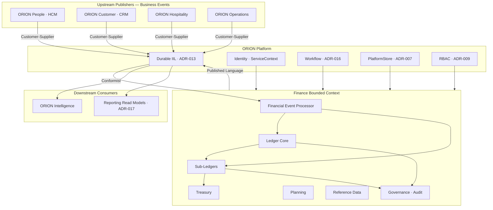
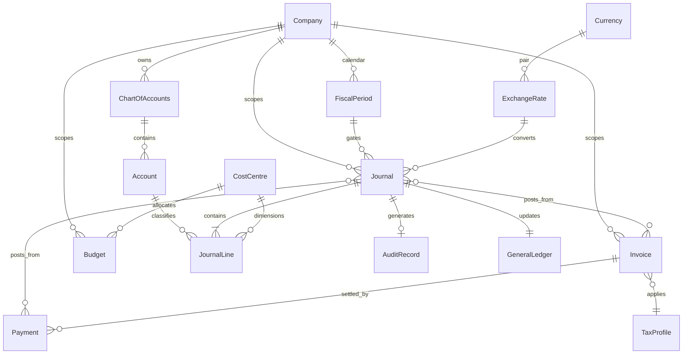

# P-009.2 — Finance Domain Model (Gate 2)

**Document ID:** P-009.2-MODEL-001  
**Program:** P-009 — ORION Enterprise Finance  
**Mission:** P-009.2 — Finance Domain Model  
**Gate:** Gate 2 — Domain Model  
**Version:** 1.0  
**Status:** Ratified — Gate 2 Domain Model  
**Classification:** Domain Architecture · Enterprise Finance  
**Authority:** Chief Enterprise Architect · Finance Domain Lead  
**Model Date:** 2 August 2026  
**Architecture Baseline:** v1.0 GA Candidate → v2.0 Multi-Domain Baseline

**Parent:** [P-009.1 Finance Strategic Assessment](../Planning/P-009.1-Finance-Strategic-Assessment.md) (Gate 1 ✅)  
**Baseline Inputs:** [P-016.2 Architecture Charter](../../00_Governance/P-016.2-ORION-v2-Architecture-Charter.md) · [ADR-013 Durable IIL](../../11_Governance/ADR/ADR-013-Durable-Intelligent-Integration-Layer.md) · [ES-FIN-001](../Engineering/ES-FIN-001_Finance_Domain_Engineering_Specification.md) · [D-007](../Blueprints/D-007_Finance_Domain_Blueprint.md) · [D-008](../Blueprints/D-008_Enterprise_Financial_Event_Model.md) · [D-009](../Blueprints/D-009_Enterprise_Ledger_Principles.md) · [ES-HCM-001 Reference Domain](../../HCM/Engineering/ES-HCM-001_Enterprise_HCM_Engineering_Specification.md)

---

## Constitutional Statement

This document is the **authoritative Gate 2 domain model** for ORION Finance. It defines aggregates, value objects, bounded context boundaries, context maps, repository contracts, and event catalogues for Gate 3 (Governance Rules) and Gate 4 (Engineering Specification).

**Scope:** Domain model · relationships · events · repositories — architecture only.  
**Out of scope:** Implementation · code · persistence schema · APIs · Gate 5.

**Modeling conventions:**

- All aggregates scoped by `organizationId` (tenant) minimum; `companyId` where multi-company applies
- **Journal** is the primary posting aggregate; **Journal Line** is an entity within the Journal aggregate boundary
- **General Ledger** is a domain capability composed of posted journals and derived balances — not a separate mutable aggregate root
- Cross-domain references use **identifiers only** — never foreign repository reads

---

## 1. Executive Summary

The Finance domain model implements the **Enterprise Financial Operating System** defined in D-007. Operational domains publish **business events** via durable IIL (ADR-013); Finance validates, transforms, and posts **accounting events** to an immutable double-entry ledger (D-009).

Gate 2 establishes **15 core aggregates** (including Journal Line as a Journal entity), **12 repository interfaces**, **domain services** for posting and transformation, and **event producer/consumer catalogues** aligned with D-008.

**HCM reference alignment:** Same patterns — single facade · aggregate roots with repository interfaces · IIL event publication · organization isolation · rules in engines · no cross-domain repository access.

**Gate 2 verdict:** Model complete for Gate 3 entry — **GO** with conditions noted in §12.

---

## 2. Bounded Context

### 2.1 Context Definition

| Field | Definition |
|-------|------------|
| **Name** | ORION Finance |
| **Ubiquitous language** | Ledger · journal · posting · period · sub-ledger · recognition · reconciliation · trial balance |
| **Authority** | Authoritative for all financial records and financial interpretation of business activity |
| **Public API** | `financeService` via `@/lib/finance` facade (Gate 4+) |
| **Integration** | Inbound: IIL business events · Outbound: IIL financial, accounting, and intelligence events |

### 2.2 In-Context vs Out-of-Context

| In Finance Bounded Context | Outside (Reference by ID Only) |
|----------------------------|----------------------------------|
| GL · CoA · journals · periods · AR/AP documents | HCM employee · CRM account · Hospitality folio |
| Invoices (financial) · payments (financial) · tax profiles | Operational contracts · reservations · pipeline |
| Budgets · cost centres · companies (finance entity) | Procurement orders · inventory items |
| Audit records · event lineage · idempotency keys | Platform identity (via ServiceContext) |

### 2.3 Sub-Contexts (Modules)

| Sub-Context | Aggregate Roots | Purpose |
|-------------|-------------------|---------|
| **Ledger Core** | Account · Journal · FiscalPeriod | CoA · posting · period control |
| **Sub-Ledgers** | Invoice · Payment | AR/AP · cash settlement |
| **Treasury** | Payment · (BankAccount — future) | Cash · banking · reconciliation |
| **Planning** | Budget · CostCentre | Budget · variance · allocation dimensions |
| **Reference Data** | Company · Currency · ExchangeRate · TaxProfile | Multi-company · FX · tax foundation |
| **Governance** | AuditRecord | Immutable audit trail |

---

## 3. Context Map

### 3.1 Context Relationships

| Partner Context | Relationship | Description |
|-----------------|--------------|-------------|
| **HCM** | Customer-Supplier (upstream) | Publishes workforce cost · expense events; Finance consumes |
| **CRM** | Customer-Supplier (upstream) | Publishes revenue · invoice intent; Finance owns financial invoice |
| **Hospitality** | Customer-Supplier (upstream) | Publishes folio · payment events |
| **Operations** | Customer-Supplier (upstream) | Publishes purchase · cost events (future) |
| **Platform IIL** | Conformist (inbound) | Finance conforms to ADR-013 envelope · ADR-014 contracts |
| **Platform Identity** | Shared Kernel | ServiceContext · organizationId |
| **Intelligence** | Published Language (downstream) | Finance publishes KPI · alert · period events |
| **Reporting (ADR-017)** | Published Language (downstream) | Read models project from Finance outbound events |

---

## 4. Aggregate Catalogue Summary

| Aggregate | Root ID | Sub-Entities / VOs | System of Record |
|-----------|---------|-------------------|------------------|
| **Chart of Accounts** | CoA structure per org/company | Account (child) | Finance |
| **Account** | `accountId` | — | Finance |
| **Journal** | `journalId` | JournalLine · PostingMetadata | Finance |
| **Journal Line** | `lineId` (within Journal) | Amount · Dimension refs | Finance (via Journal) |
| **General Ledger** | Derived balances | TrialBalance snapshot (read) | Finance (derived from Journal) |
| **Fiscal Period** | `periodId` | PeriodState · CloseChecklist | Finance |
| **Company** | `companyId` | LegalEntityProfile | Finance |
| **Cost Centre** | `costCentreId` | — | Finance |
| **Budget** | `budgetId` | BudgetLine · Encumbrance | Finance |
| **Currency** | `currencyCode` | — | Finance (org config) |
| **Exchange Rate** | `exchangeRateId` | RatePair · EffectiveDate | Finance |
| **Invoice** | `invoiceId` | InvoiceLine · TaxLine | Finance (AR sub-ledger) |
| **Payment** | `paymentId` | PaymentAllocation | Finance (AR/AP/Treasury) |
| **Tax Profile** | `taxProfileId` | TaxCode · TaxRule | Finance |
| **Audit Record** | `auditRecordId` | — | Finance (append-only) |

---

## 5. Core Aggregates

---

### 5.1 General Ledger

| Field | Definition |
|-------|------------|
| **Purpose** | Authoritative financial record — cumulative effect of all posted journals |
| **Responsibilities** | Maintain account balances by period · trial balance · control account reconciliation to sub-ledgers |
| **Ownership** | Finance Domain — derived state, not independently mutated |
| **Lifecycle** | Balances updated atomically on Journal post/reverse · snapshots at period close |

**Relationships:** Composed from **Journal** postings · reconciles to **Invoice**/**Payment** control accounts · scoped by **FiscalPeriod** · segmented by **Company** · dimensional via **CostCentre**

**Business rules:**

- GL balances change only through posted Journal aggregate
- Trial balance must balance (Σ debits = Σ credits) at all times
- Sub-ledger control accounts must reconcile to sub-ledger detail

**Invariants:**

- No direct balance mutation outside Journal posting transaction
- Every balance change traceable to a posted `journalId`

**Domain events (derived publications):**

| Event | Trigger |
|-------|---------|
| `finance.gl.balance.updated` | After journal post |
| `finance.trial_balance.generated` | On inquiry or period close step |

---

### 5.2 Chart of Accounts (CoA)

| Field | Definition |
|-------|------------|
| **Purpose** | Define the account structure for classification of all financial transactions |
| **Responsibilities** | Account hierarchy · types · active/inactive · control account designation · mapping standards |
| **Ownership** | Finance Domain |
| **Lifecycle** | Draft → Active → Inactive (no delete if posted history exists) |

**Relationships:** Contains **Account** entities · referenced by **Journal Line** · scoped to **Company** · dimensions link **CostCentre**

**Business rules:**

- Account codes unique per org/company
- Posting only to active leaf accounts (unless adjustment account policy)
- Control accounts designated for AR/AP/Cash/Tax sub-ledgers

**Invariants:**

- Hierarchy acyclic · single root per CoA version
- Cannot deactivate account with open period balances without migration plan

**Domain events:**

| Event | Trigger |
|-------|---------|
| `finance.coa.account.created` | New account activated |
| `finance.coa.account.updated` | Name/type/hierarchy change |
| `finance.coa.account.deactivated` | Account retired |

---

### 5.3 Journal

| Field | Definition |
|-------|------------|
| **Purpose** | Atomic double-entry transaction — sole mechanism for ledger mutation |
| **Responsibilities** | Compose balanced lines · post · reverse · link to source events |
| **Ownership** | Finance Domain |
| **Lifecycle** | Draft → PendingApproval → Posted → (Reversed via compensating journal) |

**Relationships:** Contains **JournalLine** entities · assigned to **FiscalPeriod** · references **Account** · optional **Company** · dimensions **CostCentre** · source **AuditRecord** · lineage to inbound IIL event

**Business rules:**

- Minimum two lines · Σ debits = Σ credits
- Posting only when period allows (`FiscalPeriod.postingAllowed`)
- Posted journals immutable — corrections via reversal journal
- Manual journals require workflow approval (ADR-016)

**Invariants:**

- `journalId` globally unique per organization
- Posted state irreversible except via explicit reversal journal referencing original
- Every posted journal has `correlationId` and `idempotencyKey` when system-generated

**Domain events:**

| Event | Trigger |
|-------|---------|
| `finance.journal.draft.created` | Manual or system draft |
| `finance.journal.submitted` | Approval workflow start |
| `finance.journal.posted` | Successful post — **authoritative accounting event** |
| `finance.journal.reversed` | Reversal journal posted |
| `finance.journal.rejected` | Validation failure |

---

### 5.4 Journal Line

| Field | Definition |
|-------|------------|
| **Purpose** | Single debit or credit line within a journal |
| **Responsibilities** | Amount · account reference · dimensions · description · tax linkage |
| **Ownership** | Finance Domain (entity within Journal aggregate) |
| **Lifecycle** | Created with journal · immutable after journal posted |

**Relationships:** Belongs to **Journal** · references **Account** · optional **CostCentre** · optional **TaxProfile** line · FX via **ExchangeRate**

**Business rules:**

- Each line exactly one of debit or credit (not both)
- Amount positive in journal currency
- Line account must be postable leaf account

**Invariants:**

- Cannot modify lines after parent journal posted
- Line `accountId` must exist and be active at post time

**Domain events:** Published via parent **Journal** events — no independent lifecycle

---

### 5.5 Account

| Field | Definition |
|-------|------------|
| **Purpose** | Classify financial transactions — asset · liability · equity · revenue · expense |
| **Responsibilities** | Code · name · type · hierarchy · control flag · currency constraint |
| **Ownership** | Finance Domain |
| **Lifecycle** | Draft → Active → Inactive |

**Relationships:** Part of **Chart of Accounts** · referenced by **JournalLine** · balance in **General Ledger**

**Business rules:**

- Account type determines normal balance (debit/credit)
- Control accounts reconcile to sub-ledger totals

**Invariants:**

- `accountCode` unique per company scope
- Cannot delete — only deactivate

**Domain events:** Via CoA events (§5.2)

---

### 5.6 Fiscal Period

| Field | Definition |
|-------|------------|
| **Purpose** | Govern when posting is permitted — fiscal calendar control |
| **Responsibilities** | Period states · open/soft-close/hard-close · posting restrictions · year-end |
| **Ownership** | Finance Domain |
| **Lifecycle** | Future → Open → SoftClosed → HardClosed → (Reopen governed) |

**Relationships:** Contains calendar hierarchy (year → periods) · gates all **Journal** posts · scopes **General Ledger** balances

**Business rules:**

- Only Open periods accept standard posting
- SoftClosed allows adjustment/reversal per policy
- HardClosed blocks all posting except governed reopen workflow

**Invariants:**

- Exactly one current Open period per company calendar (configurable exception for adjustment period)
- Period date ranges non-overlapping within year

**Domain events:**

| Event | Trigger |
|-------|---------|
| `finance.period.opened` | Period activated |
| `finance.period.soft_closed` | Soft close completed |
| `finance.period.hard_closed` | Hard close · **triggers intelligence** |
| `finance.period.reopened` | Governed reopen |

---

### 5.7 Company

| Field | Definition |
|-------|------------|
| **Purpose** | Legal entity dimension for multi-company readiness |
| **Responsibilities** | Entity identity · base currency · fiscal calendar assignment · consolidation group (future) |
| **Ownership** | Finance Domain (financial entity view — not HR legal entity master) |
| **Lifecycle** | Active → Inactive |

**Relationships:** Owns **Chart of Accounts** instance · scopes **Journal** · **Invoice** · **Budget** · links to `organizationId`

**Business rules:**

- Each journal assigned exactly one company
- Inter-company postings via dedicated IC accounts (future)

**Invariants:**

- `companyId` unique per organization
- Base currency immutable after first posted journal

**Domain events:**

| Event | Trigger |
|-------|---------|
| `finance.company.created` | New legal entity registered in Finance |
| `finance.company.base_currency.set` | Initial currency assignment |

---

### 5.8 Cost Centre

| Field | Definition |
|-------|------------|
| **Purpose** | Cost/profit dimension for management accounting and workforce cost allocation |
| **Responsibilities** | Dimension code · hierarchy · active state · budget linkage |
| **Ownership** | Finance Domain |
| **Lifecycle** | Active → Inactive |

**Relationships:** Referenced on **JournalLine** · **Budget** allocations · HCM cost events map to cost centre

**Business rules:**

- Optional on revenue lines · required on expense lines per policy
- HCM workforce cost events must resolve to valid cost centre

**Invariants:**

- Code unique per company
- Cannot deactivate if open budget encumbrances exist

**Domain events:**

| Event | Trigger |
|-------|---------|
| `finance.cost_centre.created` | New dimension |
| `finance.cost_centre.updated` | Hierarchy/name change |

---

### 5.9 Budget

| Field | Definition |
|-------|------------|
| **Purpose** | Planned financial targets for variance analysis |
| **Responsibilities** | Budget version · lines by account/cost centre · encumbrance tracking |
| **Ownership** | Finance Domain |
| **Lifecycle** | Draft → Approved → Active → Superseded → Closed |

**Relationships:** Links **Account** · **CostCentre** · **FiscalPeriod** · compares to **General Ledger** actuals (read)

**Business rules:**

- One active budget version per scenario/period set
- Encumbrance reduces available budget on commitment events

**Invariants:**

- Approved budget immutable — revisions via new version
- Variance computed from ledger actuals — not operational estimates

**Domain events:**

| Event | Trigger |
|-------|---------|
| `finance.budget.approved` | Budget activated |
| `finance.budget.variance.threshold breached` | Material variance · intelligence |
| `finance.budget.encumbered` | Commitment recorded |

---

### 5.10 Currency

| Field | Definition |
|-------|------------|
| **Purpose** | Define currencies available for transactions and reporting |
| **Responsibilities** | ISO code · precision · symbol · active state |
| **Ownership** | Finance Domain (org-level reference) |
| **Lifecycle** | Active → Inactive |

**Relationships:** **Company** base currency · **Journal** transaction currency · **ExchangeRate** pairs

**Business rules:**

- Journal currency must be active currency
- Reporting currency per company for translation (future)

**Invariants:**

- ISO 4217 code format
- Cannot deactivate currency used in posted journals

**Domain events:**

| Event | Trigger |
|-------|---------|
| `finance.currency.activated` | Currency enabled for org |

---

### 5.11 Exchange Rate

| Field | Definition |
|-------|------------|
| **Purpose** | FX conversion rates for multi-currency journals |
| **Responsibilities** | Rate pair · effective date · rate type (spot/average/closing) · source |
| **Ownership** | Finance Domain |
| **Lifecycle** | Draft → Active → Superseded |

**Relationships:** Links two **Currency** codes · applied on **Journal** post when currency ≠ company base

**Business rules:**

- Rate must exist for journal date at post time
- FX gain/loss posted via governed adjustment accounts

**Invariants:**

- One active rate per pair/type/date scope
- Rates immutable after used in posted journal

**Domain events:**

| Event | Trigger |
|-------|---------|
| `finance.exchange_rate.published` | New rate active |

---

### 5.12 Payment

| Field | Definition |
|-------|------------|
| **Purpose** | Record settlement — customer receipts and vendor disbursements |
| **Responsibilities** | Payment amount · method · allocations to invoices/bills · cash impact |
| **Ownership** | Finance Domain |
| **Lifecycle** | Draft → Posted → Reconciled → (Reversed) |

**Relationships:** Allocates to **Invoice** (AR) or vendor bill (AP) · generates **Journal** · updates cash · **AuditRecord**

**Business rules:**

- Allocations cannot exceed payment amount
- Posted payment generates cash journal automatically

**Invariants:**

- Payment references external party by ID only (CRM customerId · vendorId)
- Posted payment immutable — reversal via compensating payment/journal

**Domain events:**

| Event | Trigger |
|-------|---------|
| `finance.payment.received` | Customer receipt posted |
| `finance.payment.disbursed` | Vendor payment posted |
| `finance.payment.reconciled` | Bank reconciliation match |

---

### 5.13 Invoice

| Field | Definition |
|-------|------------|
| **Purpose** | Authoritative financial receivable document (AR sub-ledger) |
| **Responsibilities** | Invoice lines · tax · due date · aging · linkage to revenue recognition |
| **Ownership** | Finance Domain (financial invoice — not CRM quote) |
| **Lifecycle** | Draft → Issued → PartiallyPaid → Paid → Cancelled/Credited |

**Relationships:** Origin from CRM/Hospitality business events · generates **Journal** on issue · settled by **Payment** · **TaxProfile** applied

**Business rules:**

- Issue generates AR and revenue/deferred revenue journal per policy
- CRM `crm.invoice.issued` triggers transformation — Finance owns posted invoice

**Invariants:**

- Invoice number unique per company
- Cannot edit issued invoice — credit note for corrections

**Domain events:**

| Event | Trigger |
|-------|---------|
| `finance.invoice.issued` | AR journal posted |
| `finance.invoice.paid` | Fully allocated |
| `finance.invoice.cancelled` | Reversal/credit workflow |

---

### 5.14 Tax Profile

| Field | Definition |
|-------|------------|
| **Purpose** | Tax codes and rules for calculation on invoices and journal lines |
| **Responsibilities** | Tax code · rate · jurisdiction · recoverable flag · reporting category |
| **Ownership** | Finance Domain |
| **Lifecycle** | Draft → Active → Superseded |

**Relationships:** Applied on **Invoice** lines · **JournalLine** tax extensions · liability accounts in **Chart of Accounts**

**Business rules:**

- Tax calculated at invoice issue and applicable expense posts
- Tax lines post to dedicated liability/recoverable accounts

**Invariants:**

- Effective date range non-overlapping for same code/version
- Tax posted only to designated tax accounts

**Domain events:**

| Event | Trigger |
|-------|---------|
| `finance.tax.calculated` | Tax lines computed on document |
| `finance.tax.liability.updated` | Journal posts tax balance |

---

### 5.15 Audit Record

| Field | Definition |
|-------|------------|
| **Purpose** | Immutable append-only audit trail for all material Finance mutations |
| **Responsibilities** | Actor · action · entity reference · before/after snapshot hash · correlationId |
| **Ownership** | Finance Domain |
| **Lifecycle** | Created — never updated or deleted |

**Relationships:** Attached to every **Journal** post · event rejection · period transition · master data change

**Business rules:**

- Every posted journal has ≥1 audit record
- Audit includes ServiceContext actor and RBAC role

**Invariants:**

- Append-only · no mutation
- Retention per compliance policy (minimum 7 years planning target)

**Domain events:**

| Event | Trigger |
|-------|---------|
| `finance.audit.recorded` | Material mutation (internal — may feed platform audit bus) |

---

## 6. Aggregate Relationship Diagram

---

## 7. Value Objects

| Value Object | Attributes | Used By |
|--------------|------------|---------|
| **Money** | `amount` · `currencyCode` · precision | JournalLine · Invoice · Payment · Budget |
| **AccountCode** | normalized code string | Account · JournalLine |
| **PeriodRange** | `startDate` · `endDate` | FiscalPeriod |
| **DimensionRef** | `costCentreId` · `profitCentreId` (future) | JournalLine |
| **PartyRef** | `partyType` · `partyId` (CRM/HCM/vendor) | Invoice · Payment |
| **EventLineageRef** | `sourceEventId` · `correlationId` · `causationId` | Journal · AuditRecord |
| **IdempotencyKey** | composite key per ADR-013 | Event processor |
| **PostingMetadata** | `postedAt` · `postedBy` · `journalType` · `source` | Journal |
| **TaxLine** | `taxCode` · `rate` · `taxAmount` · `jurisdiction` | Invoice · JournalLine |
| **Allocation** | `targetInvoiceId` · `amount` | Payment |
| **RatePair** | `fromCurrency` · `toCurrency` | ExchangeRate |
| **TrialBalanceLine** | account totals · debit/credit · balance | General Ledger read |

**Value object rules:** Immutable · equality by value · no identity · validated on construction

---

## 8. Domain Services

| Domain Service | Responsibility | Aggregates Involved |
|----------------|----------------|---------------------|
| **PostingService** | Atomic post: validate → persist journal → update GL → sub-ledgers → publish events | Journal · GeneralLedger · Invoice · Payment |
| **ValidationService** | Pre-post rule evaluation: balance · period · account · tax · idempotency | Journal · FiscalPeriod · Account · TaxProfile |
| **JournalCompositionService** | Build journal from financial events or manual input | Journal · JournalLine |
| **EventTransformationService** | Map inbound business events (D-008) to financial events and journal templates | Journal · Invoice · Payment |
| **PeriodControlService** | Enforce posting restrictions · close checklist | FiscalPeriod |
| **ReconciliationService** | Match payments to bank statements (future) | Payment · AuditRecord |
| **BudgetVarianceService** | Compare ledger actuals to budget · encumbrance | Budget · GeneralLedger |
| **TaxCalculationService** | Compute tax lines from TaxProfile rules | TaxProfile · Invoice |
| **FxTranslationService** | Apply ExchangeRate to foreign currency journals | ExchangeRate · Journal |
| **ExecutiveSignalService** | Derive KPI thresholds · publish intelligence events | GeneralLedger · Budget · FiscalPeriod |

**Rule:** Domain services are stateless · receive `ServiceContext` per invocation · orchestrate aggregates via repositories

---

## 9. Repository Catalogue

| Repository Interface | Aggregate(s) | Key Operations (Conceptual) |
|---------------------|----------------|----------------------------|
| **ChartOfAccountsRepository** | Account · CoA | findByCode · listHierarchy · save · deactivate |
| **JournalRepository** | Journal · JournalLine | create · findById · findByCorrelationId · listByPeriod |
| **GeneralLedgerRepository** | General Ledger (balances) | getBalance · updateOnPost · trialBalance |
| **PeriodRepository** | FiscalPeriod | getCurrent · findById · transitionState · listByYear |
| **CompanyRepository** | Company | findById · list · save |
| **CostCentreRepository** | CostCentre | findByCode · list · save |
| **BudgetRepository** | Budget | findVersion · save · encumber |
| **CurrencyRepository** | Currency | findByCode · listActive |
| **ExchangeRateRepository** | ExchangeRate | findEffectiveRate · save |
| **ReceivableRepository** | Invoice | create · findById · listAging · issue · cancel |
| **PayableRepository** | VendorBill (future) | create · listAging · approve |
| **PaymentRepository** | Payment | create · allocate · findById · reconcile |
| **TaxRepository** | TaxProfile | findByCode · list · save |
| **AuditRepository** | AuditRecord | append · findByEntity · findByCorrelation |
| **IdempotencyRepository** | IdempotencyKey | exists · markProcessed |
| **EventLineageRepository** | EventLineageRef | recordChain · queryByCorrelation |

**Repository rules (HCM-aligned):**

- All queries scoped by `organizationId` minimum
- Interface in domain · implementation via PlatformStore (Gate 5)
- No cross-domain repository implementations

---

## 10. Event Catalogue

### 10.1 Inbound Event Consumers (Finance Subscribes)

| Source Domain | Event Type | Finance Action | Target Aggregate |
|---------------|------------|----------------|------------------|
| **HCM** | `hcm.workforce.cost.recorded` | Expense journal | Journal · CostCentre |
| **HCM** | `hcm.expense.approved` | AP/reimbursement journal | Journal · Payment |
| **CRM** | `crm.opportunity.won` | Revenue recognition | Journal · Invoice |
| **CRM** | `crm.invoice.issued` | AR invoice + journal | Invoice · Journal |
| **Hospitality** | `hospitality.folio.closed` | Revenue + tax journal | Journal · Invoice |
| **Hospitality** | `hospitality.payment.settled` | Payment receipt | Payment · Journal |
| **Operations** | `operations.purchase.received` | AP accrual (future) | Journal |

**Transport:** Durable IIL (ADR-013) · contracts governed by ADR-014 · idempotency per ADR-013 §3.7

### 10.2 Outbound Event Producers (Finance Publishes)

| Category | Event Type | Consumers | Trigger |
|----------|------------|-----------|---------|
| **Accounting** | `finance.journal.posted` | Platform audit · Intelligence · ADR-017 | Journal post |
| **Accounting** | `finance.journal.reversed` | Platform audit · Intelligence | Reversal |
| **Accounting** | `finance.period.hard_closed` | Intelligence · Reporting | Period close |
| **Financial** | `finance.invoice.issued` | CRM (read) · Intelligence | Invoice issue |
| **Financial** | `finance.payment.received` | CRM · Intelligence | Payment post |
| **Financial** | `finance.revenue.recognized` | Intelligence | Recognition journal |
| **Intelligence** | `finance.kpi.updated` | Executive Brief | Material post |
| **Intelligence** | `finance.alert.raised` | Executive Brief | Threshold breach |
| **Intelligence** | `finance.variance.alert` | Executive Brief | Budget variance |

### 10.3 Event Catalogue Summary

| Direction | Count (Gate 2 baseline) | Gate 4 Target |
|-----------|-------------------------|---------------|
| Inbound business events | 7 priority · 4+ future | Full D-008 mapping table |
| Outbound accounting events | 4 core | + sub-ledger events |
| Outbound intelligence events | 3 core | + KPI catalogue |

**Gate 3 deliverable:** Full event catalogue with schema versions per ADR-020

---

## 11. Cross-Domain Dependencies

| Dependency | Type | Model Impact |
|------------|------|--------------|
| **ADR-013 Durable IIL** | Platform | All inbound/outbound events |
| **ADR-014 Event Contracts** | Platform | Inbound event schemas |
| **ADR-015 Domain Boundaries** | Governance | PartyRef ID-only references |
| **ADR-020 Versioning** | Governance | Event version on all catalogue entries |
| **HCM event catalogue** | Upstream | `hcm.workforce.cost.recorded` schema |
| **CRM event catalogue** | Upstream | Revenue chain events |
| **PlatformStore (ADR-007)** | Platform | All repository persistence (Gate 5) |
| **RBAC (ADR-009)** | Platform | AuditRecord actor · API permissions (Gate 4) |
| **Workflow (ADR-016)** | Platform | Journal approval lifecycle |

**Prohibited:** Finance aggregate importing HCM/CRM repository · direct folio/customer store reads

---

## 12. Authoritative Source & Read Models

### 12.1 System of Record

| Data | Authoritative Domain | Notes |
|------|---------------------|-------|
| General ledger · journals · CoA | **Finance** | Single financial truth (D-009) |
| AR invoices · AP bills · payments | **Finance** | Sub-ledgers roll to GL |
| Fiscal periods · budgets · tax | **Finance** | |
| Employee · payroll calculation | **HCM** | Finance receives cost events only |
| CRM account · opportunity | **CRM** | Finance receives party ID + business events |
| Guest folio · reservation | **Hospitality** | Finance receives folio closure events |
| Executive Brief composition | **Intelligence** | Consumes Finance outbound events |

### 12.2 Read Models (Non-Authoritative)

| Read Model | Source | Owner | ADR |
|------------|--------|-------|-----|
| Trial balance view | GeneralLedgerRepository | Finance facade | — |
| AR aging report | ReceivableRepository | Finance facade | — |
| Executive financial dashboard | Finance KPI events | Intelligence | ADR-017 |
| Analytics projections | Finance outbound events | Intelligence | ADR-017 |
| CRM revenue dashboard (operational) | CRM domain | CRM | Not financial truth |

**Rule:** Read models never mutate authoritative aggregates · projections lag ledger post (eventual consistency acceptable for analytics per ADR-017)

### 12.3 Future Integration Points

| Integration | Direction | Model Extension |
|-------------|-----------|-----------------|
| **ERP export (GL)** | Outbound | Journal export read model |
| **Bank feed** | Inbound | BankStatement aggregate (future) |
| **Tax authority filing** | Outbound | TaxProfile reporting snapshot |
| **Consolidation group** | Internal | Company hierarchy extension |
| **Integration Hub (P-010.7)** | Inbound/Outbound | External connector mappings — not repository reads |
| **Multi-region read replicas** | Platform | ADR-019 — read model only |

---

## 13. Mapping from v0.3 Implementation

| v0.3 Module (`lib/finance/`) | Gate 2 Aggregate Mapping | Gap |
|------------------------------|--------------------------|-----|
| `chart-of-accounts/` | Account · Chart of Accounts | Company dimension · persistence |
| `general-ledger/` | Journal · General Ledger | Full journal lifecycle · PlatformStore |
| `fiscal-period/` | FiscalPeriod | Company calendar · persistence |
| `event-pipeline/` | EventTransformationService · IdempotencyRepository | Durable IIL · ADR-014 contracts |
| `repositories/InMemory*` | All repositories | PostgreSQL adapters Gate 5 |
| `services/JournalService` (stub) | JournalCompositionService | Workflow approval |
| `executive-intelligence/` | ExecutiveSignalService | Authoritative signals post-GL |

---

## 14. Gate 2 Exit Criteria

| # | Criterion | Status |
|---|-----------|--------|
| G2-1 | Core aggregates defined with purpose · lifecycle · invariants | ✅ §5 |
| G2-2 | Bounded context and context map documented | ✅ §2–3 |
| G2-3 | Aggregate relationship diagram provided | ✅ §6 |
| G2-4 | Value objects catalogued | ✅ §7 |
| G2-5 | Domain services defined | ✅ §8 |
| G2-6 | Repository catalogue complete | ✅ §9 |
| G2-7 | Event producer/consumer catalogue baseline | ✅ §10 |
| G2-8 | Cross-domain dependencies identified | ✅ §11 |
| G2-9 | System of record and read models defined | ✅ §12 |
| G2-10 | v0.3 module mapping documented | ✅ §13 |
| G2-11 | CEA Gate 2 approval | Pending sign-off |

---

## 15. Readiness for Gate 3 (Governance Rules)

| # | Criterion | Status | Gate 3 Deliverable |
|---|-----------|--------|-------------------|
| R3-1 | Rules engines per aggregate (posting · period · tax) | Pending | P-009.3 Gate 3 |
| R3-2 | Permission matrix draft | Pending | Finance RBAC catalogue |
| R3-3 | Full event catalogue with versions | Pending | ADR-014 alignment |
| R3-4 | Validation stage definitions | Partial (ES-FIN-001) | Period · journal · tax rules |
| R3-5 | Workflow trigger definitions | Pending | ADR-016 |

**Gate 3 entry verdict:** **GO** — domain model complete

---

## 16. Executive Recommendation

### 16.1 Decision Matrix

| Question | Assessment | Verdict |
|----------|------------|---------|
| Is the aggregate model complete for Finance scope? | 15 aggregates · GL via Journal · sub-ledgers defined | **GO** |
| Is bounded context clear vs HCM/CRM/Hospitality? | ID-only references · IIL-only integration | **GO** |
| Does model align with D-007/D-008/D-009? | Event pipeline · double-entry · immutable ledger | **GO** |
| Does model replicate HCM reference patterns? | Repositories · facade · events · org isolation | **GO** |
| Is ADR-013 reflected in event model? | Idempotency · correlation · durable transport | **GO** |
| May Gate 5 implementation begin? | Gate 3–4 incomplete · ADR-013 Proposed | **NO-GO** |

### 16.2 Final Verdict

| Assessment | Verdict |
|------------|---------|
| **P-009.2 Gate 2 Domain Model mission** | **GO** |
| **Finance domain model authority** | **GO** |
| **Gate 3 Governance Rules entry** | **GO** |
| **Gate 5 implementation** | **NO-GO** |
| **Overall P-009 Gate 2** | **GO** |

### 16.3 Immediate Next Actions

| # | Action | Owner | Target |
|---|--------|-------|--------|
| 1 | CEA sign-off Gate 2 domain model | Chief Enterprise Architect | Aug 2026 |
| 2 | Launch P-009.3 Gate 3 Governance Rules | Finance Domain Lead | Sep 2026 |
| 3 | Expand event catalogue to full D-008 mapping | Finance + Platform | Gate 3 |
| 4 | Draft Finance RBAC permission matrix | Finance + Security | Gate 3 |
| 5 | Begin ES-FIN-002 Gate 4 engineering spec from this model | Finance Domain Lead | 2027 Q1 |

---

## 17. Sign-Off

| Role | Decision | Date |
|------|----------|------|
| Chief Enterprise Architect | **GO** — Gate 2 domain model accepted | 2 Aug 2026 |
| Finance Domain Lead | **GO** — model ready for Gate 3 | 2 Aug 2026 |
| Architecture Review Board | Noted — Gate 3 scheduled | — |
| Program Director | **GO** | 2 Aug 2026 |

---

## 18. Related Deliverables

| Document | Path |
|----------|------|
| P-009.1 Gate 1 | [P-009.1-Finance-Strategic-Assessment.md](../Planning/P-009.1-Finance-Strategic-Assessment.md) |
| D-007 Blueprint | [D-007_Finance_Domain_Blueprint.md](../Blueprints/D-007_Finance_Domain_Blueprint.md) |
| D-008 Event Model | [D-008_Enterprise_Financial_Event_Model.md](../Blueprints/D-008_Enterprise_Financial_Event_Model.md) |
| D-009 Ledger Principles | [D-009_Enterprise_Ledger_Principles.md](../Blueprints/D-009_Enterprise_Ledger_Principles.md) |
| ES-FIN-001 (v0.3) | [ES-FIN-001_Finance_Domain_Engineering_Specification.md](../Engineering/ES-FIN-001_Finance_Domain_Engineering_Specification.md) |
| ADR-013 | [ADR-013-Durable-Intelligent-Integration-Layer.md](../../11_Governance/ADR/ADR-013-Durable-Intelligent-Integration-Layer.md) |
| HCM Reference | [ES-HCM-001](../../HCM/Engineering/ES-HCM-001_Enterprise_HCM_Engineering_Specification.md) |

---

*P-009.2 — Gate 2 architecture only · No code · No persistence · No APIs · Next mission: P-009.3 Gate 3 Governance Rules*
