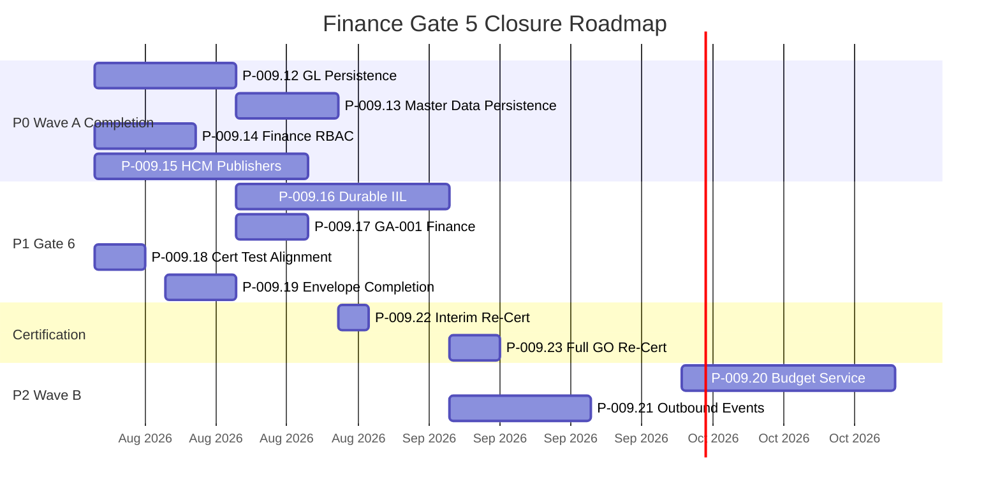

# Finance Gate 5 — Closure Roadmap

**Mission:** P-009.11 — Finance Gate 5 Closure Program  
**Document ID:** FIN-CLOSE-ROAD-001  
**Assessment Date:** 3 August 2026  
**Branch Baseline:** `develop/v2.0` @ `a5b2f72`  
**Classification:** Internal — Finance Domain Program

**Related:** [Closure Program](./Finance-Gate5-Closure-Program.md) · [Executive Summary](./Finance-Gate5-Executive-Summary.md) · [Risk Register](./Finance-Gate5-Risk-Register.md)

---

## 1. Roadmap Overview

This roadmap sequences **12 engineering missions** (P-009.12–P-009.23) to close all open FIN-R risks and achieve Finance Gate 5 **Full GO**.

*Dates are indicative engineering estimates for planning purposes.*

---

## 2. Mission Catalogue

### P-009.12 — GL PostgreSQL Persistence

| Attribute | Detail |
|-----------|--------|
| **Risk** | FIN-R-001, FIN-R-013, FIN-R-006 (partial) |
| **Owner** | Platform Engineering / Finance Domain |
| **Priority** | P0 |
| **Milestone** | Wave A Completion |
| **Duration** | ~2 weeks |
| **Dependencies** | P-009.7B `FinanceEntityPersister` |
| **Blocks** | P-009.13, P-009.17, P-009.23 |

**Current State:** `GeneralLedgerRepository` uses in-memory Maps. Posted journals survive Postgres restart; ledger entries and balances do not.

**Target State:** `ledgerEntries` and `ledgerBalances` collections persisted via `FinanceEntityPersister` with org-scoped indexes.

**Required Work:**
- Extend `finance_entities` migration for GL entity types
- Implement Postgres read/write path in `GeneralLedgerRepository`
- Wire in `createFinancePersistenceRepositories()`
- Add cross-restart integration test (true store reconnect)

**Acceptance Criteria:**
- [ ] Post balanced journal → verify GL entries and balances
- [ ] Restart PlatformStore (Postgres) → GL state identical
- [ ] Org isolation: tenant A GL invisible to tenant B after restart
- [ ] Rollback on GL failure still restores in-memory and persisted state consistently

**Closure Evidence:**
- `GeneralLedgerRepository.test.ts` — cross-restart case
- Updated [General Ledger Posting Service](../Services/General-Ledger-Posting-Service.md) doc
- FIN-R-001, FIN-R-013 → **Closed**

---

### P-009.13 — Finance Master Data Persistence

| Attribute | Detail |
|-----------|--------|
| **Risk** | FIN-R-005, FIN-R-006 (partial) |
| **Owner** | Finance Domain |
| **Priority** | P0 |
| **Milestone** | Wave A Completion |
| **Duration** | ~1.5 weeks |
| **Dependencies** | P-009.12 (shared persister infrastructure) |
| **Blocks** | P-009.23 |

**Current State:** Chart of accounts, fiscal periods, and idempotency keys exist as in-memory seed data only.

**Target State:** All three collections durable on PostgreSQL path with org scoping.

**Required Work:**
- Persist `chartOfAccounts`, `fiscalPeriods`, `idempotencyKeys`
- Update repository factory in `createFinanceRepositories()`
- Seed migration for dev/staging baseline CoA

**Acceptance Criteria:**
- [ ] CoA accounts survive restart
- [ ] Open/closed period state survives restart
- [ ] Idempotency dedup survives restart (no double-post on replay)

**Closure Evidence:**
- Repository restart tests for CoA, period, idempotency
- TD-DOMAIN-PERSIST-001 → **Closed** (Finance Wave A scope)
- FIN-R-005 → **Closed**

---

### P-009.14 — Finance API RBAC & Permission Catalog

| Attribute | Detail |
|-----------|--------|
| **Risk** | FIN-R-004 |
| **Owner** | Platform Security / Finance Domain |
| **Priority** | P0 |
| **Milestone** | Wave A Completion |
| **Duration** | ~1.5 weeks |
| **Dependencies** | ES-FIN-002 §7 permission matrix |
| **Blocks** | P-009.23, production deployment |

**Current State:** Finance REST routes accessible without fail-closed permission enforcement. Service-layer validation checks roles during posting only.

**Target State:** `finance-permission-catalog.ts` defines all Finance permissions; route middleware denies by default.

**Required Work:**
- Create permission catalog (post, inquiry, admin, period management)
- Wire middleware on all `/api/finance/*` routes
- Negative authorization test suite

**Acceptance Criteria:**
- [ ] Unauthenticated request → 401
- [ ] Authenticated without permission → 403
- [ ] Authorized role → 200/201 as appropriate
- [ ] No Finance route bypasses middleware

**Closure Evidence:**
- `tests/lib/finance/FinancePermissionCatalog.test.ts` (or equivalent)
- Security dimension score ≥ 75 in re-certification
- FIN-R-004 → **Closed**

---

### P-009.15 — HCM Canonical Event Publishers

| Attribute | Detail |
|-----------|--------|
| **Risk** | FIN-R-003 |
| **Owner** | HCM Domain |
| **Priority** | P0 |
| **Milestone** | Wave A Completion |
| **Duration** | ~3 weeks |
| **Dependencies** | P-009.9 Finance consumer · ADR-014 |
| **Blocks** | P-009.23, production HCM→Finance chain |
| **Status** | 🚫 **Blocked** — HCM domain authorization required |

**Current State:** Finance `FinanceEventConsumer` certified with synthetic test events. HCM payroll/expense services do not publish canonical events.

**Target State:** HCM emits `hcm.workforce.cost.recorded` and `hcm.expense.approved` via IIL with ADR-014 envelope.

**Required Work:**
- HCM publisher in payroll cost recording flow
- HCM publisher in expense approval flow
- Cross-domain E2E test (HCM → IIL → Finance → journal posted)

**Acceptance Criteria:**
- [ ] Real HCM payroll run produces canonical event
- [ ] Real HCM expense approval produces canonical event
- [ ] Finance consumer posts journal without synthetic wrapper
- [ ] Duplicate delivery handled idempotently

**Closure Evidence:**
- Cross-domain integration test (not synthetic)
- Updated [HCM Finance Event Chain](../Integration/HCM-Finance-Event-Chain.md)
- FIN-R-003 → **Closed**

---

### P-009.16 — Durable IIL Transport

| Attribute | Detail |
|-----------|--------|
| **Risk** | FIN-R-002 |
| **Owner** | Platform Engineering |
| **Priority** | P1 |
| **Milestone** | Gate 6 |
| **Duration** | ~3 weeks |
| **Dependencies** | ADR-013 implementation |
| **Blocks** | P-009.21, P-009.23 |
| **Status** | 🚫 **Blocked** — platform IIL program |

**Current State:** IIL uses in-process transport (TD-PLATFORM-003). Events lost on process restart.

**Target State:** Durable queue with at-least-once delivery; Finance consumer acknowledges after post-commit.

**Required Work:**
- Implement ADR-013 durable adapter (Postgres or message broker)
- Consumer ack semantics in `FinanceEventConsumer`
- DLQ for contract/version failures

**Acceptance Criteria:**
- [ ] Event published before Finance restart → consumed after restart
- [ ] Duplicate delivery → idempotent duplicate response
- [ ] Failed contract → DLQ, no partial post

**Closure Evidence:**
- IIL restart integration test
- TD-PLATFORM-003 → Closed or waiver documented
- FIN-R-002 → **Closed** or **Waived**

**Waiver Option:** Executive waiver with compensating controls (manual replay runbook, event audit log) acceptable for Gate 6 with explicit expiry at production cutover.

---

### P-009.17 — GA-001 Finance Restart Certification

| Attribute | Detail |
|-----------|--------|
| **Risk** | FIN-R-007 |
| **Owner** | QA / Platform Engineering |
| **Priority** | P1 |
| **Milestone** | Gate 6 |
| **Duration** | ~1 week |
| **Dependencies** | P-009.12 |
| **Blocks** | P-009.23 |

**Current State:** `GA001OperationalCertification.test.ts` covers platform/HCM restart scenarios; no Finance posting assertion.

**Target State:** GA-001 includes Finance journal post → restart → verify journal, GL, and lineage.

**Required Work:**
- Add Finance scenario block to GA-001 test
- Wire finance backing in GA test harness

**Acceptance Criteria:**
- [ ] GA-001 Finance scenario passes in CI
- [ ] Scenario uses PostgreSQL path (not in-memory only)

**Closure Evidence:**
- GA-001 test diff
- ES-096 operational certification alignment
- FIN-R-007 → **Closed**

---

### P-009.18 — Certification Test Alignment

| Attribute | Detail |
|-----------|--------|
| **Risk** | FIN-R-008 |
| **Owner** | Finance Domain |
| **Priority** | P2 |
| **Milestone** | Gate 6 |
| **Duration** | ~3 days |
| **Dependencies** | None |

**Current State:** P-009.5/6 domain certification tests reference stale mission constants (S-001.2 drift).

**Target State:** All cert test metadata matches current mission IDs and scope.

**Required Work:**
- Audit finance cert test mission constants
- Align assertions with P-009.5/6 deliverables

**Acceptance Criteria:**
- [ ] No mission ID mismatch in cert output
- [ ] All domain cert suites pass

**Closure Evidence:**
- Test file updates
- FIN-R-008 → **Closed**

---

### P-009.19 — ADR-014 Envelope Completion

| Attribute | Detail |
|-----------|--------|
| **Risk** | FIN-R-012 |
| **Owner** | Platform Engineering |
| **Priority** | P2 |
| **Milestone** | Gate 6 |
| **Duration** | ~1 week |
| **Dependencies** | ADR-014 |

**Current State:** `IntelligenceEvent` envelope lacks `idempotencyKey` and `eventVersion` at platform level; Finance mapper reads from payload fallback.

**Target State:** Full ADR-014 envelope fields on platform event type.

**Required Work:**
- Extend `IntelligenceEvent` interface
- Update Finance and HCM mappers to read envelope fields
- Contract validation tests

**Acceptance Criteria:**
- [ ] Envelope validation passes without payload fallback
- [ ] Version mismatch detected at envelope layer

**Closure Evidence:**
- Envelope contract tests
- FIN-R-012 → **Closed**

---

### P-009.20 — Budget Variance Service (Wave B)

| Attribute | Detail |
|-----------|--------|
| **Risk** | FIN-R-009 |
| **Owner** | Finance Domain |
| **Priority** | P2 |
| **Milestone** | Wave B |
| **Duration** | ~3 weeks |
| **Dependencies** | Intelligence budget data |
| **Status** | 📋 **Deferred** — accepted Wave A waiver |

**Current State:** Posting validation stage 7 uses intelligence stub for budget checks.

**Target State:** `BudgetVarianceService` with authoritative budget data; warn/hard-stop calibrated.

**Acceptance Criteria:**
- [ ] Soft limit produces warn
- [ ] Hard limit produces block
- [ ] No false positives from stub data

**Closure Evidence:** Service tests · FIN-R-009 → **Closed**

---

### P-009.21 — Outbound `finance.journal.posted` (Wave B)

| Attribute | Detail |
|-----------|--------|
| **Risk** | FIN-R-010 |
| **Owner** | Finance Domain |
| **Priority** | P2 |
| **Milestone** | Wave B |
| **Duration** | ~2 weeks |
| **Dependencies** | P-009.16 |
| **Status** | 📋 **Deferred** — explicit Wave A out-of-scope |

**Current State:** No outbound IIL event after successful journal post.

**Target State:** Post-commit `finance.journal.posted` per ADR-014 egress contract.

**Acceptance Criteria:**
- [ ] Event emitted only after transaction commit
- [ ] Downstream subscriber receives canonical payload

**Closure Evidence:** Egress E2E test · FIN-R-010 → **Closed**

---

### P-009.22 — Interim Re-Certification

| Attribute | Detail |
|-----------|--------|
| **Owner** | Finance Domain Lead |
| **Priority** | P0 exit validation |
| **Milestone** | Wave A Completion |
| **Duration** | ~3 days |
| **Dependencies** | P-009.12, P-009.13, P-009.14, P-009.15 |

**Purpose:** Validate P0 closure before Gate 6 program entry.

**Acceptance Criteria:**
- [ ] All P0 missions complete (or P-009.15 waived with executive approval)
- [ ] Readiness score ≥ 80
- [ ] No open High risks except waived FIN-R-002
- [ ] Updated scorecard issued

---

### P-009.23 — Full GO Re-Certification

| Attribute | Detail |
|-----------|--------|
| **Owner** | Certification Lead |
| **Priority** | Gate 6 |
| **Milestone** | Gate 6 |
| **Duration** | ~1 week |
| **Dependencies** | All P0 + P1 missions (or waivers) |

**Purpose:** Independent Gate 6 certification per ES-096; issue **Full GO** determination.

**Acceptance Criteria:**
- [ ] Readiness score ≥ 85
- [ ] Zero open High risks (or documented waivers)
- [ ] GA-001 Finance scenario passes
- [ ] Operations checklist fully green (no manual gaps)
- [ ] ES-095 maturity Level 4 evidence for Finance persistence and security

**Closure Evidence:**
- `Finance-Gate5-Certification-Report.md` v2 (Full GO)
- Updated scorecard
- Gate 5 exit sign-off per ES-092

---

## 3. Priority Matrix

| Priority | Missions | Risks | Milestone | Production Impact |
|----------|----------|-------|-----------|-------------------|
| **P0** | P-009.12, P-009.13, P-009.14, P-009.15 | FIN-R-001, -003, -004, -005, -013 | Wave A Completion | **Blocks production** |
| **P1** | P-009.16, P-009.17, P-009.18, P-009.19 | FIN-R-002, -006, -007, -008, -012 | Gate 6 | **Blocks Full GO** |
| **P2** | P-009.20, P-009.21 | FIN-R-009, -010 | Wave B | **Does not block Gate 5 exit** |

---

## 4. Risk Closure Timeline

| Phase | Target | Open High Risks | Readiness Target |
|-------|--------|-----------------|------------------|
| **Now** (P-009.11) | Closure plan ratified | 5 | 68 |
| **Wave A Completion** | P-009.22 interim cert | 0–1 (FIN-R-002 waived) | ≥ 80 |
| **Gate 6** | P-009.23 Full GO | 0 | ≥ 85 |
| **Wave B** | Extended capabilities | 0 | ≥ 90 |

---

## 5. Cross-Program Dependencies

| Dependency | Program | Impact | Mitigation |
|------------|---------|--------|------------|
| HCM event publishers | HCM (P-008.x) | Blocks FIN-R-003 | Escalate to HCM Domain Lead; parallel track |
| Durable IIL transport | Platform (P-016.x) | Blocks FIN-R-002 | Executive waiver path for Gate 6 |
| RBAC platform middleware | Platform Security | Blocks FIN-R-004 | Reuse HCM permission catalog pattern |
| GA-001 harness | Platform QA | Blocks FIN-R-007 | Coordinate with platform cert team |

---

## 6. Success Metrics

| Metric | Baseline (P-009.10) | Wave A Completion | Full GO (Gate 6) |
|--------|--------------------:|------------------:|-----------------:|
| Overall readiness | 68 | ≥ 80 | ≥ 85 |
| Persistence score | 68 | ≥ 85 | ≥ 90 |
| Security score | 58 | ≥ 75 | ≥ 80 |
| Cross-domain score | 62 | ≥ 80 | ≥ 85 |
| Open High risks | 5 | 0 | 0 |
| Finance tests | 128 | 140+ | 150+ |

---

*Finance Gate 5 Closure Roadmap · P-009.11 · Planning only · No code changes*
