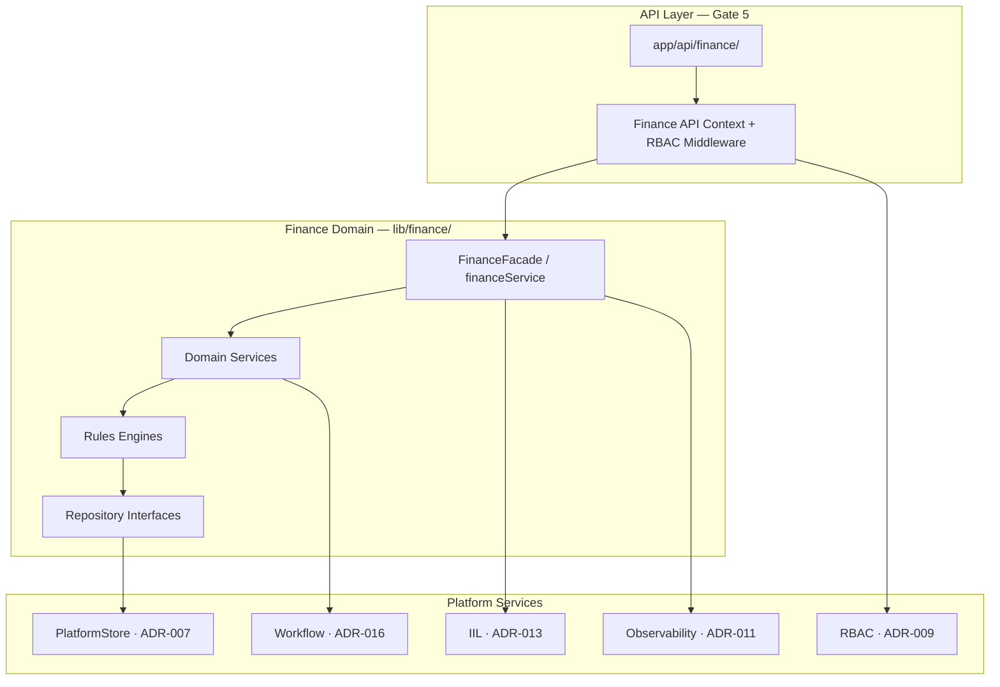

# ES-FIN-002 — Finance Engineering Specification

**Document ID:** ES-FIN-002  
**Program:** P-009 — ORION Enterprise Finance  
**Mission:** P-009.4 — Finance Engineering Specification  
**Gate:** Gate 4 — Engineering Specification  
**Version:** 1.0  
**Status:** Ratified — Gate 4 Engineering Specification  
**Classification:** Engineering Specification · Enterprise Finance  
**Authority:** Chief Enterprise Architect · Finance Domain Lead  
**Effective Date:** 2 August 2026  
**Architecture Baseline:** v1.0 GA Candidate → v2.0 Multi-Domain Baseline

**Supersedes:** [ES-FIN-001](./ES-FIN-001_Finance_Domain_Engineering_Specification.md) for v2.0 authoritative domain implementation  
**Constitutional Blueprints:** [D-007](../Blueprints/D-007_Finance_Domain_Blueprint.md) · [D-008](../Blueprints/D-008_Enterprise_Financial_Event_Model.md) · [D-009](../Blueprints/D-009_Enterprise_Ledger_Principles.md)  
**Gate Inputs:** [P-009.1 Strategic Assessment](../Planning/P-009.1-Finance-Strategic-Assessment.md) · [P-009.2 Domain Model](../Architecture/P-009.2-Finance-Domain-Model.md) · [P-009.3 Governance Rules](../Governance/P-009.3-Finance-Governance-Rules.md)  
**Platform ADRs:** [ADR-007](../../11_Governance/ADR/ADR-007-Production-Persistence-Strategy.md) · [ADR-009 RBAC](../../11_Governance/ADR/ADR-009-Role-Based-Access-Control.md) · [ADR-011 Observability](../../11_Governance/ADR/ADR-011-Observability-Architecture.md) · [ADR-013 IIL](../../11_Governance/ADR/ADR-013-Durable-Intelligent-Integration-Layer.md) · ADR-014 (roadmap) · ADR-016 (roadmap) · ADR-020 (roadmap)  
**Governance:** [ES-092–095](../../00_Governance/) · [ES-097](../../00_Governance/ES-097-ORION-Architecture-Governance-ADR-Policy.md) · [P-016.2 Charter](../../00_Governance/P-016.2-ORION-v2-Architecture-Charter.md)  
**Reference Domain:** [ES-HCM-001](../../HCM/Engineering/ES-HCM-001_Enterprise_HCM_Engineering_Specification.md)

---

## Constitutional Statement

ES-FIN-002 is the **authoritative Gate 4 engineering specification** for ORION Finance v2.0. It defines layered architecture, repository contracts, event catalogue, validation annex, permission catalogue, engineering constraints, testing strategy, and Gate 5 readiness criteria.

**Scope:** Engineering architecture · catalogues · constraints · testing · readiness — specification only.  
**Out of scope:** Implementation · production code · database schema · API route definitions · Gate 5 execution.

**Gate 4 rule (G-001 · ES-092):** No Gate 5 code until this specification is signed and required ADRs are **Accepted**.

---

## 1. Executive Summary

### 1.1 Mission

Deliver the **authoritative engineering blueprint** for ORION Finance as the second enterprise reference domain — replicating the HCM pattern (facade · repository · PlatformStore · RBAC · IIL · certification) while implementing the **financial event hub** role defined in P-016.2.

### 1.2 Scope

| In Scope (Gate 5 targets) | Phase |
|----------------------------|-------|
| General Ledger · Chart of Accounts · Fiscal Periods | Wave A |
| Financial Event Processor · HCM → Finance chain | Wave A |
| PlatformStore PostgreSQL persistence | Wave A |
| Enterprise RBAC · fail-closed REST | Wave A |
| Accounts Receivable · Accounts Payable · Payments | Wave B |
| Banking · Cash · Tax foundation | Wave B |
| Budget · Cost Centre dimensions | Wave B (partial) |
| Executive financial intelligence signals | Wave A/B incremental |
| Workflow approval bindings | Wave A (manual journals) |

### 1.3 Objectives

| # | Objective | Reference |
|---|-----------|-----------|
| O1 | Single public facade (`financeService`) | ES-HCM-001 pattern |
| O2 | All ledger mutations via balanced Journal aggregate | D-009 · P-009.3 JP-001 |
| O3 | Durable IIL ingress/egress aligned with ADR-013 | ADR-013 |
| O4 | PostgreSQL persistence via PlatformStore | ADR-007 |
| O5 | Fail-closed RBAC on all Finance REST routes | ADR-009 · P-009.3 §3 |
| O6 | Idempotent event processing — no duplicate GL posts | ADR-013 §3.7 |
| O7 | Full validation pipeline before every post | P-009.3 §4.2 |
| O8 | Certification tests for docs · events · permissions | ES-096 |

### 1.4 Out of Scope (ES-FIN-002 / Gate 5 deferrals)

| Item | Disposition |
|------|-------------|
| Database DDL / migration SQL | Gate 5 implementation annex |
| REST route implementations | Gate 5 |
| UI / workspace changes beyond facade consumption | ES-025 separate track |
| Multi-company consolidation elimination | Post-v2.0 GA |
| Operations procurement full AP | P-009 Wave B+ / Operations program |
| Analytics read models (CQRS projections) | ADR-017 Wave 4 |
| OAuth2/OIDC | v2.1+ |
| External ERP bank feed connectors | P-010.7 Integration Hub |

---

## 2. Engineering Architecture

### 2.1 Layered Architecture

Every Finance operation follows this call chain (HCM-aligned):

```
REST API route  →  FinanceFacade  →  Domain Service  →  Rules Engine  →  Repository Interface  →  PlatformStore Adapter
```



### 2.2 Layer Rules

| Layer | Package | Responsibility | May Import |
|-------|---------|----------------|------------|
| **API** | `app/api/finance/` | Auth · RBAC · HTTP envelope · pagination | `@/lib/finance` · `@/lib/finance/api` · platform context |
| **Facade** | `lib/finance/index.ts` | Public surface · event-aware wrappers · domain status | Internal wiring · event publisher · constants |
| **Service** | `lib/finance/services/` · module services | Business orchestration | Repository interfaces · rules engines · types |
| **Rules Engine** | `lib/finance/*/RulesEngine.ts` | Validation · posting rules · period rules | Types only — no repositories in engines |
| **Repository** | `lib/finance/repositories/` | Persistence contract · org scoping | Types · PlatformStore adapter interface |
| **Store Adapter** | `lib/finance/store/` (Gate 5) | PostgreSQL / in-memory implementations | PlatformStore · ES-036 patterns |

**Forbidden:** External imports from `lib/finance/*` internal paths · API routes calling repositories directly · cross-domain repository access.

### 2.3 Module Map (Target)

| Module | Path | Aggregates | Gate 5 Wave |
|--------|------|------------|-------------|
| Chart of Accounts | `chart-of-accounts/` | Account · CoA | A |
| General Ledger | `general-ledger/` | Journal · GL balances | A |
| Fiscal Period | `fiscal-period/` | FiscalPeriod | A |
| Event Pipeline | `event-pipeline/` | Idempotency · Lineage | A |
| Executive Intelligence | `executive-intelligence/` | KPI signals | A |
| Receivables | `receivables/` (new) | Invoice | B |
| Payables | `payables/` (new) | VendorBill | B |
| Treasury | `treasury/` (new) | Payment | B |
| Reference Data | `reference/` (new) | Company · Currency · ExchangeRate · TaxProfile · CostCentre | A/B |
| Auth | `auth/` (new) | Permission catalog | A |
| Wiring | `createFinanceWiring.ts` (new) | Composition root | A |

**v0.3 modules** (`lib/finance/` existing) conform to this map — refactored during Gate 5, not replaced wholesale.

### 2.4 Composition Root

Centralized wiring in `lib/finance/createFinanceWiring.ts` (Gate 5):

1. Resolve `ORION_STORE_ADAPTER=memory|postgres` (dev/CI/production policy per ADR-007)
2. Instantiate PlatformStore adapters for each repository
3. Wire domain services with repository dependencies
4. Register IIL inbound subscribers via `registerFinanceSubscribers`
5. Register Finance permissions via `registerFinancePermissions`
6. Inject `IILTransportAdapter` when ADR-013 Implemented
7. Return wiring consumed by `FinanceFacade` constructor

**Rule:** Domains and routes never instantiate repositories directly.

### 2.5 PlatformStore Integration (ADR-007)

| Field | Specification |
|-------|---------------|
| **Adapter pattern** | One PlatformStore persister module per aggregate family |
| **Schema namespace** | `finance_*` tables · platform-owned migrations |
| **Org scoping** | Every query includes `organizationId` from `ServiceContext` |
| **Transactions** | Unit-of-work for Journal post + GL update + sub-ledger + idempotency mark |
| **Dev/CI** | In-memory adapter permitted · CI also runs PostgreSQL certification job |
| **Production** | PostgreSQL only · reject `memory` adapter |
| **Migration** | Versioned forward-only · domain-owned · ADR-012 release step |

**PlatformStore mappings (conceptual — no DDL in this spec):**

| Repository | Store Entity Group |
|------------|-------------------|
| ChartOfAccountsRepository | `finance_account` |
| JournalRepository | `finance_journal` · `finance_journal_line` |
| GeneralLedgerRepository | `finance_gl_balance` |
| PeriodRepository | `finance_fiscal_period` · `finance_fiscal_year` |
| CompanyRepository | `finance_company` |
| ReceivableRepository | `finance_invoice` · `finance_invoice_line` |
| PaymentRepository | `finance_payment` · `finance_payment_allocation` |
| IdempotencyRepository | `finance_idempotency_key` |
| EventLineageRepository | `finance_event_lineage` |
| AuditRepository | `finance_audit_record` |
| TaxRepository | `finance_tax_profile` · `finance_tax_code` |
| BudgetRepository | `finance_budget` · `finance_budget_line` |
| CostCentreRepository | `finance_cost_centre` |
| CurrencyRepository | `finance_currency` |
| ExchangeRateRepository | `finance_exchange_rate` |

### 2.6 RBAC Integration (ADR-009)

| Field | Specification |
|-------|---------------|
| **Catalog** | `lib/finance/auth/finance-permission-catalog.ts` |
| **Registration** | `registerFinancePermissions()` at wiring bootstrap |
| **Middleware** | Route-derived permission lookup · fail-closed 401/403 |
| **Context** | `getFinanceApiContext()` resolves authenticated `ServiceContext` |
| **SoD** | Enforced in ValidationService authorization stage · workflow for approvals |

See §6 Permission Catalogue.

### 2.7 Workflow Integration (ADR-016 Roadmap)

| Trigger | Workflow | Gate |
|---------|----------|------|
| Manual journal submit | Approval → post | Wave A |
| AP payment above threshold | Dual approval | Wave B |
| Period hard close | Controller approval checklist | Wave A |
| Period reopen | Fin Admin + Controller | Wave A |

Finance publishes workflow state transitions as IIL events where material.

### 2.8 IIL Integration (ADR-013)

| Field | Specification |
|-------|---------------|
| **Ingress** | `FinancialEventPipelineService` sole subscriber entry |
| **Egress** | `finance-events.ts` · module `*-events.ts` wrappers on facade |
| **Service ID** | `FINANCE_IIL_SERVICE_ID` (existing constant) |
| **Transport** | `IILTransportAdapter` injected at composition root |
| **Envelope** | ADR-013 canonical fields required |
| **Registry** | Inbound schemas registered per ADR-014 before production |

### 2.9 Observability (ADR-011)

| Signal | Specification |
|--------|---------------|
| **Health** | Extend platform health with Finance subsystem: event processor · DLQ depth · post latency |
| **Logging** | Structured logs include `correlationId` · `journalId` · `organizationId` |
| **Metrics** | Queue lag · posts/sec · validation rejection rate · period state |
| **Tracing** | Cross-domain chain: inbound event → journal → outbound event |

---

## 3. Repository Catalogue

Confirms [P-009.2 §9](../Architecture/P-009.2-Finance-Domain-Model.md) with Gate 4 transaction and PlatformStore requirements.

### 3.1 Repository Interfaces

| Repository | Aggregate(s) | Responsibilities | Transaction Boundary |
|------------|--------------|------------------|----------------------|
| **ChartOfAccountsRepository** | Account | CRUD · hierarchy · deactivate · resolve control accounts | Single-entity |
| **JournalRepository** | Journal · JournalLine | Create draft · post transition · findByCorrelationId · listByPeriod | **Included in post UoW** |
| **GeneralLedgerRepository** | GL balances | getBalance · updateOnPost · trialBalance | **Included in post UoW** |
| **PeriodRepository** | FiscalPeriod | getCurrent · transitionState · postingAllowed query | Read in validation · write on close |
| **CompanyRepository** | Company | CRUD · base currency | Single-entity |
| **CostCentreRepository** | CostCentre | CRUD · hierarchy | Single-entity |
| **BudgetRepository** | Budget | Versions · encumber · variance inputs | Encumbrance in post UoW when enabled |
| **CurrencyRepository** | Currency | Active list · findByCode | Read-mostly |
| **ExchangeRateRepository** | ExchangeRate | findEffectiveRate · save | Read in validation |
| **ReceivableRepository** | Invoice | Issue · cancel · aging · allocate | Issue triggers post UoW |
| **PayableRepository** | VendorBill | Create · approve · aging | Wave B |
| **PaymentRepository** | Payment | Create · allocate · reconcile | Post UoW with cash journal |
| **TaxRepository** | TaxProfile | Codes · effective rules | Read in validation |
| **AuditRepository** | AuditRecord | Append-only · query | Same UoW as triggering mutation |
| **IdempotencyRepository** | IdempotencyKey | exists · markProcessed | **First write in event post UoW** |
| **EventLineageRepository** | EventLineageRef | recordChain · queryByCorrelation | Post-success in UoW |

### 3.2 Repository Contract Rules

| Rule ID | Requirement |
|---------|-------------|
| **REP-001** | All methods accept `ServiceContext` or explicit `organizationId` |
| **REP-002** | Return types use `readonly` collections |
| **REP-003** | `domain: "finance"` discriminator on factory registration |
| **REP-004** | No cross-domain types in repository interfaces |
| **REP-005** | Interface changes require ES-FIN-002 version bump |
| **REP-006** | PostgreSQL adapter implements same interface as in-memory |

### 3.3 Unit of Work — Journal Post Transaction

Atomic boundary for `PostingService.post()`:

```
BEGIN
  IdempotencyRepository.markProcessed (if event-driven)
  JournalRepository.savePosted(journal)
  GeneralLedgerRepository.updateBalances(journal.lines)
  ReceivableRepository / PaymentRepository updates (if applicable)
  EventLineageRepository.recordChain
  AuditRepository.append
COMMIT
  → publish outbound IIL events (after commit)
```

**Rollback:** Any failure → no outbound accounting events · rejection audit only.

---

## 4. Complete Event Catalogue

### 4.1 Envelope Standard (ADR-013 Alignment)

Every Finance inbound and outbound event SHALL conform:

| Field | Required | Notes |
|-------|----------|-------|
| `eventId` | Yes | UUID v4 |
| `eventType` | Yes | Namespaced · see tables below |
| `eventVersion` | Yes | Semver or integer · ADR-020 |
| `sourceService` | Yes | Registered service ID |
| `sourceDomain` | Yes | `finance` · `hcm` · `crm` · `hospitality` · `operations` |
| `organizationId` | Yes | Tenant scope |
| `entityType` | Yes | Business entity type |
| `entityId` | Yes | Business entity ID |
| `timestamp` | Yes | ISO-8601 UTC |
| `actorId` | Yes | From ServiceContext or system actor |
| `correlationId` | Yes | Propagated through chains |
| `causationId` | No | Parent eventId |
| `idempotencyKey` | Yes (inbound) | ADR-013 §3.7 |
| `partitionKey` | Yes | `{organizationId}:{entityType}:{entityId}` |
| `priority` | Yes | low · normal · high · critical |
| `securityClassification` | Yes | internal default for financial data |
| `payload` | Yes | Versioned schema per ADR-014 |
| `auditMetadata` | Yes | Actor role · workspace |

### 4.2 Inbound Events (Finance Subscribes)

| eventType | eventVersion | Source | Schema Owner | Finance Action | Idempotency Entity |
|-----------|--------------|--------|--------------|----------------|-------------------|
| `hcm.workforce.cost.recorded` | 1 | HCM | ADR-014 | Expense GL journal | `employeeId` + cost period |
| `hcm.expense.approved` | 1 | HCM | ADR-014 | AP/reimbursement journal | `expenseId` |
| `crm.opportunity.won` | 1 | CRM | ADR-014 | Revenue recognition journal | `opportunityId` |
| `crm.invoice.issued` | 1 | CRM | ADR-014 | AR invoice + journal | `invoiceId` |
| `hospitality.folio.closed` | 1 | Hospitality | ADR-014 | Revenue + tax journal | `folioId` |
| `hospitality.payment.settled` | 1 | Hospitality | ADR-014 | Payment receipt + cash journal | `paymentId` |
| `operations.purchase.received` | 1 | Operations | ADR-014 | AP accrual (Wave B+) | `purchaseId` |

**Inbound validation (P-009.3 IEV-*):** ServiceRegistry · schema · org scope · idempotency before transform.

### 4.3 Outbound Events (Finance Publishes)

#### Accounting Events (post-commit)

| eventType | eventVersion | Trigger | Key Payload Fields |
|-----------|--------------|---------|-------------------|
| `finance.journal.posted` | 1 | Successful post | `journalId` · `periodId` · `totalDebit` · `correlationId` |
| `finance.journal.reversed` | 1 | Reversal post | `originalJournalId` · `reversalJournalId` |
| `finance.period.hard_closed` | 1 | Period hard close | `periodId` · `companyId` · `closedAt` |

#### Financial Events

| eventType | eventVersion | Trigger | Key Payload Fields |
|-----------|--------------|---------|-------------------|
| `finance.invoice.issued` | 1 | AR invoice posted | `invoiceId` · `partyId` · `amount` · `currency` |
| `finance.invoice.paid` | 1 | Invoice fully paid | `invoiceId` · `paymentId` |
| `finance.invoice.cancelled` | 1 | Credit/cancel workflow | `invoiceId` · `reasonCode` |
| `finance.payment.received` | 1 | Customer receipt | `paymentId` · `amount` · `partyId` |
| `finance.payment.disbursed` | 1 | Vendor payment | `paymentId` · `vendorId` |
| `finance.revenue.recognized` | 1 | Recognition journal | `sourceEntityId` · `amount` |

#### Intelligence Events

| eventType | eventVersion | Trigger | Key Payload Fields |
|-----------|--------------|---------|-------------------|
| `finance.kpi.updated` | 1 | Material post / period activity | `kpiCode` · `value` · `periodId` |
| `finance.alert.raised` | 1 | Threshold breach | `alertCode` · `severity` · `message` |
| `finance.variance.alert` | 1 | Budget hard/soft breach | `budgetId` · `varianceAmount` |

### 4.4 Versioning (ADR-020 Roadmap)

| Rule | Specification |
|------|---------------|
| Initial catalogue | `eventVersion: 1` for all types above |
| Additive payload fields | Minor version bump optional · backward compatible |
| Breaking changes | New `eventType` suffix or major version · ADR required |
| Certification | Doc tests assert catalogue paths and event type inventory |

### 4.5 Correlation

| Rule | Specification |
|------|---------------|
| Inbound | Preserve publisher `correlationId` |
| Derived | Set `causationId` = inbound `eventId` |
| Outbound | Propagate same `correlationId` on all derived events |
| Storage | EventLineageRepository records full chain |

### 4.6 Idempotency

| Rule | Specification |
|------|---------------|
| Key format | `{organizationId}:{sourceService}:{eventType}:{entityId}:{businessSequence}` |
| Check timing | Before EventTransformationService (VAL-IDP-001) |
| Mark timing | Start of post UoW (before journal persist) |
| Consumer | GL posting dedupes on `eventId` AND idempotency key |
| Window | 24 hours minimum · configurable per event type |

### 4.7 Replay Considerations (ADR-013)

| Scenario | Behaviour |
|----------|-----------|
| Consumer bug recovery | Replay by `correlationId` · dedupe prevents double-post |
| New subscriber backfill | Replay from durable store · read-only until post |
| Certification | Staging replay of HCM cost chain required at Gate 6 |
| Permission | `finance.event.replay` · Controller approval in production |
| Audit | All replays append AuditRecord |

**Gate 5 blocker:** Durable IIL (ADR-013 **Implemented**) required before production inbound processing — in-memory transport acceptable for unit tests only.

---

## 5. Validation Specification

### 5.1 Posting Pipeline

```
IIL Inbound / Manual Submit
    → FinancialEventPipelineService.receive()
    → ValidationService.runStages()
    → EventTransformationService.transform()  [inbound only]
    → JournalCompositionService.compose()
    → ValidationService.runStages()  [journal]
    → PostingService.post()
    → Outbound IIL publish (post-commit)
    → ExecutiveSignalService.evaluate()
```

### 5.2 Validation Order

Per [P-009.3 §4.2](../Governance/P-009.3-Finance-Governance-Rules.md):

| Order | Stage | Rule IDs | Engine |
|-------|-------|----------|--------|
| 1 | Organization | VAL-ORG-001 · VAL-ORG-002 | ValidationService |
| 2 | Period | VAL-PER-001 · VAL-PER-002 | PeriodRulesEngine |
| 3 | Duplicate / Idempotency | VAL-IDP-001 · VAL-IDP-002 | ValidationService + IdempotencyRepository |
| 4 | Accounts | VAL-ACC-001 · VAL-ACC-002 | CoaRulesEngine · LedgerRulesEngine |
| 5 | Currency | VAL-CUR-001 · VAL-CUR-002 | ValidationService |
| 6 | Balance | VAL-BAL-001 | LedgerRulesEngine |
| 7 | Authorization | VAL-AUTH-001 · VAL-AUTH-002 | ValidationService + RBAC |
| 8 | Budget (optional) | BUD-001 · BUD-002 | BudgetVarianceService |

### 5.3 Failure Handling

| Result | Ledger | Audit | IIL |
|--------|--------|-------|-----|
| **Pass** | Mutation proceeds | Append on success | Outbound events post-commit |
| **Fail** | No mutation | Rejection audit record | No accounting events |
| **Warn** | Mutation proceeds (budget soft) | Warning flag | `finance.variance.alert` |

Structured rejection shape:

```typescript
// Conceptual — not production code
{
  stage: ValidationStage;
  code: string;       // e.g. PERIOD_CLOSED
  message: string;
  field?: string;
}
```

### 5.4 Error Categories

| Category | Code Prefix | HTTP (API layer) | Retry |
|----------|-------------|------------------|-------|
| Organization scope | `ORGANIZATION_*` | 400 | No |
| Period control | `PERIOD_*` | 409 | No |
| Idempotency duplicate | `DUPLICATE_*` | 409 | No (idempotent success optional) |
| Account | `ACCOUNT_*` | 400 | No |
| Currency / FX | `CURRENCY_*` | 400 | No |
| Balance | `BALANCE_*` | 422 | No |
| Authorization | `AUTH_*` | 401/403 | No |
| Budget block | `BUDGET_*` | 422 | No |
| Infrastructure | `INFRA_*` | 503 | Yes (IIL retry per ADR-013) |

### 5.5 Retry Behaviour

| Layer | Policy |
|-------|--------|
| **IIL delivery** | ADR-013: 5 attempts · exponential backoff · DLQ on exhaustion |
| **Posting transaction** | No partial retry — full UoW rollback · caller retries idempotently |
| **Validation** | No retry — fix input or event |
| **Outbound publish** | Post-commit · async · retry via IIL transport |

---

## 6. Permission Catalogue

Maps [P-009.3 §3](../Governance/P-009.3-Finance-Governance-Rules.md) to engineering codes. Route patterns defined at Gate 5 — permissions defined here.

### 6.1 Administrative Permissions

| Code | Capability | Typical Routes (Gate 5) |
|------|------------|-------------------------|
| `finance.admin` | CoA · company · currency · tax · master data | `/api/finance/admin/*` |
| `finance.period.close` | Period transitions · reopen | `/api/finance/periods/*/close` |
| `finance.budget.write` | Budget versions · encumbrance | `/api/finance/budgets/*` |
| `finance.event.replay` | IIL replay operations | `/api/finance/events/replay` |

### 6.2 Operational Permissions

| Code | Capability | Typical Routes (Gate 5) |
|------|------------|-------------------------|
| `finance.journal.read` | GL inquiry · trial balance · journals | `/api/finance/ledger/*` · `/api/finance/journals/*` |
| `finance.journal.write` | Draft manual journals | `POST /api/finance/journals` |
| `finance.journal.post` | Post approved/system journals | `POST /api/finance/journals/*/post` |
| `finance.journal.reverse` | Reversal journals | `POST /api/finance/journals/*/reverse` |
| `finance.journal.approve` | Workflow approval | `POST /api/finance/journals/*/approve` |
| `finance.ar.read` | AR inquiry · aging | `/api/finance/receivables/*` |
| `finance.ar.write` | Issue/cancel invoices | `POST/PATCH /api/finance/receivables/*` |
| `finance.ap.read` | AP inquiry · aging | `/api/finance/payables/*` |
| `finance.ap.write` | Bills · vendor ops | `POST/PATCH /api/finance/payables/*` |
| `finance.payment.disburse` | Outbound payments | `POST /api/finance/payments/disburse` |
| `finance.controller` | Policy waivers · high approvals | Cross-cutting approval endpoints |

### 6.3 Audit Permissions

| Code | Capability | Typical Routes (Gate 5) |
|------|------------|-------------------------|
| `finance.audit.read` | Audit trail · lineage query | `/api/finance/audit/*` |

### 6.4 Executive Permissions

| Code | Capability | Typical Routes (Gate 5) |
|------|------------|-------------------------|
| `finance.intelligence.read` | KPIs · alerts · executive summary | `/api/finance/intelligence/*` |
| `finance.budget.read` | Budget vs actual views | `/api/finance/budgets` (GET) |
| `finance.journal.read` | Limited GL read (executive) | Scoped read endpoints |

### 6.5 Role → Permission Mapping

| Role | Permissions |
|------|-------------|
| **Finance Administrator** | All except none excluded |
| **Controller** | All except `finance.admin` standalone — has `finance.controller` |
| **Accountant** | journal.* · ledger read · intelligence.read · budget.read |
| **Accounts Payable** | ap.* · payment.disburse · ap.read |
| **Accounts Receivable** | ar.* · ar.read |
| **Auditor** | *.read · finance.audit.read |
| **Executive** | intelligence.read · budget.read · limited journal.read |
| **Read-only** | journal.read · ar.read (aging only) · ap.read (aging only) |

### 6.6 Route Permission Rules (ADR-009)

| Rule | Requirement |
|------|-------------|
| FIN-RBAC-001 | Every route maps to exactly one permission |
| FIN-RBAC-002 | Unmapped route fails CI certification test |
| FIN-RBAC-003 | Fail-closed middleware on all `/api/finance/*` |
| FIN-RBAC-004 | Permission catalog registered before routes merge |

**Gate 5 deliverable:** `finance-permission-catalog.ts` + `FinanceDomainCertification.test.ts` path coverage

---

## 7. Engineering Constraints

| ID | Constraint | Enforcement |
|----|------------|-------------|
| **EC-001** | No cross-domain repository access | Architecture tests · code review |
| **EC-002** | External imports `@/lib/finance` only | ESLint import rules · cert tests |
| **EC-003** | No direct SQL outside PlatformStore adapters | Code review · adapter-only data access |
| **EC-004** | Double-entry: Σ debits = Σ credits | LedgerRulesEngine · POST-001 |
| **EC-005** | Posted journals immutable | Journal aggregate state machine |
| **EC-006** | Repository isolation per aggregate | No cross-repo joins in services |
| **EC-007** | Rules in engines — not routes | PeriodRulesEngine · LedgerRulesEngine · CoaRulesEngine |
| **EC-008** | IIL-only cross-domain integration | No CRM/HCM/Hospitality imports in Finance |
| **EC-009** | Events published from facade/event modules only | Code review |
| **EC-010** | Platform services via injection — not duplicated | Composition root |
| **EC-011** | Organization isolation on every repository call | Adapter base class |
| **EC-012** | No Gate 5 code without this spec + Accepted ADRs | ES-094 CP-G4 |

---

## 8. Testing Strategy

Per [ES-096](../../00_Governance/ES-096-ORION-Enterprise-Testing-Certification-Standards.md) · HCM reference (`tests/lib/finance/` existing).

### 8.1 Unit Tests

| Target | Scope |
|--------|-------|
| Rules engines | LedgerRulesEngine · PeriodRulesEngine · CoaRulesEngine · PipelineRulesEngine |
| Validation stages | Each VAL-* stage in isolation |
| Event transformation | D-008 mapping templates · mock payloads |
| Value objects | Money · AccountCode · IdempotencyKey validation |
| Tax calculation | TaxCalculationService |

**Location:** `tests/lib/finance/unit/`  
**Requirement:** No Next.js · no HTTP · inject in-memory repositories

### 8.2 Integration Tests

| Target | Scope |
|--------|-------|
| PostingService UoW | Journal + GL + idempotency atomicity |
| Event pipeline | Inbound event → journal → GL balance |
| Period gating | Post rejected on HardClosed |
| Reversal chain | Original + reversal linkage |
| Sub-ledger control | AR total = control account |

**Location:** `tests/lib/finance/integration/`  
**Adapter:** In-memory default · PostgreSQL optional with env

### 8.3 Certification Tests

| Target | Scope |
|--------|-------|
| Domain certification | `FinanceDomainCertification.test.ts` — module inventory |
| Doc paths | Governance + ES-FIN-002 references |
| Event catalogue | All event types registered |
| Permission catalogue | All routes mapped |
| Facade boundary | No internal exports from index |

**Verdict driver:** Gate 6 GO / CONDITIONAL GO

### 8.4 Performance Tests

| Target | Threshold (Gate 6) |
|--------|-------------------|
| Trial balance query | p95 < 500ms (10k journals fixture) |
| Event post pipeline | p95 < 200ms (single HCM cost event) |
| Bulk period close | < 30s checklist (design partner scale) |

**Framework:** P-015.9 performance modules · Gate 6 evidence

### 8.5 Security Tests

| Target | Scope |
|--------|-------|
| Fail-closed RBAC | 401 unauthenticated · 403 unauthorized |
| Org isolation | Cross-tenant read/write rejected |
| SoD | Creator cannot approve same journal |
| Replay permission | Unauthorized replay rejected |

**Location:** `tests/lib/finance/security/` · `tests/lib/platform/security/` integration

### 8.6 Regression Tests

| Rule | Requirement |
|------|-------------|
| Full suite | `npm test` — full count recorded · not domain-only |
| Four gates | typecheck · lint · test · build on every PR |
| CI PostgreSQL | GA staging pattern for Finance adapter |
| HCM chain | Regression test: HCM cost event → Finance GL |

---

## 9. Gate 5 Readiness Checklist

### 9.1 Engineering Prerequisites

| # | Prerequisite | Status | Owner |
|---|--------------|--------|-------|
| E1 | ES-FIN-002 ratified (this document) | ✅ | CEA |
| E2 | P-009.1 Gate 1 ✅ | ✅ | Program |
| E3 | P-009.2 Gate 2 ✅ | ✅ | Program |
| E4 | P-009.3 Gate 3 ✅ | ✅ | Program |
| E5 | Finance Domain Lead assigned | ✅ | Program Director |
| E6 | `createFinanceWiring.ts` spec understood | ✅ | Finance Eng |
| E7 | PlatformStore finance adapter design reviewed | Pending | Platform Eng |

### 9.2 Architecture Compliance

| # | Checkpoint | Status |
|---|------------|--------|
| A1 | P-016.2 Charter Commitment A1 (replicate HCM) | ✅ Specified |
| A2 | Finance as hub (A3) — inbound catalogue defined | ✅ §4.2 |
| A3 | Facade boundary documented | ✅ §2 |
| A4 | No cross-domain repository reads | ✅ EC-001 |
| A5 | ES-094 CP-G4 passed | ✅ Gate 4 sign-off |

### 9.3 Governance Compliance

| # | Checkpoint | Status |
|---|------------|--------|
| G1 | Eight financial policies reflected in validation | ✅ §5 |
| G2 | Permission catalogue complete | ✅ §6 |
| G3 | SoD rules in validation + workflow | ✅ §5 · §2.7 |
| G4 | Audit append-only specified | ✅ §3.1 AuditRepository |
| G5 | ES-092 lifecycle Gate 4 complete | ✅ This document |

### 9.4 ADR Dependencies

| ADR | Required Status for Gate 5 | Current | Blocker? |
|-----|---------------------------|---------|----------|
| **ADR-013** Durable IIL | **Accepted** minimum · **Implemented** for production inbound | **Proposed** | **YES** |
| **ADR-014** Event Contracts | **Accepted** | Planned | **YES** |
| **ADR-015** Domain Boundaries | **Accepted** | Planned | **YES** |
| **ADR-020** Versioning | **Accepted** | Planned | **YES** |
| **ADR-007** PlatformStore | **Accepted** · HCM Implemented | ✅ | No |
| **ADR-009** RBAC | **Accepted** · HCM Implemented | ✅ | No |
| **ADR-016** Workflow | **Accepted** (soft) | Planned | Soft |
| **ADR-011** Observability | **Accepted** | ✅ | No |
| **ADR-012** Release | **Accepted** | ✅ | No |

### 9.5 Outstanding Blockers

| ID | Blocker | Severity | Resolution |
|----|---------|----------|--------------|
| **B1** | ADR-013 not Accepted | **Critical** | ARB review · Proposed → Accepted |
| **B2** | ADR-014 not Accepted | **High** | Event schema registry mission |
| **B3** | ADR-015 not Accepted | **High** | Domain boundary ADR |
| **B4** | ADR-020 not Accepted | **High** | Versioning ADR |
| **B5** | Finance PostgreSQL adapter not implemented | **High** | Gate 5 Wave A · Platform Eng |
| **B6** | v1.0 Gate 7 pending | Medium | Founder sign-off · commercial baseline |
| **B7** | TD-DOMAIN-PERSIST-001 open | **High** | Closed by Gate 5 Wave A completion |

### 9.6 Gate 5 Entry Verdict

| Assessment | Verdict |
|------------|---------|
| Gate 4 engineering specification complete | **GO** |
| Gate 5 implementation authorized | **NO-GO** until B1–B4 Accepted |
| Gate 5 Wave A (in-memory dev + architecture spike) | **CONDITIONAL GO** — spike only with Accepted ADRs |

---

## 10. Executive Recommendation

### 10.1 Decision Matrix

| Question | Assessment | Verdict |
|----------|------------|---------|
| Is ES-FIN-002 complete for Gate 4? | All 9 sections · catalogues · readiness | **GO** |
| Is architecture HCM-aligned? | Facade · repo · PlatformStore · RBAC · IIL | **GO** |
| Is event catalogue sufficient for Wave A? | 7 inbound · 12 outbound · ADR-013 envelope | **GO** |
| Is validation annex complete? | 8 stages · error categories · retry | **GO** |
| Is permission catalogue ready for Gate 5? | 17 codes · 8 roles · route rules | **GO** |
| May Gate 5 production implementation begin? | ADR-013–015 · ADR-020 not Accepted | **NO-GO** |

### 10.2 Final Verdict

| Assessment | Verdict |
|------------|---------|
| **P-009.4 Gate 4 Engineering Specification mission** | **GO** |
| **ES-FIN-002 as authoritative v2.0 engineering reference** | **GO** |
| **Gate 5 implementation (production)** | **NO-GO** |
| **Gate 5 planning and ADR closure track** | **CONDITIONAL GO** |
| **Overall P-009 Gate 4** | **GO** |

**Conditions for unconditional Gate 5 GO:**

1. ADR-013 · ADR-014 · ADR-015 · ADR-020 **Accepted**
2. Platform Engineering approves Finance PlatformStore adapter design
3. ADR-013 **Implemented** before production inbound HCM chain
4. Finance permission catalog + certification tests in first Gate 5 PR

### 10.3 Immediate Next Actions

| # | Action | Owner | Target |
|---|--------|-------|--------|
| 1 | CEA + Chief Architect Gate 4 sign-off | CEA | Aug 2026 |
| 2 | Advance ADR-013 Proposed → Accepted | Platform · ARB | 2027 Q1 |
| 3 | Draft ADR-014 event contract schemas from §4.2 | Finance + Platform | Post ADR-013 Accept |
| 4 | PlatformStore finance adapter design review | Platform Engineering | Pre-Gate 5 |
| 5 | Plan Gate 5 Wave A mission breakdown (P-009.5+) | Finance Domain Lead | Sep 2026 |

---

## 11. Sign-Off

| Role | Decision | Date |
|------|----------|------|
| Chief Enterprise Architect | **GO** — Gate 4 ES-FIN-002 ratified | 2 Aug 2026 |
| Chief Architect | **GO** | 2 Aug 2026 |
| Finance Domain Lead | **GO** | 2 Aug 2026 |
| Platform Engineering Lead | **CONDITIONAL GO** — pending adapter design | 2 Aug 2026 |
| Program Director | **GO** | 2 Aug 2026 |

---

## 12. Related Deliverables

| Document | Path |
|----------|------|
| ES-FIN-001 (superseded v0.3) | [ES-FIN-001_Finance_Domain_Engineering_Specification.md](./ES-FIN-001_Finance_Domain_Engineering_Specification.md) |
| P-009.3 Governance Rules | [P-009.3-Finance-Governance-Rules.md](../Governance/P-009.3-Finance-Governance-Rules.md) |
| P-009.2 Domain Model | [P-009.2-Finance-Domain-Model.md](../Architecture/P-009.2-Finance-Domain-Model.md) |
| ADR-013 | [ADR-013-Durable-Intelligent-Integration-Layer.md](../../11_Governance/ADR/ADR-013-Durable-Intelligent-Integration-Layer.md) |
| ES-HCM-001 Reference | [ES-HCM-001_Enterprise_HCM_Engineering_Specification.md](../../HCM/Engineering/ES-HCM-001_Enterprise_HCM_Engineering_Specification.md) |
| ES-096 Testing | [ES-096-ORION-Enterprise-Testing-Certification-Standards.md](../../00_Governance/ES-096-ORION-Enterprise-Testing-Certification-Standards.md) |

---

## 13. Version History

| Version | Date | Author | Changes |
|---------|------|--------|---------|
| 1.0 | 2026-08-02 | Chief Enterprise Architect | Initial Gate 4 ratification — supersedes ES-FIN-001 for v2.0 |

---

*ES-FIN-002 — Gate 4 engineering specification only · No implementation · No APIs · No schema · Gate 5 blocked until ADR-013–015 · ADR-020 Accepted*
