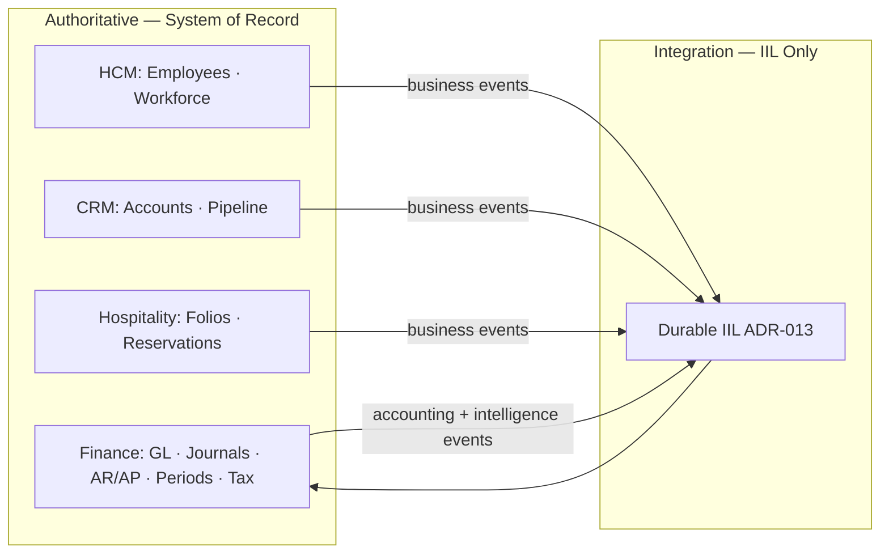

# P-009.3 — Finance Governance Rules (Gate 3)

**Document ID:** P-009.3-GOV-001  
**Program:** P-009 — ORION Enterprise Finance  
**Mission:** P-009.3 — Finance Governance Rules  
**Gate:** Gate 3 — Governance Rules  
**Version:** 1.0  
**Status:** Ratified — Gate 3 Governance Rules  
**Classification:** Domain Governance · Enterprise Finance  
**Authority:** Chief Enterprise Architect · Finance Domain Lead  
**Rules Date:** 2 August 2026  
**Architecture Baseline:** v1.0 GA Candidate → v2.0 Multi-Domain Baseline

**Parent:** [P-009.2 Finance Domain Model](../Architecture/P-009.2-Finance-Domain-Model.md) (Gate 2 ✅)  
**Baseline Inputs:** [P-009.1 Strategic Assessment](../Planning/P-009.1-Finance-Strategic-Assessment.md) · [P-016.2 Architecture Charter](../../00_Governance/P-016.2-ORION-v2-Architecture-Charter.md) · [ADR-013 Durable IIL](../../11_Governance/ADR/ADR-013-Durable-Intelligent-Integration-Layer.md) · [P-016.3 ADR Program (ADR-014 roadmap)](../../00_Governance/P-016.3-ORION-v2-ADR-Program.md) · [ES-092–095](../../00_Governance/) · [D-009 Ledger Principles](../Blueprints/D-009_Enterprise_Ledger_Principles.md) · [HCM Permission Model](../../HCM/Engineering/HCM-Technical-Debt-Register.md) (ADR-009 reference)

---

## Constitutional Statement

This document is the **authoritative Gate 3 governance rules** for ORION Finance. It defines financial policies, permission matrix, rule engine catalogue, event governance, authoritative data ownership, and compliance controls for Gate 4 (Engineering Specification) and Gate 5 implementation.

**Scope:** Governance rules · policies · permissions · rule catalogue · compliance — architecture only.  
**Out of scope:** Implementation · code · persistence · APIs · Gate 5.

**Governance hierarchy:**

```
ORION Canon → G-001 → ES-092 Lifecycle → ES-094 Compliance → P-009.3 (this document) → ES-FIN-002 (Gate 4)
```

**HCM reference alignment:** Finance adopts the HCM pattern — domain permission catalog · route-derived permissions · fail-closed middleware · rules in engines · segregation of duties · audit on material mutations.

---

## 1. Executive Summary

Gate 3 translates the [P-009.2 domain model](../Architecture/P-009.2-Finance-Domain-Model.md) into **enforceable governance rules**. Finance is the **authoritative financial system of record**; these rules ensure posting integrity, period control, RBAC enforcement, event contract compliance, and audit traceability before any Gate 5 code.

**Deliverables:**

| Deliverable | Section |
|-------------|---------|
| Financial policies (8) | §2 |
| Permission matrix (8 roles) | §3 |
| Rule engine catalogue | §4 |
| Event governance | §5 |
| Authoritative data matrix | §6 |
| Compliance framework | §7 |

**Gate 3 verdict:** Governance rules complete for Gate 4 entry — **GO** with conditions in §12.

---

## 2. Financial Policies

### 2.1 Journal Posting Policy

| Rule ID | Policy |
|---------|--------|
| **JP-001** | All ledger mutations occur **only** through balanced **Journal** aggregates |
| **JP-002** | Σ debits = Σ credits for every journal — no exceptions (D-009) |
| **JP-003** | Minimum two journal lines per posted journal |
| **JP-004** | Posted journals are **immutable** — corrections via reversal journal only |
| **JP-005** | Every posted journal references source: business event · financial event · or governed manual entry |
| **JP-006** | System-generated journals from IIL events require valid `idempotencyKey` (ADR-013) |
| **JP-007** | Manual journals require workflow approval before post (Approval Policy) |
| **JP-008** | Posting to inactive or non-leaf accounts prohibited unless adjustment policy explicitly allows |
| **JP-009** | Sub-ledger documents (Invoice · Payment) generate journals — never post directly to GL |

**Authority:** Controller approves policy exceptions · documented in AuditRecord

---

### 2.2 Fiscal Period Policy

| Rule ID | Policy |
|---------|--------|
| **FP-001** | Every journal assigned to exactly one **FiscalPeriod** |
| **FP-002** | Standard posting permitted only when period state = **Open** |
| **FP-003** | **SoftClosed** permits adjustment and reversal journals per configured policy |
| **FP-004** | **HardClosed** prohibits all posting except governed reopen workflow |
| **FP-005** | Period transitions require Controller or Finance Administrator role |
| **FP-006** | Hard close requires close checklist completion (trial balance · sub-ledger reconciliation) |
| **FP-007** | Hard close publishes `finance.period.hard_closed` — triggers intelligence and reporting freeze |
| **FP-008** | Reopen of hard-closed period requires Finance Administrator + audit justification |

**Authority:** Controller owns period calendar · Finance Administrator executes close/reopen

---

### 2.3 Currency Policy

| Rule ID | Policy |
|---------|--------|
| **CU-001** | Every journal declares transaction **Currency** (ISO 4217) |
| **CU-002** | Company **base currency** set once before first posted journal — change requires ADR waiver |
| **CU-003** | Foreign currency journals require effective **ExchangeRate** at journal date |
| **CU-004** | FX gain/loss posted via designated adjustment accounts — not manual override |
| **CU-005** | Inactive currencies prohibited for new journals |
| **CU-006** | Rounding differences within defined tolerance post to rounding account |

**Authority:** Finance Administrator maintains currency and rate tables

---

### 2.4 Tax Policy

| Rule ID | Policy |
|---------|--------|
| **TX-001** | Tax calculated from active **TaxProfile** — not ad-hoc rates on journal lines |
| **TX-002** | Issued invoices require tax lines when taxable supply |
| **TX-003** | Tax posted to designated liability/recoverable accounts per TaxProfile |
| **TX-004** | Tax profile changes effective-dated — no retroactive application to posted journals |
| **TX-005** | Tax adjustments via credit note or adjustment journal — not invoice edit |

**Authority:** Controller approves TaxProfile activation · Accountant applies on transactions

---

### 2.5 Approval Policy

| Rule ID | Policy |
|---------|--------|
| **AP-001** | Manual journals above materiality threshold require workflow approval (ADR-016) |
| **AP-002** | AP payment disbursements require Accounts Payable + Controller dual approval above threshold |
| **AP-003** | Period hard close requires Controller approval |
| **AP-004** | CoA structural changes (new control accounts) require Finance Administrator approval |
| **AP-005** | Approver cannot be sole creator of same journal (segregation of duties) |
| **AP-006** | Emergency post without approval requires waiver (ES-094 §7) · post-audit within 24 hours |

**Materiality thresholds:** Defined per organization in Gate 4 ES-FIN-002 — configurable, not hard-coded

---

### 2.6 Reversal Policy

| Rule ID | Policy |
|---------|--------|
| **RV-001** | Reversal implemented as new journal referencing original `journalId` |
| **RV-002** | Reversal lines mirror original debits/credits inverted |
| **RV-003** | Reversal permitted only in period allowing reversals (Open or SoftClosed per policy) |
| **RV-004** | System event corrections use compensating business event + new journal — not silent delete |
| **RV-005** | Reversal requires reason code and AuditRecord |
| **RV-006** | Original and reversal journals linked in EventLineageRepository |

**Authority:** Accountant initiates · Controller approves above materiality

---

### 2.7 Budget Control Policy

| Rule ID | Policy |
|---------|--------|
| **BG-001** | Active **Budget** version explicit per fiscal year/scenario |
| **BG-002** | Encumbrance recorded on commitment events where policy enabled |
| **BG-003** | Over-budget posting: **Warn** at soft threshold · **Block** at hard threshold (configurable) |
| **BG-004** | Variance alerts published to Intelligence when materiality exceeded |
| **BG-005** | Budget figures never override ledger actuals — variance read from GL |

**Authority:** Controller owns budget approval · Finance Administrator maintains versions

---

### 2.8 Audit Policy

| Rule ID | Policy |
|---------|--------|
| **AU-001** | Every material mutation creates append-only **AuditRecord** |
| **AU-002** | Audit includes: actor · role · timestamp · entity · action · correlationId |
| **AU-003** | Posted journals · period transitions · master data changes are material |
| **AU-004** | Audit records never updated or deleted |
| **AU-005** | Auditor role has read-only access to all Finance data and audit trail |
| **AU-006** | Audit retention minimum 7 years (compliance target) |
| **AU-007** | Failed validation attempts on inbound IIL events logged — no ledger mutation |

**Authority:** Finance Administrator ensures retention · Auditor validates compliance

---

## 3. Permission Matrix

### 3.1 Role Definitions

| Role | Description |
|------|-------------|
| **Finance Administrator** | Domain config: CoA · periods · currencies · tax · company · roles |
| **Controller** | Financial control: approvals · period close · policy exceptions · budget approval |
| **Accountant** | GL operations: manual journals · reversals · inquiries · reconciliation support |
| **Accounts Payable** | Vendor bills · payment scheduling · AP aging |
| **Accounts Receivable** | Customer invoices · receipts · AR aging |
| **Auditor** | Read-only: all Finance data · audit trail · reports |
| **Executive** | Executive intelligence · KPI dashboards · Brief — no posting |
| **Read-only** | Inquiry: trial balance · limited reports — no mutations |

### 3.2 Permission Codes (Conceptual)

| Code | Capability |
|------|------------|
| `finance.admin` | Master data · CoA · company · currency · tax · period admin |
| `finance.controller` | Approvals · period close · policy waiver initiate |
| `finance.journal.read` | View journals · trial balance · GL inquiry |
| `finance.journal.write` | Create draft manual journals |
| `finance.journal.post` | Post system and approved journals |
| `finance.journal.reverse` | Create reversal journals |
| `finance.journal.approve` | Approve manual journals (workflow) |
| `finance.ar.read` / `finance.ar.write` | AR invoice and receipt operations |
| `finance.ap.read` / `finance.ap.write` | AP bill and payment operations |
| `finance.payment.disburse` | Execute outbound payments |
| `finance.period.close` | Soft/hard close · reopen |
| `finance.budget.read` / `finance.budget.write` | Budget inquiry and maintenance |
| `finance.audit.read` | Audit trail access |
| `finance.intelligence.read` | KPI · alerts · executive financial views |
| `finance.event.replay` | Elevated IIL replay (ADR-013) |

### 3.3 Role × Permission Matrix

| Permission | Fin Admin | Controller | Accountant | AP | AR | Auditor | Executive | Read-only |
|------------|:---------:|:----------:|:----------:|:--:|:--:|:-------:|:---------:|:---------:|
| `finance.admin` | ✅ | ❌ | ❌ | ❌ | ❌ | ❌ | ❌ | ❌ |
| `finance.controller` | ✅ | ✅ | ❌ | ❌ | ❌ | ❌ | ❌ | ❌ |
| `finance.journal.read` | ✅ | ✅ | ✅ | ◐ | ◐ | ✅ | ◐ | ✅ |
| `finance.journal.write` | ✅ | ✅ | ✅ | ❌ | ❌ | ❌ | ❌ | ❌ |
| `finance.journal.post` | ✅ | ✅ | ✅ | ❌ | ❌ | ❌ | ❌ | ❌ |
| `finance.journal.reverse` | ✅ | ✅ | ✅ | ❌ | ❌ | ❌ | ❌ | ❌ |
| `finance.journal.approve` | ✅ | ✅ | ❌ | ❌ | ❌ | ❌ | ❌ | ❌ |
| `finance.ar.read` | ✅ | ✅ | ✅ | ❌ | ✅ | ✅ | ◐ | ◐ |
| `finance.ar.write` | ✅ | ✅ | ◐ | ❌ | ✅ | ❌ | ❌ | ❌ |
| `finance.ap.read` | ✅ | ✅ | ✅ | ✅ | ❌ | ✅ | ❌ | ❌ |
| `finance.ap.write` | ✅ | ✅ | ◐ | ✅ | ❌ | ❌ | ❌ | ❌ |
| `finance.payment.disburse` | ✅ | ✅ | ❌ | ✅* | ❌ | ❌ | ❌ | ❌ |
| `finance.period.close` | ✅ | ✅ | ❌ | ❌ | ❌ | ❌ | ❌ | ❌ |
| `finance.budget.read` | ✅ | ✅ | ✅ | ◐ | ◐ | ✅ | ✅ | ◐ |
| `finance.budget.write` | ✅ | ✅ | ❌ | ❌ | ❌ | ❌ | ❌ | ❌ |
| `finance.audit.read` | ✅ | ✅ | ◐ | ❌ | ❌ | ✅ | ❌ | ❌ |
| `finance.intelligence.read` | ✅ | ✅ | ✅ | ◐ | ◐ | ✅ | ✅ | ❌ |
| `finance.event.replay` | ✅ | ✅ | ❌ | ❌ | ❌ | ❌ | ❌ | ❌ |

**Legend:** ✅ Full · ◐ Subset (own sub-ledger only) · ❌ None  
**\* AP disburse:** Requires dual approval above threshold per AP-002

### 3.4 RBAC Enforcement Rules (ADR-009)

| Rule | Requirement |
|------|-------------|
| **RBAC-001** | Permission catalog defined **before** Finance REST routes (Gate 4) |
| **RBAC-002** | Fail-closed: unauthenticated → 401 · unauthorized → 403 |
| **RBAC-003** | Every route maps to exactly one permission code |
| **RBAC-004** | Organization isolation enforced at repository layer regardless of role |
| **RBAC-005** | Executive and Read-only roles cannot post or approve |
| **RBAC-006** | Platform registers Finance permissions at domain bootstrap (HCM pattern) |

**Gate 4 deliverable:** `finance-permission-catalog.ts` specification in ES-FIN-002

---

## 4. Rule Engine Catalogue

Rules live in **rules engines** — not routes · not UI · not orchestrators (Architecture Handbook).

### 4.1 Posting Rules

| Rule ID | Engine | Condition | Action |
|---------|--------|-----------|--------|
| **POST-001** | LedgerRulesEngine | Σ debits ≠ Σ credits | Reject · `BALANCE_MISMATCH` |
| **POST-002** | LedgerRulesEngine | < 2 lines | Reject · `MIN_LINES` |
| **POST-003** | LedgerRulesEngine | Account inactive | Reject · `ACCOUNT_INACTIVE` |
| **POST-004** | LedgerRulesEngine | Non-leaf account | Reject · `NON_POSTING_ACCOUNT` |
| **POST-005** | PostingService | Period not Open (standard post) | Reject · `PERIOD_CLOSED` |
| **POST-006** | PostingService | Missing source reference | Reject · `ORPHAN_JOURNAL` |
| **POST-007** | PostingService | Duplicate idempotency key | Skip or reject · `DUPLICATE_EVENT` |
| **POST-008** | PostingService | Sub-ledger out of balance with control account | Reject · `CONTROL_ACCOUNT_MISMATCH` |

---

### 4.2 Validation Rules

Execution order per ES-FIN-001 (Gate 4 implements):

```
Organization → Period → Duplicate/Idempotency → Accounts → Currency → Balance → Authorization
```

| Stage | Rule ID | Validation |
|-------|---------|------------|
| **Organization** | VAL-ORG-001 | `organizationId` matches ServiceContext |
| **Organization** | VAL-ORG-002 | `companyId` valid for organization |
| **Period** | VAL-PER-001 | Period exists and permits posting type |
| **Period** | VAL-PER-002 | Journal date within period range |
| **Duplicate** | VAL-IDP-001 | Idempotency key not processed (IdempotencyRepository) |
| **Duplicate** | VAL-IDP-002 | Event `eventId` not duplicate within dedupe window |
| **Accounts** | VAL-ACC-001 | All account IDs exist and active |
| **Accounts** | VAL-ACC-002 | Account type appropriate for line (e.g., revenue credit) |
| **Currency** | VAL-CUR-001 | Currency code valid and active |
| **Currency** | VAL-CUR-002 | Exchange rate exists for foreign currency date |
| **Balance** | VAL-BAL-001 | Debits equal credits |
| **Authorization** | VAL-AUTH-001 | Actor has required permission for operation |
| **Authorization** | VAL-AUTH-002 | Approval reference present when required |

**Output:** Pass → continue · Fail → structured rejection + audit log · no ledger mutation

---

### 4.3 Period Controls

| Rule ID | Period State | Standard Post | Adjustment | Reversal | Manual Close |
|---------|--------------|---------------|------------|----------|--------------|
| **PER-001** | Future | ❌ | ❌ | ❌ | ❌ |
| **PER-002** | Open | ✅ | ✅ | ✅ | ❌ |
| **PER-003** | SoftClosed | ❌ | ✅* | ✅ | ✅ |
| **PER-004** | HardClosed | ❌ | ❌ | ❌ | ❌ |

**\* Adjustment in SoftClosed:** Requires Controller permission

**Engine:** PeriodRulesEngine · consulted by ValidationService before every post

---

### 4.4 Approval Rules

| Rule ID | Trigger | Approver | SoD Check |
|---------|---------|----------|-----------|
| **APR-001** | Manual journal > materiality | Controller or delegated approver | Creator ≠ approver |
| **APR-002** | AP payment > threshold | AP create · Controller approve | AP-002 |
| **APR-003** | Period hard close | Controller | N/A |
| **APR-004** | CoA control account change | Finance Administrator | N/A |
| **APR-005** | Period reopen | Finance Administrator + Controller | N/A |

**Engine:** Workflow Platform (ADR-016) · Finance trigger bindings · state persisted via Workflow

---

### 4.5 Budget Validation

| Rule ID | Condition | Mode | Action |
|---------|-----------|------|--------|
| **BUD-001** | Encumbrance + actual > budget soft limit | Warn | Post with `finance.variance.alert` |
| **BUD-002** | Encumbrance + actual > budget hard limit | Block | Reject · `BUDGET_EXCEEDED` |
| **BUD-003** | No active budget version | Warn | Post · log informational |
| **BUD-004** | Cost centre required on expense line | Block | Reject · `COST_CENTRE_REQUIRED` |

**Engine:** BudgetVarianceService · invoked during ValidationService authorization stage

---

### 4.6 Cross-Company Rules

| Rule ID | Policy | v2.0 GA Scope |
|---------|--------|---------------|
| **XC-001** | Every journal scoped to single `companyId` | **Required** |
| **XC-002** | Inter-company journals use designated IC due/to accounts | Planned · Gate 5 Wave B |
| **XC-003** | Consolidation elimination entries | Deferred post-GA |
| **XC-004** | Cross-company posting requires Finance Administrator | When IC enabled |
| **XC-005** | Company base currency isolation — no cross-currency post without FX | **Required** |

**Engine:** CrossCompanyRulesEngine (Gate 4+) · validates company dimension on all lines

---

## 5. Event Governance

Per [ADR-013](../../11_Governance/ADR/ADR-013-Durable-Intelligent-Integration-Layer.md) · [ADR-014 roadmap](../../00_Governance/P-016.3-ORION-v2-ADR-Program.md) · [D-008 Event Model](../Blueprints/D-008_Enterprise_Financial_Event_Model.md).

### 5.1 Inbound Event Validation

| Rule ID | Requirement |
|---------|-------------|
| **IEV-001** | Publisher registered in IIL ServiceRegistry |
| **IEV-002** | Event envelope conforms to ADR-013 (eventId · eventType · eventVersion · organizationId · correlationId · idempotencyKey) |
| **IEV-003** | Event schema registered in ADR-014 contract registry before production processing |
| **IEV-004** | `sourceDomain` must be authorized publisher (HCM · CRM · Hospitality · Operations) |
| **IEV-005** | Payload validated against versioned schema — reject on schema failure (dead-letter) |
| **IEV-006** | Idempotency checked before transformation (VAL-IDP-001) |
| **IEV-007** | Unknown event types logged · no ledger mutation · optional DLQ |

**Authorized inbound events (priority v2.0):**

| Event Type | Source | Finance Transformation |
|------------|--------|------------------------|
| `hcm.workforce.cost.recorded` | HCM | Expense journal |
| `hcm.expense.approved` | HCM | AP/reimbursement journal |
| `crm.opportunity.won` | CRM | Revenue recognition |
| `crm.invoice.issued` | CRM | AR invoice + journal |
| `hospitality.folio.closed` | Hospitality | Revenue + tax journal |
| `hospitality.payment.settled` | Hospitality | Payment receipt |

---

### 5.2 Outbound Event Standards

| Rule ID | Requirement |
|---------|-------------|
| **OEV-001** | Finance publishes only from facade wrapper or domain event modules |
| **OEV-002** | Accounting events (`finance.journal.posted`) published **after** successful atomic post |
| **OEV-003** | Intelligence events published after materiality evaluation — not on every line |
| **OEV-004** | All outbound events include `correlationId` propagated from inbound chain |
| **OEV-005** | Event catalogue documented with certification tests (Gate 4) |
| **OEV-006** | Breaking payload changes require ADR-020 approval |

**Priority outbound events:**

| Event Type | Category | Consumers |
|------------|----------|-----------|
| `finance.journal.posted` | Accounting | Intelligence · Audit · ADR-017 |
| `finance.journal.reversed` | Accounting | Intelligence · Audit |
| `finance.period.hard_closed` | Period | Intelligence · Reporting |
| `finance.invoice.issued` | Financial | CRM (read) · Intelligence |
| `finance.kpi.updated` | Intelligence | Executive Brief |
| `finance.alert.raised` | Intelligence | Executive Brief |

---

### 5.3 Event Ownership

| Event Layer | Owner | Publisher Authority |
|-------------|-------|---------------------|
| **Business events** | Operational domains | HCM · CRM · Hospitality · Operations |
| **Financial events** | Finance | Finance Event Processor |
| **Accounting events** | Finance | PostingService (post-success) |
| **Intelligence events** | Finance (derivatives) | ExecutiveSignalService |

Finance **must not** publish business events on behalf of operational domains.

---

### 5.4 Versioning Rules (ADR-020 Roadmap)

| Rule ID | Requirement |
|---------|-------------|
| **VER-001** | Every event carries `eventVersion` |
| **VER-002** | Additive optional fields — no ADR required |
| **VER-003** | Breaking changes → new major version or new `eventType` |
| **VER-004** | Dual publishing allowed during migration — bounded period · documented |
| **VER-005** | Consumers must tolerate unknown optional fields |

---

### 5.5 Correlation

| Rule ID | Requirement |
|---------|-------------|
| **COR-001** | Platform generates `correlationId` if not supplied |
| **COR-002** | Finance-derived events inherit inbound `correlationId` |
| **COR-003** | `causationId` set to parent `eventId` for derived events |
| **COR-004** | EventLineageRepository records full chain for audit |
| **COR-005** | Operator trace: HCM cost → Finance journal → Brief signal via correlationId |

---

### 5.6 Idempotency

| Rule ID | Requirement |
|---------|-------------|
| **IDP-001** | Publisher key: `{organizationId}:{sourceService}:{eventType}:{entityId}:{businessSequence}` |
| **IDP-002** | Consumer dedupe on `eventId` and idempotency key |
| **IDP-003** | GL posting handlers strictly idempotent — duplicate events cannot double-post |
| **IDP-004** | IdempotencyRepository marks processed keys before post commit |
| **IDP-005** | Dedupe window minimum 24 hours · configurable per event type |

---

### 5.7 Replay Governance

| Rule ID | Requirement |
|---------|-------------|
| **RPL-001** | Replay requires `finance.event.replay` permission |
| **RPL-002** | All replay operations audited with actor · criteria · outcome |
| **RPL-003** | Replay creates new delivery attempts — does not mutate original envelope |
| **RPL-004** | Consumer dedupe prevents double-post on replay |
| **RPL-005** | Production replay requires Controller approval + change record |
| **RPL-006** | Staging replay permitted for certification evidence (Gate 6) |

---

## 6. Authoritative Data Matrix

### 6.1 System of Record

| Data Entity | System of Record | Domain | Mutable By |
|-------------|------------------|--------|------------|
| General Ledger balances | **Finance** | Finance | Journal post only |
| Journal · JournalLine | **Finance** | Finance | PostingService |
| Chart of Accounts · Account | **Finance** | Finance | Finance Administrator |
| Fiscal Period | **Finance** | Finance | Controller / Fin Admin |
| Invoice (financial AR) | **Finance** | Finance | AR workflows |
| Payment (financial) | **Finance** | Finance | AP/AR/Treasury |
| Budget · CostCentre | **Finance** | Finance | Controller / Fin Admin |
| Company (financial entity) | **Finance** | Finance | Finance Administrator |
| Currency · ExchangeRate | **Finance** | Finance | Finance Administrator |
| TaxProfile | **Finance** | Finance | Finance Administrator |
| AuditRecord | **Finance** | Finance | Append-only |
| Idempotency keys | **Finance** | Finance | Event Processor |
| Event lineage | **Finance** | Finance | Event Processor |

### 6.2 Reference Data (Finance Holds Financial View)

| Reference | Authoritative Source | Finance Holds | Reference Rule |
|-----------|---------------------|---------------|----------------|
| Customer party | **CRM** | `partyId` on Invoice | ID only · no CRM repo read at post |
| Employee | **HCM** | `employeeId` on expense lines | ID only |
| Vendor | **Operations/CRM** (future) | `vendorId` on AP | ID only |
| Guest folio | **Hospitality** | `folioId` in event payload | Event-only · no folio repo |
| Organization tenant | **Platform Identity** | `organizationId` | ServiceContext |
| User/actor | **Platform Identity** | `actorId` in AuditRecord | ServiceContext |

### 6.3 Read Models (Non-Authoritative)

| Read Model | Source | Owner | Staleness |
|------------|--------|-------|-----------|
| Trial balance view | GeneralLedgerRepository | Finance facade | Real-time post-query |
| AR aging report | ReceivableRepository | Finance facade | Real-time |
| Executive financial KPI | Finance intelligence events | Intelligence | Eventual |
| Analytics projections | ADR-017 read models | Intelligence | Eventual |
| CRM pipeline dashboard | CRM domain | CRM | Not financial truth |

### 6.4 Cross-Domain Ownership Summary



**Prohibited:** Finance repository reads HCM/CRM/Hospitality stores · operational domain posts to GL directly

---

## 7. Compliance

### 7.1 Audit

| Control | Implementation |
|---------|----------------|
| Immutable audit trail | AuditRecord aggregate · AU-004 |
| Actor attribution | ServiceContext · RBAC role on every mutation |
| Event lineage | EventLineageRepository · correlationId chain |
| Failed attempt logging | IEV-007 · inbound rejection audit |
| Retention | AU-006 · 7-year minimum target |

### 7.2 Traceability

| Trace Path | Evidence |
|------------|----------|
| Business event → journal | EventLineageRepository · correlationId |
| Journal → GL balance | journalId on balance update |
| Invoice → payment → cash | PaymentAllocation · journal links |
| Period close → reporting | `finance.period.hard_closed` event |
| Manual journal → approver | Workflow instance · AuditRecord |

### 7.3 Segregation of Duties

| SoD Rule | Control |
|----------|---------|
| Creator ≠ approver | APR-001 · APR-005 |
| AP create ≠ payment approve (high value) | AP-002 |
| Posting ≠ period close without Controller | FP-005 · APR-003 |
| Admin config ≠ audit-only role | Permission matrix §3.3 |
| Executive ≠ posting | RBAC-005 |

### 7.4 Financial Controls

| Control | Policy / Rule |
|---------|---------------|
| Double-entry balance | JP-002 · POST-001 |
| Period gating | FP-001–004 · PER-001–004 |
| Immutable posted history | JP-004 · RV-001 |
| Idempotent event processing | IDP-001–005 |
| Sub-ledger reconciliation | POST-008 · FP-006 |
| Budget enforcement | BG-001–003 · BUD-001–002 |
| Tax compliance | TX-001–005 |

### 7.5 Exception Handling

| Exception Type | Process | Authority |
|----------------|---------|-----------|
| Validation failure | Structured rejection · audit · no post | Automatic |
| Policy waiver | ES-094 waiver record · compensating controls | Controller + CEA |
| Emergency post | AP-006 · 24-hour retroactive audit | Finance Administrator |
| Event schema mismatch | Dead-letter · operator review | Platform + Finance |
| Period reopen | FP-008 · dual approval | Fin Admin + Controller |

**Waiver prohibited for:** Fail-closed RBAC · cross-domain repository reads · unbalanced journals · ADR-013 idempotency bypass

---

## 8. Gate 3 Exit Criteria

| # | Criterion | Status |
|---|-----------|--------|
| G3-1 | Eight financial policies defined | ✅ §2 |
| G3-2 | Permission matrix with eight roles | ✅ §3 |
| G3-3 | Rule engine catalogue (posting · validation · period · approval · budget · cross-company) | ✅ §4 |
| G3-4 | Event governance (inbound · outbound · versioning · correlation · idempotency · replay) | ✅ §5 |
| G3-5 | Authoritative data matrix | ✅ §6 |
| G3-6 | Compliance framework (audit · SoD · controls · exceptions) | ✅ §7 |
| G3-7 | Alignment with P-009.2 domain model | ✅ |
| G3-8 | CEA Gate 3 approval | Pending sign-off |

**Gate 3 mission verdict:** **GO**

---

## 9. Readiness for Gate 4 (Engineering Specification)

| # | Criterion | Status | Gate 4 Deliverable |
|---|-----------|--------|-------------------|
| R4-1 | ES-FIN-002 engineering spec from this model + rules | Pending | ES-FIN-002 |
| R4-2 | Finance permission catalog specification | Pending | ES-FIN-002 §RBAC |
| R4-3 | Full event catalogue with schemas | Pending | Finance-Event-Catalogue.md |
| R4-4 | Validation stage implementation annex | Partial (ES-FIN-001) | ES-FIN-002 §Validation |
| R4-5 | ADR-013 Accepted | Pending (Proposed) | Gate 5 blocker |
| R4-6 | ADR-014 Accepted | Pending | Event schema registry |

**Gate 4 entry verdict:** **GO**

---

## 10. Executive Recommendation

### 10.1 Decision Matrix

| Question | Assessment | Verdict |
|----------|------------|---------|
| Are financial policies complete and enforceable? | 8 policies · 50+ rules | **GO** |
| Is permission matrix sufficient for SoD? | 8 roles · fail-closed · HCM-aligned | **GO** |
| Is rule engine catalogue ready for ES-FIN-002? | 6 rule categories · IDs assigned | **GO** |
| Is event governance aligned with ADR-013/014? | Inbound/outbound · idempotency · replay | **GO** |
| Is authoritative data matrix clear? | SoR · reference · read models | **GO** |
| May Gate 5 implementation begin? | Gate 4 incomplete · ADR-013 Proposed | **NO-GO** |

### 10.2 Final Verdict

| Assessment | Verdict |
|------------|---------|
| **P-009.3 Gate 3 Governance Rules mission** | **GO** |
| **Finance governance rules authority** | **GO** |
| **Gate 4 Engineering Specification entry** | **GO** |
| **Gate 5 implementation** | **NO-GO** |
| **Overall P-009 Gate 3** | **GO** |

### 10.3 Immediate Next Actions

| # | Action | Owner | Target |
|---|--------|-------|--------|
| 1 | CEA sign-off Gate 3 governance rules | Chief Enterprise Architect | Aug 2026 |
| 2 | Launch P-009.4 Gate 4 ES-FIN-002 mission | Finance Domain Lead | Sep 2026 |
| 3 | Publish Finance Event Catalogue (full D-008 mapping) | Finance + Platform | Gate 4 |
| 4 | Specify finance-permission-catalog in ES-FIN-002 | Finance + Security | Gate 4 |
| 5 | Track ADR-013 → Accepted for Gate 5 planning | Platform Engineering | 2027 Q1 |

---

## 11. Sign-Off

| Role | Decision | Date |
|------|----------|------|
| Chief Enterprise Architect | **GO** — Gate 3 governance rules accepted | 2 Aug 2026 |
| Finance Domain Lead | **GO** | 2 Aug 2026 |
| Security Architect | **GO** — RBAC matrix reviewed | 2 Aug 2026 |
| Program Director | **GO** | 2 Aug 2026 |

---

## 12. Related Deliverables

| Document | Path |
|----------|------|
| P-009.1 Gate 1 | [P-009.1-Finance-Strategic-Assessment.md](../Planning/P-009.1-Finance-Strategic-Assessment.md) |
| P-009.2 Gate 2 | [P-009.2-Finance-Domain-Model.md](../Architecture/P-009.2-Finance-Domain-Model.md) |
| D-009 Ledger Principles | [D-009_Enterprise_Ledger_Principles.md](../Blueprints/D-009_Enterprise_Ledger_Principles.md) |
| ADR-013 | [ADR-013-Durable-Intelligent-Integration-Layer.md](../../11_Governance/ADR/ADR-013-Durable-Intelligent-Integration-Layer.md) |
| ES-094 Compliance | [ES-094-Enterprise-Architecture-Compliance-Standard.md](../../00_Governance/ES-094-Enterprise-Architecture-Compliance-Standard.md) |
| HCM RBAC reference | [hcm-permission-catalog.ts](../../lib/hcm/auth/hcm-permission-catalog.ts) |

---

*P-009.3 — Gate 3 governance only · No code · No persistence · No APIs · Next mission: P-009.4 Gate 4 Engineering Specification (ES-FIN-002)*
