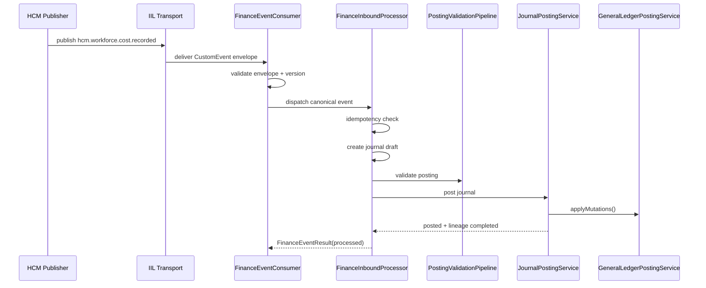

# HCM → Finance Event Chain

**Document ID:** FIN-INT-001  
**Program:** P-009 — ORION Enterprise Finance  
**Mission:** P-009.9 — HCM → Finance Durable Event Chain  
**Version:** 1.0  
**Status:** Implemented — First Cross-Domain Business Transaction  
**Classification:** Platform Architecture · Finance Integration  
**Date:** 3 August 2026

**Baseline:** [ADR-013](../../11_Governance/ADR/ADR-013-Durable-Intelligent-Integration-Layer.md) · [ADR-014](../../11_Governance/ADR/ADR-014-Cross-Domain-Event-Contracts.md) · [Posting Validation Pipeline](../Services/Posting-Validation-Pipeline.md)

---

## Purpose

Documents the **HCM → Finance durable event chain** — the first production-grade cross-domain business workflow in ORION v2.0 Wave A.

Finance consumes authoritative HCM events through the Intelligent Integration Layer and executes governed journal posting via the existing validation and posting pipeline.

**Scope:** `hcm.workforce.cost.recorded` and `hcm.expense.approved` only.

---

## Architecture

```
HCM Publisher
  → IIL Transport (ADR-013)
  → FinanceEventConsumer
        ├── Envelope validation
        ├── Version validation
        └── Organization validation
  → FinanceEventDispatcher
  → FinanceInboundProcessor
        ├── Contract validation
        ├── Idempotency (EventLineageRepository)
        ├── FinanceEventMapper → JournalDraftInput + PostingContext
        ├── PostingValidationPipeline
        ├── JournalPostingService
        └── GeneralLedgerPostingService
  → PlatformStore commit
  → EventLineage completed
```

| Component | Responsibility |
|-----------|----------------|
| `FinanceEventConsumer` | IIL subscription · envelope/version/org validation |
| `FinanceEventDispatcher` | Route by canonical `eventType` |
| `FinanceEventMapper` | Map HCM payload → journal draft + posting context (no calculations) |
| `FinanceInboundProcessor` | End-to-end orchestration inside posting UoW |
| `FinanceEventResult` | Structured processing outcome |

---

## Sequence



---

## Transaction Boundary

The entire workflow executes inside the **PlatformStore `TransactionManager`** boundary established by `JournalPostingService`:

- Validation failure → no journal mutation · no ledger mutation · rollback
- Posting failure → journal reverted to `draft` · rollback
- Duplicate idempotency key → short-circuit without double GL entries

Idempotency is enforced at three layers:

1. **EventLineageRepository** — inbound duplicate detection
2. **PostingValidationPipeline** — idempotency stage
3. **JournalPostingService** — completed duplicate short-circuit

---

## Supported Events

| eventType | Finance Action | Idempotency Entity |
|-----------|----------------|-------------------|
| `hcm.workforce.cost.recorded` | Payroll expense journal (Dr 5100 · Cr 3100) | `employeeId` + `costPeriodId` |
| `hcm.expense.approved` | AP/reimbursement journal (Dr 5100 · Cr 2100) | `expenseId` |

**Contract version:** `eventVersion: 1` (ADR-020)

---

## Extension Points

| Extension | Mission |
|-----------|---------|
| CRM / Hospitality inbound chains | Wave A+ |
| Durable IIL transport adapter | ADR-013 production |
| `finance.journal.posted` outbound | ADR-014 egress |
| BudgetVarianceService integration | P-009.9+ |
| Event contract JSON schema registry | ADR-014 certification |

---

*HCM → Finance Event Chain · P-009.9 · First multi-domain business transaction*
