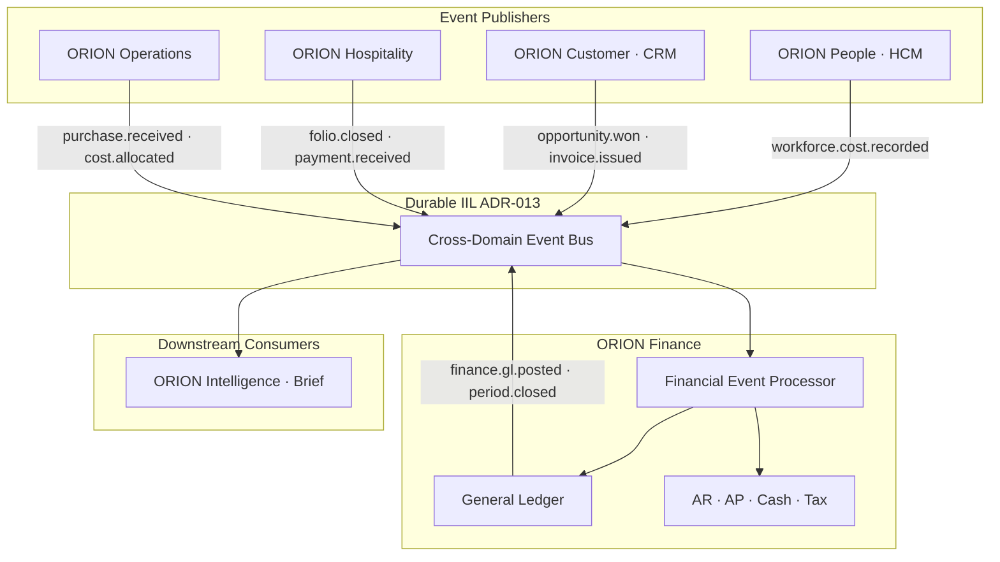
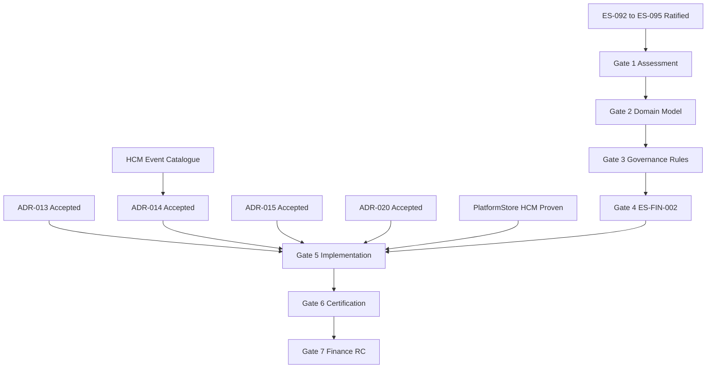

# P-009.1 — Finance Domain Strategic Assessment (Gate 1)

**Document ID:** P-009.1-ASSESS-001  
**Program:** P-009 — ORION Enterprise Finance  
**Mission:** P-009.1 — Finance Domain Strategic Assessment  
**Gate:** Gate 1 — Business Domain Blueprint / Strategic Assessment  
**Version:** 1.0  
**Status:** Ratified — Gate 1 Strategic Assessment  
**Classification:** Domain Planning · Architecture · Governance  
**Authority:** Chief Enterprise Architect · Finance Domain Lead (assigned at Gate 2)  
**Assessment Date:** 2 August 2026  
**Architecture Baseline:** v1.0 GA Candidate → v2.0 Multi-Domain Baseline  
**Development Branch:** `develop/v2.0` (architecture missions only — no Gate 5)

**Baseline Inputs:** [P-016.1 v2.0 Strategic Planning](../../00_Governance/P-016.1-ORION-v2-Strategic-Planning.md) · [P-016.2 Architecture Charter](../../00_Governance/P-016.2-ORION-v2-Architecture-Charter.md) · [P-016.3 ADR Program](../../00_Governance/P-016.3-ORION-v2-ADR-Program.md) · [ADR-013 Durable IIL](../11_Governance/ADR/ADR-013-Durable-Intelligent-Integration-Layer.md) · [ES-092–095](../../00_Governance/) · [Architecture Handbook v1.0](../../00_Governance/ORION_Enterprise_Architecture_Handbook_v1.0.md) · [Master Roadmap v1.0](../../00_Governance/ORION_Enterprise_Platform_Master_Roadmap_v1.0.md) · [ES-HCM-001 Reference Domain](../HCM/Engineering/ES-HCM-001_Enterprise_HCM_Engineering_Specification.md)

**Prior Art (v0.3 — requires v2.0 elevation):** [D-007 Finance Blueprint](../Blueprints/D-007_Finance_Domain_Blueprint.md) · [D-008 Financial Event Model](../Blueprints/D-008_Enterprise_Financial_Event_Model.md) · [D-009 Ledger Principles](../Blueprints/D-009_Enterprise_Ledger_Principles.md) · [ES-FIN-001](../Engineering/ES-FIN-001_Finance_Domain_Engineering_Specification.md)

---

## Constitutional Statement

This document initiates **Gate 1** of the ORION Finance Domain Program (P-009) under the v2.0 governance framework. It establishes the strategic assessment for Finance as the **second enterprise reference domain** after HCM.

**Scope:** Strategic assessment · business scope · domain relationships · architecture assessment · risks · dependencies · Gate 1 exit criteria.  
**Out of scope:** Implementation · database schema · APIs · services · Gate 5 code.

---

## 1. Executive Summary

### 1.1 Why Finance Is the Next Strategic Domain

ORION v1.0 delivered a **production-certified platform core** and **HCM reference domain**. The Executive Operating System narrative cannot be commercially credible without **authoritative financial truth**. Finance is the mandatory second domain because:

| Reason | Evidence |
|--------|----------|
| **Executive OS completeness** | Brief and intelligence require financial signals — not placeholder workspace data |
| **Cross-domain hub** | P-016.2 Commitment A3 — HCM workforce cost, CRM revenue, and Hospitality folio events converge on Finance |
| **Commercial bundle** | Design partner offer expands from HCM-only to HCM + Finance (2027 H2+ target) |
| **Domain dependency chain** | CRM elevation, Hospitality folio posting, and Operations procurement all **hard-depend** on Finance |
| **Master Roadmap sequence** | P-009 follows P-015 · precedes P-008 Phase II and P-007 Phase II |
| **Reference architecture replication** | HCM proved facade · repository · PlatformStore · RBAC · IIL · certification — Finance inherits the pattern |

Finance is not a greenfield concept. Constitutional blueprints (D-007–D-009), ES-FIN-001, workspace UI, and substantial `lib/finance/` modules exist at **v0.3 construction maturity**. v2.0 Gate 1 re-frames Finance as an **enterprise authoritative domain program** — not a workspace feature.

### 1.2 Business Objectives

| # | Objective | Success Measure |
|---|-----------|-----------------|
| BO-1 | **Authoritative general ledger** | Journal entries persist across restart · trial balance certified |
| BO-2 | **Financial event hub** | HCM → Finance workforce cost chain operational on durable IIL |
| BO-3 | **Sub-ledger completeness** | AR · AP · Banking · Cash within Finance bounded context |
| BO-4 | **Period control** | Fiscal open/close governs posting · audit trail complete |
| BO-5 | **Executive financial intelligence** | Brief signals sourced from Finance IIL events — not seeds |
| BO-6 | **Design partner readiness** | Finance RC credible for paid pilot (2028 Q1 target) |
| BO-7 | **ERP replacement narrative** | Finance + HCM bundle supports mid-market credibility |

### 1.3 Enterprise Value

| Stakeholder | Value |
|-------------|-------|
| **Executives** | Trusted P&L, cash, and variance intelligence in Executive Brief |
| **Finance operators** | Single ledger · controlled periods · auditable journal lineage |
| **Domain programs** | CRM, Hospitality, Operations publish events — Finance posts without coupling |
| **Platform engineering** | Second PlatformStore consumer validates v2.0 persistence pattern |
| **Commercial** | Unlocks HCM + Finance design partner · path to three-domain bundle |
| **Governance** | Proves v2.0 multi-domain architecture beyond single reference domain |

---

## 2. Business Scope

Finance owns the **financial interpretation** of enterprise activity. Operational domains retain authoritative operational records; Finance maintains the authoritative financial record.

### 2.1 In-Scope Capabilities

| Capability | Description | v0.3 State | v2.0 Gate 5 Target |
|------------|-------------|------------|-------------------|
| **General Ledger** | Journal entries · posting · trial balance · inquiry | Module exists · in-memory | Authoritative · PostgreSQL |
| **Chart of Accounts** | Account hierarchy · types · mapping standards | P-009.2 delivered · in-memory | Persistent · certified |
| **Accounts Payable** | Vendor bills · obligations · aging · settlement | Service stubs | Gate 5+ implementation |
| **Accounts Receivable** | Customer invoices · credit notes · aging · collections | Service stubs | Gate 5+ implementation |
| **Banking** | Bank accounts · statements · reconciliation state | Repository interfaces | Gate 5+ implementation |
| **Cash Management** | Cash position · transfers · liquidity snapshots | Service stubs | Gate 5+ implementation |
| **Budgets** | Budget versions · allocations · variance baselines | Service stubs | Post-GL wave |
| **Cost Centres** | Cost dimension definitions · allocation targets | CoA dimension support | Full dimension posting |
| **Financial Periods** | Fiscal calendar · open/close · posting restrictions | P-009.5 delivered · in-memory | Persistent · period lock certified |
| **Journal Processing** | Manual and system-generated entries · approval intent | Posting interface · journal stub | P-009.4+ · workflow integration |
| **Financial Reporting** | Balance sheet · P&L · cash flow · management packs | Deferred | Post sub-ledger wave |
| **Tax Foundation** | Tax codes · tax lines · compliance reporting inputs | TaxService stub | Foundation at RC minimum |
| **Audit Trail** | Actor · timestamp · source event lineage on all mutations | Event pipeline lineage · partial | Full RBAC audit · ADR-009 |
| **Multi-company readiness** | Org-scoped today · entity/company dimension future | `organizationId` isolation | Company dimension in CoA · deferred GA |

### 2.2 Scope Boundary

| Finance Owns | Finance Does Not Own |
|--------------|---------------------|
| GL · CoA · journals · AR/AP · cash · tax · budgets · periods | CRM accounts · opportunities · pipeline |
| Financial interpretation of business events | HCM employee master · payroll calculation engine |
| Authoritative ledger balances | Hospitality reservations · guest folios (source events only) |
| Financial KPIs and executive financial intelligence | Operational procurement · inventory execution |

Reference: [D-007 §4–5](../Blueprints/D-007_Finance_Domain_Blueprint.md)

### 2.3 Phased Delivery (Planning)

| Phase | Scope | Target |
|-------|-------|--------|
| **Gates 1–4** | Blueprint · domain model · governance rules · ES-FIN-002 | 2026 Q4 – 2027 Q2 |
| **Gate 5 Wave A** | PlatformStore · event processor · GL · periods · HCM chain | 2027 Q2 – Q3 |
| **Gate 5 Wave B** | AR · AP · banking · cash | 2027 Q4 – 2028 Q1 |
| **Gate 6–7** | Certification · Finance RC · design partner | 2028 Q1 |

---

## 3. Relationship to Other Domains

Finance is the **integration hub** for financial consequences. Cross-domain integration is **IIL-only** per Architecture Handbook and ADR-013.

### 3.1 HCM (ORION People)

| Integration | Direction | Event Examples | Finance Action |
|-------------|-----------|----------------|----------------|
| **Payroll costs** | HCM → Finance | `hcm.workforce.cost.recorded` | GL expense posting · cost centre |
| **Employee expenses** | HCM → Finance | `hcm.expense.approved` | AP liability or reimbursement |
| **Workforce analytics** | Finance → Intelligence | `finance.workforce.cost.summary` | Brief workforce cost signal |

**Dependency:** HCM v1.0 GA (reference) · ADR-013 · ADR-014 event contracts.  
**Priority chain:** First cross-domain chain to certify (P-016.2 Wave 2).

### 3.2 CRM (ORION Customer)

| Integration | Direction | Event Examples | Finance Action |
|-------------|-----------|----------------|----------------|
| **Revenue** | CRM → Finance | `crm.opportunity.won` | Revenue recognition · deferred revenue |
| **Invoices** | CRM → Finance | `crm.invoice.issued` | AR sub-ledger · GL receivable |
| **Payments** | CRM/Hospitality → Finance | `payment.received` | Cash · AR clearance |

**Dependency:** Finance alpha minimum before CRM Gate 5 (P-016.3 release blockers).  
**Rule:** CRM does not post to GL directly.

### 3.3 Hospitality

| Integration | Direction | Event Examples | Finance Action |
|-------------|-----------|----------------|----------------|
| **Guest folios** | Hospitality → Finance | `hospitality.folio.closed` | Revenue · tax · payment allocation |
| **Bookings** | Hospitality → Finance | `hospitality.reservation.confirmed` | Deposit liability (optional) |
| **Payments** | Hospitality → Finance | `hospitality.payment.settled` | Cash · folio clearance |

**Dependency:** Finance event processor operational · ADR-013 Implemented.

### 3.4 Operations

| Integration | Direction | Event Examples | Finance Action |
|-------------|-----------|----------------|----------------|
| **Purchasing** | Operations → Finance | `operations.purchase.received` | AP accrual · inventory asset (future) |
| **Inventory costs** | Operations → Finance | `operations.cost.allocated` | COGS · cost centre posting |

**Dependency:** Finance GA prerequisite for Operations Gate 5 (Master Roadmap P6).  
**Timeline:** 2028–2029 — not v2.0 Gate 1 blocker.

### 3.5 Intelligence

| Integration | Direction | Event Examples | Consumer Action |
|-------------|-----------|----------------|-----------------|
| **Financial analytics** | Finance → Intelligence | `finance.kpi.updated` · `finance.alert.raised` | Brief · executive dashboards |
| **Period signals** | Finance → Intelligence | `finance.period.closed` | Executive period summary |
| **Authoritative metrics** | Finance → Intelligence | GL-derived KPIs | Replace placeholder Finance workspace seeds |

**Dependency:** ADR-017 · ADR-018 (Wave 4) · Finance authoritative events first (Commitment A2).

---

## 4. Architecture Assessment

Finance shall **replicate the HCM reference pattern** (P-016.2 Commitment A1) — not invent parallel architecture.

### 4.1 HCM Reference Pattern (Target Replication)

| HCM Reference (ES-HCM-001) | Finance Target (P-009) |
|------------------------------|------------------------|
| Single public facade `hcmFacade` | `financeService` via `FinanceFacade` |
| API → Facade → Service → Repository → Store | Same layering |
| PlatformStore PostgreSQL persister | `FinancePlatformStore` adapter |
| RBAC permission catalog · 38 routes | Finance permission matrix · fail-closed REST |
| 67+ IIL events · event catalogue | Financial + subscribed business events |
| 13 workflow triggers | Approval flows for journals · AP · AR |
| Documentation certification tests | Finance doc + event certification tests |
| Gate 6 independent certification | P-009 Gate 6 |

### 4.2 Platform Reuse Assessment

| Platform Capability | v1.0 State | Finance Reuse | Gap |
|---------------------|------------|---------------|-----|
| **PlatformStore** | HCM PostgreSQL certified in CI | **Required** — all authoritative Finance repos | Finance persister module · schema namespace `finance_*` |
| **RBAC (ADR-009)** | HCM 38 routes fail-closed | **Required** — Finance REST APIs | Permission catalog · middleware before routes |
| **Observability (ADR-011)** | 6 health endpoints · structured logging | **Reuse** — extend health for Finance subsystems | Finance-specific metrics · GL posting latency |
| **Workflow (P-010.2)** | HCM 13 triggers | **Required** — journal/AP approval flows | ADR-016 Platform Workflow Engine bindings |
| **IIL (P-006 · ADR-013)** | In-process · HCM publishes | **Required** — subscribe + publish | ADR-013 **Accepted** · durable transport · ADR-014 contracts |
| **Identity (ADR-008)** | ServiceContext · org isolation | **Reuse** — unchanged | None |
| **Release CI (ADR-012)** | Quality gate · GA staging | **Reuse** — Finance tests on develop/v2.0 | Finance PostgreSQL CI step |

### 4.3 Current Finance Architecture State

| Layer | Maturity | Notes |
|-------|----------|-------|
| **Blueprints D-007–D-009** | Draft · v0.3 baseline | Require Gate 1–3 ratification at v2.0 baseline |
| **ES-FIN-001** | Draft · v0.3 | Superseded by ES-FIN-002 at Gate 4 (planned) |
| **Public facade** | Implemented | `lib/finance/index.ts` · `FinanceFacade.ts` |
| **Modules** | Partial | CoA · GL · fiscal period · event pipeline · executive intelligence |
| **Repositories** | In-memory only | `InMemory*Repository` — TD-DOMAIN-PERSIST-001 |
| **REST APIs** | Minimal / workspace | Not enterprise RBAC-certified |
| **IIL** | Publisher registered | `FINANCE_IIL_SERVICE_ID` · pipeline subscribers · in-process transport |
| **Certification tests** | Domain tests exist | Not Gate 6 production certification |
| **Workspace UI** | Delivered | ES-025 · placeholder/seed data |

**Architecture readiness (P-016.1):** **4/5** for planning · **2/5** for authoritative GA.

### 4.4 Expected New Platform Capabilities

Finance as second reference domain requires **platform extensions** — not Finance-only silos:

| Capability | Owner | Trigger |
|------------|-------|---------|
| **Finance PlatformStore persister** | Platform Engineering | Gate 5 Wave A |
| **Cross-domain event contracts (HCM → Finance)** | Platform + Finance | ADR-014 |
| **Finance RBAC permission catalog** | Finance + Security | Gate 4 |
| **Financial event schema registry** | Platform | ADR-014 · ADR-020 |
| **Idempotent GL posting consumer pattern** | Finance · documented for CRM reuse | ADR-013 §3.7 |
| **Finance CI certification job** | Platform | Gate 5 entry |
| **Workflow bindings for journal approval** | Platform + Finance | ADR-016 |

---

## 5. Strategic Risks

### 5.1 Business Risks

| ID | Risk | Severity | Mitigation |
|----|------|----------|------------|
| BR-001 | Finance scope creep before IIL durable | High | ADR-013 gate · phased scope §2.3 |
| BR-002 | Design partner expects full ERP before RC | Medium | Phased RC scope · explicit sub-ledger roadmap |
| BR-003 | Executive Brief shows Finance before authoritative | Medium | Commitment A2 — no authoritative claim until Gate 6 |
| BR-004 | Multi-company complexity deferred but promised | Medium | Multi-company readiness in scope · GA scope explicit in Gate 4 |

### 5.2 Technical Risks

| ID | Risk | Severity | Mitigation |
|----|------|----------|------------|
| TR-001 | In-memory Finance repos treated as production-ready | High | TD-DOMAIN-PERSIST-001 · PlatformStore Gate 5 Wave A |
| TR-002 | Duplicate GL posting on IIL retry | Critical | ADR-013 idempotency · idempotency repository pattern exists |
| TR-003 | v0.3 modules diverge from HCM reference | Medium | ADR-015 domain boundaries · facade convergence audit |
| TR-004 | Event pipeline complexity underestimated | Medium | Phased processor · HCM chain first |
| TR-005 | SQLite/PostgreSQL adapter divergence | Medium | CI PostgreSQL · ADR-007 pattern |

### 5.3 Governance Risks

| ID | Risk | Severity | Mitigation |
|----|------|----------|------------|
| GR-001 | Gate 5 starts before ADR-013 Accepted | High | P-016.3 release blockers · ES-094 CP-V2-ADR |
| GR-002 | D-007/ES-FIN-001 remain draft at Gate 5 | High | Gate 1–4 refresh missions P-009.2–P-009.4 (planning IDs) |
| GR-003 | Finance Domain Lead unassigned | Medium | Assign at Gate 2 entry |
| GR-004 | Prior P-009.x missions conflate with v2.0 gates | Medium | This document establishes v2.0 Gate 1; legacy missions mapped in Gate 2 |

### 5.4 Migration Risks

| ID | Risk | Severity | Mitigation |
|----|------|----------|------------|
| MR-001 | Seed data mistaken for production ledger | High | Clear staging/production config · remove seeds from staging |
| MR-002 | v0.3 in-memory tests break on PostgreSQL swap | Medium | Parallel adapter · incremental repo migration (ADR-007 model) |
| MR-003 | Workspace UI coupled to seed data | Medium | Facade API consumption · ES-025 points to authoritative services |

### 5.5 Performance Risks

| ID | Risk | Severity | Mitigation |
|----|------|----------|------------|
| PR-001 | Event processor bottleneck at multi-domain volume | Medium | Partition keys · ADR-013 ordering · load test at Gate 6 |
| PR-002 | GL posting latency impacts Brief freshness | Medium | Async pipeline · P-015.9 performance framework |
| PR-003 | Trial balance query cost at scale | Low | Index strategy in Gate 4 ES · defer to Gate 6 benchmarks |

### 5.6 Security Risks

| ID | Risk | Severity | Mitigation |
|----|------|----------|------------|
| SR-001 | Financial data exposed without RBAC | Critical | Permission catalog before REST · fail-closed · ADR-009 |
| SR-002 | Cross-tenant ledger access | Critical | Organization isolation at repository layer · certification tests |
| SR-003 | Manual journal without approval audit | High | Workflow + audit trail · ADR-016 |
| SR-004 | IIL event payload leaks PII/financial detail | Medium | Security classification on envelopes · ADR-013 §3.5 |

---

## 6. Dependencies

### 6.1 Dependency Matrix

| Dependency | Type | Status (Aug 2026) | Finance Impact | Blocker? |
|------------|------|-------------------|----------------|----------|
| **ADR-013 Durable IIL** | Architecture | **Proposed** | HCM → Finance chain · event survival | **Yes — Gate 5** |
| **ADR-014 Cross-Domain Event Contracts** | Architecture | Planned | HCM/CRM/Hospitality inbound schemas | **Yes — Gate 5** |
| **ADR-015 Domain Service Boundaries** | Architecture | Planned | Facade convergence | **Yes — Gate 5** |
| **ADR-020 Versioning & Compatibility** | Architecture | Planned | Event/facade versioning | **Yes — Gate 5** |
| **ADR-016 Platform Workflow Engine** | Architecture | Planned | Journal/AP approval | Soft — Gate 6 |
| **ADR-007 PlatformStore / PostgreSQL** | Platform | **Accepted · Implemented (HCM)** | Finance persistence | **Yes — Gate 5 Wave A** |
| **ADR-009 RBAC** | Platform | **Accepted · Implemented (HCM)** | Finance API security | **Yes — Gate 5** |
| **P-016.2 Architecture Charter** | Governance | **Ratified** | Program direction | No |
| **P-016.4 ES-092–095** | Governance | **Ratified** | Lifecycle · debt · compliance · maturity | No |
| **v1.0 Gate 7** | Release | Pending | Commercial baseline | Soft — Gate 5 |
| **HCM reference domain** | Domain | GA candidate · 930/930 tests | Pattern replication · workforce events | No — Gate 1 |
| **TD-DOMAIN-PERSIST-001** | Debt | Open | Finance in-memory | **Yes — Gate 5 close** |
| **TD-PLATFORM-003** | Debt | Open | IIL in-process | **Yes — via ADR-013** |

### 6.2 Dependency Flow

### 6.3 Finance Persistence Dependency

| Requirement | Source | Gate |
|-------------|--------|------|
| `FinancePlatformStore` adapter interface | ADR-007 extension | Gate 4 ES |
| PostgreSQL schema namespace `finance_*` | ES-036 · ADR-007 | Gate 5 |
| Migration runner integration | ADR-012 | Gate 5 |
| CI PostgreSQL certification | GA staging pattern | Gate 5 |
| In-memory dev-only default | ADR-007 · TD-HCM-005-DEV precedent | Gate 5 |

---

## 7. Success Criteria

### 7.1 Gate 1 Exit Requirements

| # | Criterion | Status |
|---|-----------|--------|
| G1-1 | Strategic rationale for Finance as second reference domain documented | ✅ §1 |
| G1-2 | Business scope defined with in/out boundaries | ✅ §2 |
| G1-3 | Cross-domain relationships mapped (HCM · CRM · Hospitality · Operations · Intelligence) | ✅ §3 |
| G1-4 | Platform reuse assessment complete | ✅ §4 |
| G1-5 | Strategic risks identified with mitigations | ✅ §5 |
| G1-6 | Dependency matrix with blockers identified | ✅ §6 |
| G1-7 | Phased delivery outline aligned with Master Roadmap | ✅ §2.3 |
| G1-8 | Chief Enterprise Architect Gate 1 review | Pending sign-off |

**Gate 1 mission verdict:** **GO** — strategic assessment complete.

### 7.2 Readiness for Gate 2 (Domain Model)

| # | Criterion | Status | Owner |
|---|-----------|--------|-------|
| R2-1 | Assign Finance Domain Lead | Pending | Program Director |
| R2-2 | Ratify D-007 at v2.0 baseline (or publish D-007 v2.0) | Pending | CEA · Gate 2 |
| R2-3 | Entity model draft from D-008 event entities | Pending | Gate 2 mission |
| R2-4 | Map v0.3 `lib/finance/` modules to target domain model | Pending | Gate 2 |
| R2-5 | HCM dependency matrix formalized | Pending | Gate 2 |
| R2-6 | ADR-013 progression tracked (Proposed → Accepted) | In progress | Platform Engineering |

**Gate 2 entry verdict:** **CONDITIONAL GO**

**Conditions:**

1. Finance Domain Lead assigned before Gate 2 kickoff
2. D-007 elevated from v0.3 draft to v2.0 ratified blueprint (Gate 2 deliverable)
3. ADR-013 on path to Accepted (not required for Gate 2 entry · required for Gate 5)

### 7.3 Explicit Non-Goals (Gate 1)

| Non-Goal | Rationale |
|----------|-----------|
| Gate 5 implementation | Blocked until Gates 2–4 and ADRs Accepted |
| PostgreSQL schema design | Gate 4 ES deliverable |
| REST API route definitions | Gate 4–5 |
| CRM or Hospitality domain work | Finance first per charter |
| Authoritative Brief Finance signals | Requires Finance Gate 6 minimum |

---

## 8. Executive Recommendation

### 8.1 Decision Matrix

| Question | Assessment | Verdict |
|----------|------------|---------|
| Is Finance the correct second reference domain? | Master Roadmap · charter · dependency chain aligned | **GO** |
| Is the business scope appropriate for v2.0? | GL · sub-ledgers · periods · event hub · phased realistically | **GO** |
| Is platform reuse strategy sound? | HCM pattern replication · PlatformStore · RBAC · IIL | **GO** |
| Are risks identified and mitigated? | Business · technical · governance · migration · performance · security covered | **GO** |
| Are dependencies correctly sequenced? | ADR-013–015 · ADR-020 before Gate 5 | **GO** |
| May Gate 5 Finance implementation begin? | ADR-013 Proposed · Gates 2–4 incomplete | **NO-GO** |
| May Gate 2 Domain Model begin? | Gate 1 complete · Domain Lead assignment pending | **CONDITIONAL GO** |

### 8.2 Final Verdict

| Assessment | Verdict |
|------------|---------|
| **P-009.1 Gate 1 Strategic Assessment mission** | **GO** |
| **Finance as v2.0 second reference domain** | **GO** |
| **Gate 2 Domain Model entry** | **CONDITIONAL GO** |
| **Gate 5 Finance implementation** | **NO-GO** |
| **Overall P-009 program launch** | **CONDITIONAL GO** |

### 8.3 Immediate Next Actions

| # | Action | Owner | Target |
|---|--------|-------|--------|
| 1 | CEA sign-off on Gate 1 assessment | Chief Enterprise Architect | Aug 2026 |
| 2 | Assign Finance Domain Lead | Program Director | Sep 2026 |
| 3 | Launch P-009.2 Gate 2 Domain Model mission | Finance Domain Lead | Sep 2026 |
| 4 | Elevate D-007/D-008/D-009 to v2.0 baseline | Finance + CEA | Gate 2 |
| 5 | Track ADR-013 ARB review to Accepted | Platform Engineering | 2027 Q1 |
| 6 | Map legacy P-009.1–P-009.7 missions to v2.0 gate structure | Program Director | Gate 2 |

---

## 9. Sign-Off

| Role | Decision | Date |
|------|----------|------|
| Chief Enterprise Architect | **GO** — Gate 1 assessment accepted | 2 Aug 2026 |
| Program Director | **CONDITIONAL GO** — pending Domain Lead assignment | 2 Aug 2026 |
| Finance Domain Lead | Pending assignment | — |
| Architecture Review Board | Noted — Gate 2 scheduling | — |

---

## 10. Related Deliverables

| Document | Path |
|----------|------|
| D-007 Finance Blueprint | [D-007_Finance_Domain_Blueprint.md](../Blueprints/D-007_Finance_Domain_Blueprint.md) |
| D-008 Financial Event Model | [D-008_Enterprise_Financial_Event_Model.md](../Blueprints/D-008_Enterprise_Financial_Event_Model.md) |
| D-009 Ledger Principles | [D-009_Enterprise_Ledger_Principles.md](../Blueprints/D-009_Enterprise_Ledger_Principles.md) |
| ES-FIN-001 (v0.3) | [ES-FIN-001_Finance_Domain_Engineering_Specification.md](../Engineering/ES-FIN-001_Finance_Domain_Engineering_Specification.md) |
| HCM Reference | [ES-HCM-001](../HCM/Engineering/ES-HCM-001_Enterprise_HCM_Engineering_Specification.md) |
| P-016.2 Charter | [P-016.2-ORION-v2-Architecture-Charter.md](../../00_Governance/P-016.2-ORION-v2-Architecture-Charter.md) |
| ADR-013 | [ADR-013-Durable-Intelligent-Integration-Layer.md](../../11_Governance/ADR/ADR-013-Durable-Intelligent-Integration-Layer.md) |

---

*P-009.1 — Gate 1 planning only · No implementation · No schema · No APIs · Next mission: P-009.2 Gate 2 Domain Model*
