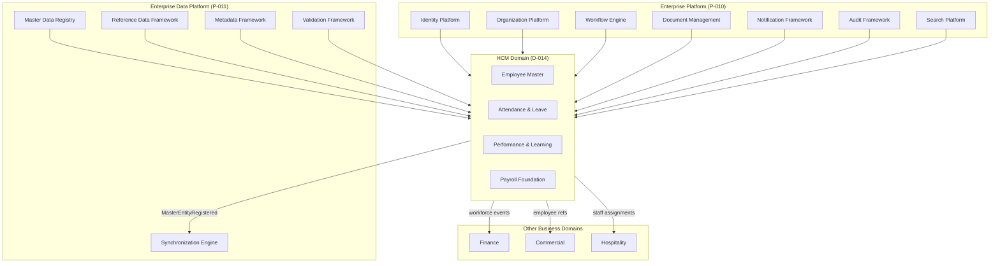
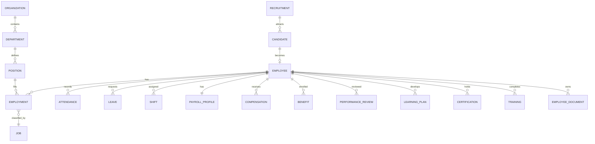
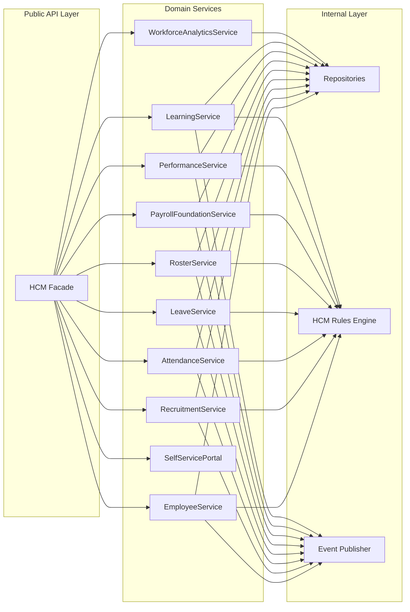
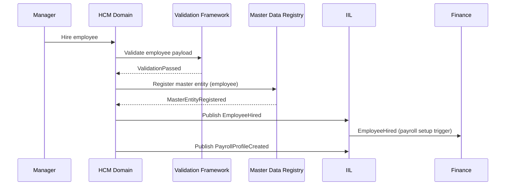
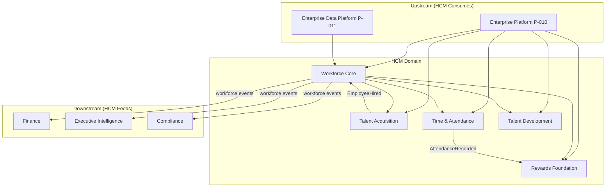

# D-014 – Enterprise Human Capital Management (HCM) Architecture Blueprint

**Document ID:** D-014  
**Domain:** Human Capital Management (HCM)  
**Version:** 1.0  
**Architecture Baseline:** v0.3  
**Status:** Draft — Pending Governance Approval  
**Classification:** Business Architecture  
**Authority:** Chief Enterprise Architect  
**Owner:** HCM Domain Lead (to be assigned)  

**Prerequisites:** Canon C-001–C-010 · Core Platform P-001–P-006A · Enterprise Platform P-010 · Enterprise Data Platform P-011

**Related Governance:** [ARCHITECTURE_BASELINE_v0.3.md](../../11_Governance/Architecture/ARCHITECTURE_BASELINE_v0.3.md) · [ARCHITECTURE_FREEZE_v0.3.md](../../11_Governance/Architecture/ARCHITECTURE_FREEZE_v0.3.md)

**Related Platform:** [D-011 — Enterprise Data Architecture](../Data/Blueprints/D-011_Enterprise_Data_Architecture_Blueprint.md) · [D-013 — Enterprise Data Governance](../Data/Governance/D-013_Enterprise_Data_Governance.md) · [ES-DATA-001 — Data Platform Engineering Spec](../Data/Engineering/ES-DATA-001-Enterprise-Data-Platform-Engineering-Specification.md) · [ES-033 — Event & Messaging Architecture](../../02_Engineering/ES-033-Event-Messaging-Architecture.md) · [ES-056 — Data Governance & Information Architecture](../../02_Engineering/ES-056-ORION-Data-Governance-Information-Architecture.md)

**Related Domain Blueprints:** [D-007 — Finance Domain Blueprint](../../Finance/Blueprints/D-007_Finance_Domain_Blueprint.md)

**Successor:** D-015 — Enterprise Workforce Domain Model *(planned)*

---

## 1. HCM Vision

Human Capital Management is the **Enterprise Workforce Operating System** for ORION.

The HCM domain owns the complete employee lifecycle — from workforce planning and recruitment through onboarding, employment, development, performance, compensation foundations, and separation — while consuming certified enterprise platform and data platform services for identity, organization context, master data, validation, synchronization, documents, workflow, notifications, audit, and search.

HCM answers a distinct executive question: *Who works for the enterprise, in what capacity, with what skills and obligations, and how is the workforce performing and evolving?*

HCM does not compete with Finance for payroll accounting, Commercial for customer relationships, or Hospitality for guest operations. HCM owns **workforce truth**; other domains consume workforce identifiers and events when business activity involves employees.

---

## 2. Mission

The HCM domain exists to ensure that:

- Every person employed or engaged by the enterprise has an authoritative workforce record with clear employment context
- Organizational structure, positions, and reporting relationships are governed and organization-scoped
- Time, attendance, leave, and rostering support operational workforce management without duplicating platform services
- Compensation and benefits foundations are maintained for downstream payroll and finance integration without performing payroll calculations
- Performance, learning, and certification records support talent development and compliance
- Workforce events propagate to Finance, Audit, Search, and executive intelligence through approved contracts
- Multi-company, multi-branch, and localized workforce operations scale within organization boundaries

---

## 3. Architectural Principles

The HCM domain shall adhere to the following principles. They are **non-negotiable** unless changed through formal architecture governance.

| Principle | Statement |
|-----------|-------------|
| **Workforce ownership** | HCM owns employee lifecycle, employment, positions, attendance, leave, performance, and learning records |
| **Platform consumption** | Identity, organization, audit, notification, workflow, document, search, and data platform capabilities are consumed — not reimplemented |
| **Data platform consumption** | Employee master registration, reference codes, metadata, validation, and synchronization use Enterprise Data Platform public APIs |
| **Domain independence** | HCM does not embed Finance, CRM, Procurement, or Hospitality business logic |
| **Event-driven** | Workforce state changes publish domain events via IIL; cross-domain writes occur only through owned aggregates |
| **Organization scoped** | All workforce records scoped by `organizationId`; no cross-tenant data access |
| **Multi-company ready** | Legal entities, branches, and company assignments modeled within organization context |
| **Localization ready** | Labels, date formats, leave types, and policy references support locale configuration |
| **API first** | Cross-domain interaction through approved service APIs and event contracts |
| **Executive intelligence ready** | Workforce metrics feed executive dashboards as derived, read-only projections |

---

## 4. Domain Modules

The HCM domain is organized into **bounded modules**. Each module owns specific aggregates and publishes defined events. Modules share platform services but maintain clear aggregate boundaries.

| Module | Purpose | Primary Aggregates |
|--------|---------|-------------------|
| **Organization Structure** | Legal entities, branches, departments, reporting hierarchy within workforce context | Organization (workforce view), Department, Position |
| **Employee Master** | Authoritative person-in-workforce record | Employee, Employment |
| **Recruitment** | Requisitions, pipelines, hiring workflow intent | Recruitment, Candidate |
| **Candidate Management** | Pre-hire profiles, applications, assessments | Candidate |
| **Onboarding** | Pre-start tasks, provisioning checklist, document collection | Employment (onboarding phase) |
| **Employee Documents** | Workforce document metadata and lifecycle | Employee Document |
| **Attendance** | Time capture, presence, exceptions | Attendance |
| **Leave Management** | Leave types, balances, requests, approvals | Leave |
| **Shift Management** | Shift definitions, templates, assignments | Shift |
| **Rostering** | Schedule composition across teams and locations | Shift (roster projections) |
| **Payroll Foundation** | Payroll profile, pay elements structure — **not calculation** | Payroll Profile |
| **Compensation** | Salary bands, allowances, adjustment history | Compensation |
| **Benefits** | Benefit enrollment, eligibility, plan assignments | Benefit |
| **Performance Management** | Review cycles, ratings, calibration support | Performance Review |
| **Goals & Reviews** | Objectives, milestones, review outcomes | Performance Review |
| **Learning & Development** | Development plans, curricula assignment | Learning Plan |
| **Training** | Training sessions, completion records | Training |
| **Certifications** | Professional credentials, expiry tracking | Certification |
| **Employee Self-Service** | Employee-facing portal capabilities | Read/update via domain services |
| **Manager Self-Service** | Manager approvals, team views, roster actions | Read/update via domain services |
| **Separation & Exit** | Offboarding, clearance, employment termination | Employment |
| **Workforce Analytics** | Derived KPIs, dashboards, executive summaries | Read-only projections |

---

## 5. Scope

### 5.1 In Scope

HCM **owns** the following capabilities and authoritative records:

| Capability | Description |
|------------|-------------|
| Employee master and employment records | Person-in-workforce identity, hire date, status, assignments |
| Organization structure (workforce) | Departments, positions, jobs, reporting lines |
| Recruitment and candidates | Requisitions, applications, hire decisions |
| Onboarding and separation | Lifecycle transitions, checklists, exit processing |
| Attendance and time | Clock events, timesheets, exception handling |
| Leave | Policies, balances, requests, approvals |
| Shifts and rostering | Shift patterns, assignments, schedule publishing |
| Payroll foundation | Payroll profile, pay structure references — not net pay calculation |
| Compensation and benefits | Salary, allowances, benefit enrollments |
| Performance and goals | Review cycles, goals, outcomes |
| Learning, training, certifications | Plans, completions, credential tracking |
| Employee and manager self-service | Portal-facing operations through HCM services |
| Workforce analytics | Headcount, turnover, absence, compliance KPIs |

### 5.2 Out of Scope

HCM **does not own** the following (explicitly deferred):

| Area | Owner / Notes |
|------|---------------|
| Payroll calculations | External payroll engine or future Finance integration mission |
| Tax engines | Finance / statutory compliance systems |
| Accounting / GL posting | Finance domain |
| ERP integrations | Integration Platform (P-010.7) adapters only |
| AI recruitment scoring | Deferred; no automated hiring decisions |
| AI performance scoring | Deferred; human-managed review outcomes |
| Platform identity credentials | Identity Platform |
| Organization platform registry | Organization Platform (authoritative org tree consumed) |
| Document binary storage | Document Management Framework (P-010.4) |

**Integration rule:** Finance subscribes to `PayrollProfileCreated`, compensation change events, and separation events for **accounting integration** — HCM publishes; Finance posts.

---

## 6. Domain Boundaries

### 6.1 Authoritative Ownership

| Record Type | Authoritative Owner | HCM Role |
|-------------|---------------------|----------|
| User credentials / authentication | Identity Platform | Consume user ID; link to Employee |
| Organization legal entity registry | Organization Platform | Consume; extend with workforce structure |
| Employee master (workforce) | **HCM** | Authoritative |
| Employment / assignment | **HCM** | Authoritative |
| Customer / party | Commercial | No ownership |
| Guest / reservation | Hospitality | No ownership |
| General ledger / payroll journals | Finance | Subscribe to HCM events only |
| Vendor / supplier | Commercial / Procurement | No ownership |
| Employee canonical registration | Enterprise Data Platform | Register via Master Data Registry |
| Reference codes (leave types, grades) | Enterprise Data Platform (Reference Data) | Consume |
| Workforce documents (metadata) | **HCM** | Binary storage via Document Platform |

### 6.2 Boundary Rules

1. **HCM owns workforce records.** Other domains reference employee IDs; they do not maintain parallel employee masters.
2. **Platform services are consumed, not duplicated.** Audit, notification, workflow, search, and validation use platform public APIs.
3. **Cross-domain access is event- and API-based only.** No direct repository imports across domain boundaries.
4. **Employee identity links are immutable after hire.** User-to-employee binding changes only through governed lifecycle events.
5. **Workforce intelligence is derived.** Analytics modules read from HCM projections; they do not mutate authoritative state.

### 6.3 Domain Boundary Diagram



---

## 7. Aggregate Model

HCM adopts **Domain-Driven Design** aggregate roots with organization-scoped consistency boundaries. Aggregates enforce invariants internally; cross-aggregate coordination occurs through domain events and application services.

### 7.1 Aggregate Catalogue

| Aggregate Root | Description | Key Entities (internal) | Consistency Boundary |
|----------------|-------------|-------------------------|----------------------|
| **Organization** | Workforce view of org unit within tenant | OrgUnit, Branch, CostCentreLink | Single org subtree mutation |
| **Employee** | Person in workforce; core identity in HCM | PersonProfile, ContactInfo, EmergencyContact | Employee profile and status |
| **Employment** | Contractual relationship and assignment | Assignment, JobRelationship, TerminationRecord | One active primary employment per employee per company |
| **Position** | Defined slot in org structure | PositionDefinition, FTE, Grade | Position catalog per org unit |
| **Department** | Organizational department node | DepartmentHead, Members (refs) | Department hierarchy |
| **Job** | Job catalog entry | JobFamily, JobLevel, Description | Job definition |
| **Candidate** | Pre-hire person | Application, Assessment, Offer | Candidate pipeline |
| **Recruitment** | Hiring requisition | Requisition, PipelineStage, Approval | Requisition lifecycle |
| **Attendance** | Time record cluster | TimeEntry, Exception, Approval | Daily/period attendance bundle |
| **Leave** | Leave request and balance | LeaveBalance, LeaveRequest, Approval | Leave request transaction |
| **Shift** | Shift definition and assignment | ShiftTemplate, ShiftAssignment | Shift roster period |
| **Payroll Profile** | Payroll-relevant attributes | PayGroup, PayElements, BankDetailRef | Profile version |
| **Compensation** | Compensation package | Salary, Allowance, Adjustment | Compensation version |
| **Benefit** | Benefit enrollment | Plan, Enrollment, Dependent | Enrollment period |
| **Performance Review** | Review cycle instance | Goal, Rating, Comment | Review cycle |
| **Learning Plan** | Development plan | Module, Progress, Assignment | Plan instance |
| **Certification** | Credential record | Credential, Expiry, Verification | Certification instance |
| **Training** | Training event completion | Session, Attendance, Outcome | Training record |
| **Employee Document** | Document registry entry | DocumentType, RetentionClass, DocRef | Document metadata |

### 7.2 Aggregate Relationship Model



### 7.3 Aggregate Design Rules

| Rule | Description |
|------|-------------|
| AR-01 | Each aggregate root is the sole entry point for mutations within its boundary |
| AR-02 | References to other aggregates use immutable IDs only |
| AR-03 | Cross-aggregate workflows use domain events and platform workflow engine |
| AR-04 | Employee aggregate registers with Master Data Registry on hire |
| AR-05 | Employment termination closes active assignments; does not delete Employee |
| AR-06 | Payroll Profile changes emit events; Finance consumes for journal intent |
| AR-07 | PII fields carry classification metadata from Data Governance policies |

---

## 8. Bounded Contexts

HCM is subdivided into **bounded contexts** to manage complexity and team ownership:

| Context | Aggregates | Integration Style |
|---------|------------|-------------------|
| **Workforce Core** | Employee, Employment, Organization, Department, Position, Job | Publishes master workforce events; registers master data |
| **Talent Acquisition** | Recruitment, Candidate | Publishes hire-ready events; consumes Organization |
| **Time & Attendance** | Attendance, Leave, Shift | Publishes time events; consumes Employee, Employment |
| **Rewards Foundation** | Payroll Profile, Compensation, Benefit | Publishes compensation events; Finance subscribes |
| **Talent Development** | Performance Review, Learning Plan, Training, Certification | Publishes development events |
| **Workforce Documents** | Employee Document | Consumes Document Platform; publishes metadata events |
| **Workforce Experience** | Self-Service portals (application layer) | Orchestrates across contexts via application services |
| **Workforce Intelligence** | Analytics projections | Read-only; subscribes to all workforce events |

Contexts communicate through **domain events** and **application services** — never through shared mutable tables.

---

## 9. Service Catalogue

Public HCM domain services expose workforce operations through a **HCM Facade** (`lib/hcm/` — future implementation). Internal repositories remain private.

### 9.1 Conceptual Domain Services

| Service | Responsibility | Primary Aggregates |
|---------|----------------|-------------------|
| **EmployeeService** | Hire, update, transfer, promote, separate; employee lookup | Employee, Employment |
| **RecruitmentService** | Requisitions, candidates, offers, hire conversion | Recruitment, Candidate |
| **AttendanceService** | Clock-in/out, timesheet submission, exception handling | Attendance |
| **LeaveService** | Balance inquiry, request, approval, cancellation | Leave |
| **RosterService** | Shift templates, roster build, publish, swap | Shift |
| **PayrollFoundationService** | Payroll profile CRUD, pay element assignment — no calculation | Payroll Profile |
| **PerformanceService** | Review cycles, goals, ratings, completion | Performance Review |
| **LearningService** | Plans, training assignment, certification tracking | Learning Plan, Training, Certification |
| **SelfServicePortal** | Employee and manager self-service orchestration | Cross-context reads/writes via services |
| **WorkforceAnalyticsService** | Headcount, turnover, absence, compliance KPIs | Read-only projections |

### 9.2 Service Architecture



### 9.3 Application Service Rules

| Rule | Description |
|------|-------------|
| SVC-01 | All mutations pass through domain services — no direct repository access from API routes |
| SVC-02 | Services validate via Enterprise Data Platform Validation Framework before persistence |
| SVC-03 | Employee registration invokes Master Data Registry public API |
| SVC-04 | Self-service operations enforce role-scoped authorization (employee vs manager) |
| SVC-05 | Analytics service is read-only; never mutates aggregate state |

---

## 10. Event Catalogue

HCM publishes **workforce domain events** through the Intelligence Integration Layer (IIL) with `sourceService: hcm-workspace` (future registration).

### 10.1 Outbound Events (Published)

| Event | Trigger | Payload Minimum | Consumers |
|-------|---------|-----------------|-----------|
| **EmployeeHired** | Employment activated after hire | employeeId, organizationId, companyId, positionId, hireDate | Finance, Audit, Search, Data Platform |
| **EmployeeUpdated** | Employee profile or assignment change | employeeId, changedFields, version | Search, Sync, Audit |
| **EmployeeTransferred** | Inter-company or inter-department move | employeeId, fromOrgUnit, toOrgUnit, effectiveDate | Finance, Audit |
| **EmployeePromoted** | Grade or position upgrade | employeeId, fromPosition, toPosition, effectiveDate | Audit, Analytics |
| **LeaveApproved** | Leave request approved | leaveId, employeeId, leaveType, startDate, endDate | Roster, Analytics, Notification |
| **AttendanceRecorded** | Time entry confirmed | attendanceId, employeeId, date, hours | Payroll Foundation, Analytics |
| **ShiftAssigned** | Shift roster published | shiftId, employeeId, startTime, endTime | Notification, Hospitality (staff scheduling) |
| **PayrollProfileCreated** | Payroll profile initialized | profileId, employeeId, payGroup, effectiveDate | Finance |
| **CompensationChanged** | Salary or allowance adjustment | employeeId, compensationId, changeType, effectiveDate | Finance, Audit |
| **BenefitEnrolled** | Benefit plan enrollment | employeeId, benefitId, planCode, effectiveDate | Audit |
| **PerformanceCompleted** | Review cycle finalized | reviewId, employeeId, rating, period | Analytics, Learning |
| **TrainingCompleted** | Training session completed | trainingId, employeeId, courseCode, completionDate | Certification, Analytics |
| **CertificationIssued** | Credential recorded | certificationId, employeeId, credentialCode, expiryDate | Compliance, Analytics |
| **EmployeeSeparated** | Employment terminated | employeeId, separationDate, reasonCode | Finance, Audit, Identity, Search |

### 10.2 Inbound Events (Consumed)

| Event | Source | HCM Action |
|-------|--------|------------|
| OrganizationUpdated | Organization Platform | Refresh org structure projections |
| UserCreated | Identity Platform | Link candidate/user to employee on hire |
| MasterEntityRegistered | Data Platform | Confirm employee registry sync |
| ValidationPassed | Data Platform | Proceed with pending workforce mutation |
| WorkflowApproved | Workflow Engine | Execute approved leave, transfer, separation |
| DocumentStored | Document Platform | Attach document reference to Employee Document aggregate |

### 10.3 Event Flow Diagram



---

## 11. Integration Matrix

### 11.1 Platform Consumption Matrix

| Platform Capability | HCM Usage | Integration Pattern |
|--------------------|-----------|---------------------|
| **Identity Platform** | User-employee linking, SSO context | API consume |
| **Organization Registry** | Legal entities, branches, org hierarchy | API consume + event subscribe |
| **Master Data Registry** | Employee canonical registration | `masterDataRegistryService.register()` |
| **Reference Data Framework** | Leave types, grades, job codes, separation reasons | `referenceLookupService` |
| **Metadata Framework** | Entity/attribute metadata for extensibility | `metadataService` |
| **Validation Framework** | Pre-persistence workforce validation | `validationService.validate()` |
| **Synchronization Engine** | Propagate employee changes to subscribers | Event consume/publish |
| **Document Management** | Contract, ID, certification document storage | API consume |
| **Workflow Engine** | Leave, transfer, separation approvals | API consume + event subscribe |
| **Notification Framework** | Leave approval, roster publish, review reminders | Event publish trigger |
| **Audit Framework** | Workforce mutation audit trail | Platform audit registration |
| **Search Platform** | Employee, candidate, document discovery | Search registration on events |

### 11.2 Domain Integration Matrix

| Domain | Direction | Integration | Data Shared |
|--------|-----------|-------------|-------------|
| **Finance** | HCM → Finance | Events: PayrollProfileCreated, CompensationChanged, EmployeeSeparated | Employee ID, pay group, effective dates — not operational HR detail |
| **Commercial** | Reference only | Employee as sales rep / account owner | Employee ID, display name |
| **Hospitality** | HCM → Hospitality | Events: ShiftAssigned (staff scheduling) | Employee ID, property assignment |
| **Procurement** | None direct | No workforce ownership overlap | — |
| **Compliance Platform** | HCM → Compliance | Audit events, PII classification | Audit records, classification metadata |

### 11.3 Dependency Matrix

| HCM Component | Depends On | Dependency Type | Failure Mode |
|---------------|------------|-----------------|--------------|
| EmployeeService | Master Data Registry | Hard | Block hire until registry available |
| EmployeeService | Validation Framework | Hard | Block mutation on validation failure |
| LeaveService | Workflow Engine | Soft | Manual approval fallback in dev |
| Employee Document | Document Platform | Soft | Metadata-only mode without binary |
| Workforce Analytics | All workforce events | Soft | Stale metrics; no write impact |
| PayrollFoundationService | Reference Data | Hard | Block profile without pay codes |
| SelfServicePortal | Identity Platform | Hard | Portal unavailable without auth |

---

## 12. Context Map



---

## 13. Engineering Recommendations

### 13.1 Package Structure (Future)

```
lib/hcm/
├── index.ts                    # HcmFacade — sole public export
├── services/                   # Public domain services
├── repositories/               # Internal — interfaces + implementations
├── aggregates/                 # Internal — aggregate logic (optional)
├── HcmRulesEngine.ts           # Domain validation rules
├── hcm-events.ts               # IIL event publishing
├── register-hcm-subscribers.ts # Inbound event handlers
└── data/                       # Seed data (dev/test)

types/hcm.ts                    # Canonical HCM types
app/(platform)/hcm/             # HCM workspace routes (future)
app/api/hcm/                    # REST API routes (future)
tests/hcm/                      # Domain tests
docs/HCM/                       # Blueprints, models, engineering specs
```

### 13.2 Aggregate Design Recommendations

- Prefer **small aggregates** for Attendance and Leave (daily/transaction scope) over monolithic Employee aggregate for all mutations
- Keep **Employment** as the lifecycle authority for hire, transfer, promote, separate
- Use **optimistic concurrency** (version field) on Employee and Employment for conflict detection aligned with Synchronization Engine
- Register Employee as canonical entity type `employee` in Master Data Registry on hire

### 13.3 Scalability & Performance

| Concern | Recommendation |
|---------|----------------|
| Headcount scale | Partition repositories by organizationId; index employeeId, businessKey |
| Attendance volume | Time-series friendly storage for attendance entries; aggregate daily summaries |
| Roster queries | Pre-compute roster projections; publish ShiftAssigned events asynchronously |
| Analytics | CQRS read models fed by workforce events; never query write model for dashboards |
| Search | Register searchable fields via Search Platform on EmployeeHired/Updated |

### 13.4 Organization Isolation & Security

- Every repository query includes `organizationId` from `ServiceContext`
- PII fields (national ID, bank details) classified as **Restricted** or **PII** per D-013
- Manager self-service scoped to direct/indirect reports via org hierarchy
- Employee self-service limited to own records and approved workflows
- Separation events trigger Identity Platform deprovisioning workflow (consume, not own)

### 13.5 Localization

- Reference Data Framework stores locale-specific labels for leave types, job titles, separation reasons
- Date/time fields stored UTC; displayed in organization locale
- Policy rules (leave accrual, working week) configured per country/region via organization policies

### 13.6 Extension Model

- Custom employee attributes via Metadata Framework (`metadataService.upsertOrgAttributeDefinition()`)
- Domain-specific extensions (e.g., hospitality staff certifications) attach as metadata — not hard-coded columns
- New workforce modules added as bounded contexts with own aggregates and event catalog entries
- Feature flags per organization for module enablement (recruitment, performance, learning)

---

## 14. Future Expansion Strategy

| Phase | Capability | Prerequisite |
|-------|------------|--------------|
| **Phase 1** | Workforce Core — Employee, Employment, Organization Structure | D-015 Domain Model, ES-HCM-001 |
| **Phase 2** | Time & Attendance — Attendance, Leave, Shift | Phase 1 |
| **Phase 3** | Talent Acquisition — Recruitment, Candidate, Onboarding | Phase 1 |
| **Phase 4** | Rewards Foundation — Payroll Profile, Compensation, Benefits | Phase 1 · Finance event contracts |
| **Phase 5** | Talent Development — Performance, Learning, Certifications | Phase 1 |
| **Phase 6** | Self-Service Portals — Employee and Manager ESS/MSS | Phases 1–5 |
| **Phase 7** | Workforce Analytics — Executive dashboards | Phases 1–5 · P-011.7 patterns |
| **Deferred** | Payroll calculation engine integration | Finance blueprint amendment |
| **Deferred** | Workforce planning & succession | Analytics maturity |
| **Deferred** | AI-assisted workforce insights | ES-057 AI governance approval |

Each phase requires engineering specification, mission implementation, and domain certification before production.

---

## 15. Success Criteria

| Criterion | Target |
|-----------|--------|
| **Boundary compliance** | Zero Finance, CRM, or Hospitality entities owned by HCM |
| **Platform consumption** | All cross-cutting capabilities consumed via public platform APIs |
| **Master data registration** | Every employee registered in Master Data Registry on hire |
| **Event coverage** | All lifecycle transitions publish catalogued domain events |
| **Organization isolation** | 100% of queries and events scoped by organizationId |
| **Validation gate** | All mutations pass Validation Framework before persistence |
| **Canon compliance** | C-001–C-010 addressed in ES-HCM-001 and mission close |
| **Certification readiness** | Domain passes typecheck, lint, test, build before GO |

---

## 16. Canon Compliance

| Canon | Applicability to HCM |
|-------|---------------------|
| **C-001 Product Constitution** | Executive workforce visibility; decision-oriented headcount and compliance metrics |
| **C-002 Executive Mind** | Workforce KPIs feed Brief and executive dashboards |
| **C-003 Platform Architecture** | HCM as business domain consuming platform and data platform services |
| **C-004 Executive Intelligence** | WorkforceAnalyticsService as read-only intelligence layer |
| **C-005 Design Language** | HCM workspace UI conforms to ORION design tokens (future) |
| **C-006 Engineering Constitution** | Facade, repository, service layer, validation gates |
| **C-007 Workspace Framework** | HCM workspace routes, RBAC, sub-navigation |
| **C-008 AI & Learning** | No AI recruitment or performance scoring in initial scope |
| **C-009 Security & Trust** | PII classification, org scoping, audit trail, role-based self-service |
| **C-010 Integration & Events** | IIL event contracts; Data Platform consumption; no cross-domain repository access |

---

## 17. Approval

| Role | Name | Date | Status |
|------|------|------|--------|
| HCM Domain Lead | *To be assigned* | — | Pending |
| Chief Enterprise Architect | — | — | Pending |
| Data Governance Lead | — | — | Pending |
| CTO | — | — | Pending |

---

## Document History

| Version | Date | Author | Change |
|---------|------|--------|--------|
| 1.0 | 31 July 2026 | Chief Enterprise Architect | Initial HCM Architecture Blueprint |

---

*D-014 · Enterprise HCM Architecture Blueprint · ORION Enterprise Platform · Architecture Baseline v0.3*
