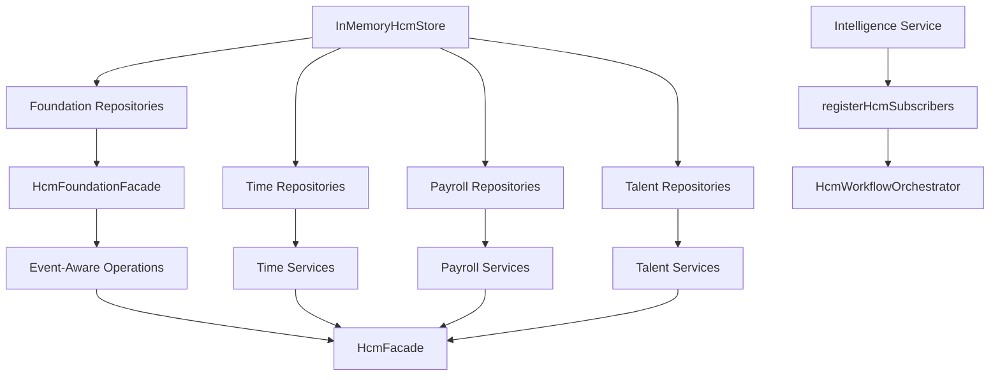

# Enterprise HCM Architecture Guide

**Document ID:** HCM-ARCH-001  
**Parent:** [ES-HCM-001](./ES-HCM-001_Enterprise_HCM_Engineering_Specification.md)  
**Blueprint:** [D-014](../Blueprints/D-014_Enterprise_HCM_Architecture_Blueprint.md)

---

## System Context

Enterprise HCM is a domain module within the ORION platform. It manages the workforce lifecycle from organization structure through talent development, publishing lifecycle events to the Intelligence Integration Layer (IIL) for workflow, finance integration, and executive intelligence.

```
┌──────────────────────────────────────────────────────────────────┐
│                     ORION Enterprise Platform                     │
├─────────────┬─────────────┬─────────────┬────────────────────────┤
│  Identity   │  Workflow   │     IIL     │   Executive Workspace   │
│  Platform   │  Platform   │             │                         │
└──────┬──────┴──────┬──────┴──────┬──────┴───────────┬─────────────┘
       │             │             │                  │
       │             │◄────────────┤ HCM Events       │
       │             │             │                  │
       ▼             ▼             ▼                  ▼
┌──────────────────────────────────────────────────────────────────┐
│                    Enterprise HCM Domain                          │
│  ┌─────────────┐  ┌─────────────┐  ┌─────────────────────────┐  │
│  │ REST API    │→ │  HcmFacade  │→ │ Services + RulesEngines │  │
│  │ app/api/hcm │  │  (public)   │  │ (internal)              │  │
│  └─────────────┘  └──────┬──────┘  └───────────┬─────────────┘  │
│                          │                      │                 │
│                          ▼                      ▼                 │
│                   Event Publisher          Repositories → Store    │
└──────────────────────────────────────────────────────────────────┘
```

---

## Layering Model

| Layer | Package | Responsibility |
|-------|---------|----------------|
| **Presentation (API)** | `app/api/hcm/` | HTTP, auth context, response envelopes |
| **Application (Facade)** | `lib/hcm/index.ts` | Public API, event-aware orchestration |
| **Domain (Services)** | `lib/hcm/*/services/` | Business rules, lifecycle transitions |
| **Domain (Rules)** | `lib/hcm/*RulesEngine.ts` | Pure validation and state machines |
| **Infrastructure (Repos)** | `lib/hcm/*/repositories/` | Persistence abstraction |
| **Infrastructure (Store)** | `lib/hcm/data/` | In-memory development store |

**Invariant:** No layer may skip adjacent layers downward (API → Facade → Service → Repository → Store).

---

## Facade Pattern

`HcmFacade` is the **sole public entry point**:

- Foundation operations exposed as flat methods with IIL event publication
- Operational capabilities grouped as service properties
- `getDomainStatus()` reports implementation completeness
- `getWorkspaceBootstrap()` supplies workspace metadata

Internal `HcmFoundationFacade` wires P-012.1–P-012.5 services but is not exported.

---

## Repository Pattern

Repository interfaces define organization-scoped contracts. In-memory implementations back development and tests. Production deployments will swap implementations without changing services or facade signatures.

Factory: `createFoundationRepositories(store)` centralizes foundation repository creation.

---

## Dependency Injection

`createHcmWiring()` constructs the full object graph:



---

## Workflow Integration

```
HCM Service/Facade
       │
       ▼
  IIL publish (CustomEvent)
       │
       ▼
  registerHcmSubscribers
       │
       ▼
  HcmWorkflowOrchestrator.handle()
       │
       ├── dispatchWorkflowInboundEvent("WorkflowRequested")
       └── publishWorkflowEvent("WorkflowStarted")
```

The orchestrator maps `payload.hcmEventType` to `HCM_WORKFLOW_TEMPLATES` entries. It performs no business validation.

---

## IIL Integration

| Aspect | Implementation |
|--------|----------------|
| Service ID | `hcm-workspace` (`HCM_IIL_SERVICE_ID`) |
| Event type | `CustomEvent` |
| Discriminator | `payload.hcmEventType` |
| Foundation publisher | `HcmEventPublisher` via event-aware facade |
| Operational publishers | Domain-specific publish functions in services |

---

## Organization Scoping

Every repository method accepts `organizationId` as the first parameter. Services derive it from `context.organizationId`. Cross-organization data access returns null or empty results — never foreign records.

---

## Module Map

| Mission | Modules | Facade Access |
|---------|---------|---------------|
| P-012.1 | Organization | Flat methods |
| P-012.2 | Employee | Flat methods |
| P-012.3 | Employment | Flat methods |
| P-012.4 | Recruitment | Flat methods |
| P-012.5 | Onboarding | Flat methods |
| P-012.6 | Time | `attendance`, `leave`, `roster`, `calendar`, `shifts`, `overtime` |
| P-012.7 | Payroll | `payroll`, `payrollPeriods`, `payrollCalculation`, `payrollAdjustments`, `payrollValidation` |
| P-012.8 | Talent | `performance`, `learning`, `certification`, `talent` |

---

## Bootstrap and Workspace

```typescript
hcmFacade.getWorkspaceBootstrap(context);
// → { moduleKey, workspaceId, capabilities, missions, basePath: "/hcm", ... }
```

Capabilities enumerated in `HCM_ALL_CAPABILITIES` (`constants.ts`).

---

## Related Documents

- [HCM Package Guide](./HCM-Package-Guide.md)
- [HCM Dependency Matrix](./HCM-Dependency-Matrix.md)
- [HCM API Catalogue](./HCM-API-Catalogue.md)
- [HCM Event Catalogue](./HCM-Event-Catalogue.md)

---

*ORION Enterprise Platform · Enterprise HCM v1.0*
