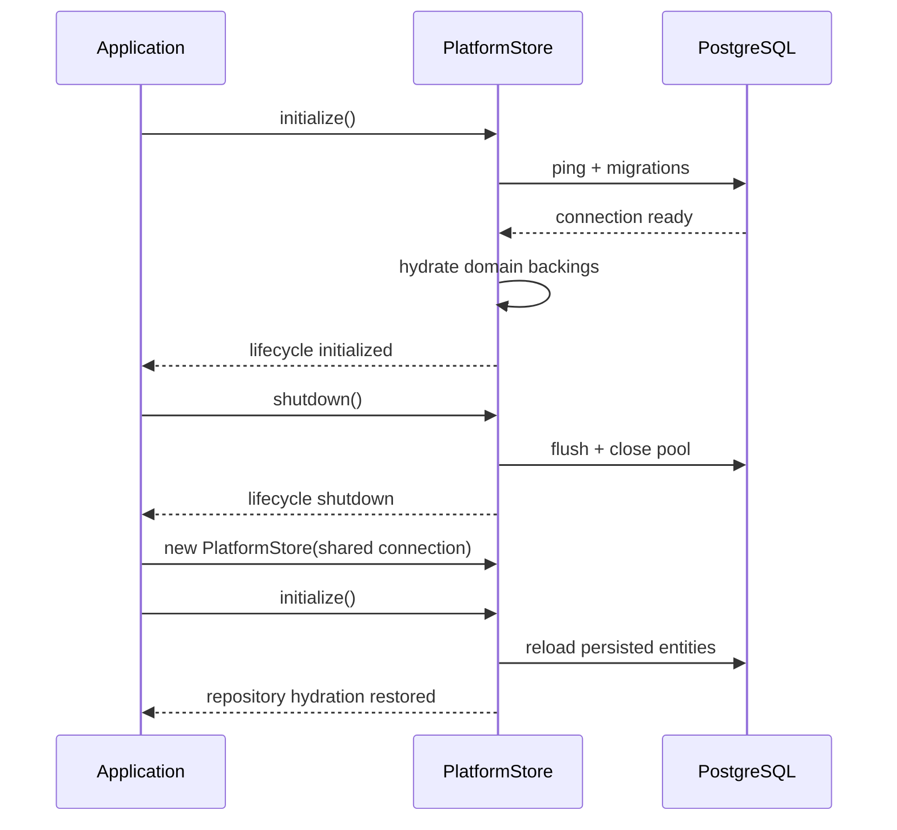

# PostgreSQL Operational Certification

**Mission:** P-011.2 — PostgreSQL Operational Certification  
**Governance:** [P-017.1 §15](../00_Governance/P-017.1-Gate6-Master-Integration-Plan.md) · OPS-001 · GA-001  
**Status:** Implemented — Engineering Evidence  
**Classification:** Platform Operations · Gate 7 Preparation

**Related:** [Enterprise Operations Readiness](./Enterprise-Operations-Readiness.md) · [Runbook — Platform Startup](./Runbook-Platform-Startup.md)

---

## Purpose

Provides **engineering evidence** that ORION's PostgreSQL persistence layer operates correctly under production-like conditions: cold boot, warm restart, graceful shutdown, transaction recovery, repository hydration, and composition root restoration.

This mission closes the engineering gap for OPS-001. Live staging PostgreSQL execution remains an operational activity.

---

## Architecture

```
PostgresCertificationContext (shared connection + migrations)
  ├── verifyPostgresColdBoot()
  ├── verifyPlatformStartup()
  ├── verifyPlatformShutdown()
  ├── verifyPostgresWarmRestart()
  ├── verifyPostgresMultipleRestartCycles()
  ├── verifyPostgresHydration()
  ├── verifyPostgresTransactionRecovery()
  ├── verifyPostgresOrganizationIsolation()
  ├── EnterpriseReadinessService.generatePostgresCertificationReport()
  │     ├── composition root restoration
  │     ├── canonical event infrastructure
  │     ├── health verification
  │     └── enterprise readiness report
  └── PostgresOperationalCertificationReport
        ├── verdict: pass | conditional | fail
        ├── scenarios[]
        ├── evidence[]
        └── recommendations[]
```

| Component | Path |
|-----------|------|
| Certification orchestrator | `EnterpriseReadinessService.certifyPostgresqlOperational()` |
| Report model | `OperationalReadinessReport.ts` |
| Store verification | `PlatformStoreFactory.ts` |
| Test suite | `PostgresOperationalCertification.test.ts` |

---

## Test Methodology

### Environment

| Layer | CI / Unit | Staging (OPS-001) |
|-------|-----------|-------------------|
| Connection | `MockDatabaseConnection` | Live PostgreSQL |
| Migrations | `bootstrapMigration` via `MigrationRunner` | Full migration registry |
| Evidence weight | Engineering certification | Production sign-off |

**Rule (ADR-012):** Mock certification proves engineering readiness. Live staging replay is required for GA evidence.

### Scenarios

| Scenario | Verification |
|----------|-------------|
| **Cold boot** | Uninitialized store → `initialize()` → health probe |
| **Graceful shutdown** | `shutdown()` → lifecycle `shutdown` |
| **Warm restart** | Shutdown → new store instance → shared connection → hydration |
| **Multiple restart cycles** | 3× init/shutdown without corruption |
| **Persistence integrity** | Migration readiness + health after init |
| **Repository hydration** | HCM · Finance · CRM · Procurement backings |
| **Transaction recovery** | Begin → rollback → store operational |
| **Organization isolation** | Seed data scoped to authoritative org |
| **Composition roots** | `createFinanceWiring` · `createCrmWiring` · `createProcurementWiring` |
| **Canonical publishers** | Event pipeline registries after wiring |
| **Health verification** | `HealthStatusService.verifyHealth()` |
| **Readiness report** | Full `generateReadinessReport()` |

---

## Restart Sequence



---

## Recovery Sequence

1. Detect failure via `/api/health/operations`
2. Execute [Runbook — Platform Shutdown](./Runbook-Platform-Shutdown.md)
3. Validate backup if data corruption suspected ([Runbook — Disaster Recovery](./Runbook-Disaster-Recovery.md))
4. Cold boot via `verifyPostgresColdBoot()`
5. Confirm transaction recovery via `verifyPostgresTransactionRecovery()`
6. Re-run `generatePostgresCertificationReport()`

---

## Certification Verdicts

| Verdict | Criteria |
|---------|----------|
| **Pass** | All scenarios `healthy` |
| **Conditional** | One or more scenarios `degraded`, none `unhealthy` |
| **Fail** | Any scenario `unhealthy` |

---

## Usage

```typescript
import { enterpriseReadinessService } from "@/lib/platform/operations";
import { createPostgresCertificationStore } from "@/lib/platform/store";

const report = await enterpriseReadinessService.certifyPostgresqlOperational({
  connection,
  migrationRunner,
});

console.log(report.verdict);       // "pass" | "conditional" | "fail"
console.log(report.evidence);      // Engineering evidence strings
console.log(report.recommendations); // Gate 7 follow-ups
```

---

## Known Limitations

1. **CI uses mock PostgreSQL** — proves engineering logic, not network latency or connection pool exhaustion
2. **72h continuous health monitoring** — operational activity on staging, not automated in unit tests
3. **Backup/restore drill** — validated by `BackupService` / `DisasterRecoveryService`; live restore is Gate 7 ops
4. **Blue/Green deployment** — documented in deployment runbook; not exercised in P-011.2 scope

---

## Gate 7 Evidence Checklist

| Evidence | P-011.2 | Staging Execution |
|----------|---------|-------------------|
| Cold boot certification | ✅ Automated test | ⏳ Live replay |
| Warm restart survival | ✅ Automated test | ⏳ Live replay |
| Transaction rollback | ✅ Automated test | ⏳ Live replay |
| Organization isolation | ✅ Automated test | ⏳ Cross-tenant negative suite |
| Composition root restoration | ✅ Automated test | ⏳ Deploy verification |
| 72h health green | — | ⏳ OPS-001 |
| DR drill with RTO/RPO | — | ⏳ Gate 7 |

---

## Test Coverage

`tests/lib/platform/operations/PostgresOperationalCertification.test.ts` — 11 scenarios covering all certification paths.

---

*Mission P-011.2 · ORION Enterprise Platform v2.0 · August 2026*
