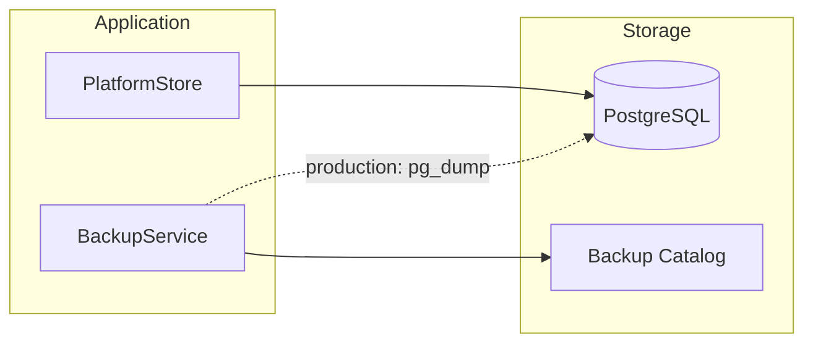

# ORION Backup & Recovery Guide

**Mission:** P-015.8 — Enterprise Operational Readiness  
**Authority:** Platform Engineering Lead  
**Classification:** Operational · Internal  
**Last Updated:** August 2026

**Related:** [Enterprise Operational Readiness](./Enterprise-Operational-Readiness.md) · [Operations Runbook](./Operations-Runbook.md) · [ADR-007](../../11_Governance/ADR/ADR-007-Production-Persistence-Strategy.md)

---

## Backup Policy

| Parameter | Value | Description |
|-----------|-------|-------------|
| **RPO (Recovery Point Objective)** | 24 hours | Maximum acceptable data loss |
| **RTO (Recovery Time Objective)** | 60 minutes | Target time to restore service |
| **Retention** | 30 days | Backup catalog retention |
| **Verification** | After every backup | Automatic integrity check |

Policy configured via `backupService.getPolicy()` / `backupService.configurePolicy()`.

---

## Backup Architecture



### Development / Test

`BackupService` maintains a logical backup catalog with checksum verification. Used for operational readiness testing and drill validation.

### Staging / Production

Production backups require PostgreSQL-native tools:

```bash
# Example — adjust for your environment
pg_dump $DATABASE_URL --format=custom --file=orion-backup-$(date +%Y%m%d).dump
```

Register backup metadata programmatically:

```typescript
import { backupService } from "@/lib/platform/operations";

backupService.createBackup({
  provider: "postgresql",
  tables: ["platform_migrations", "hcm_employees", "hcm_departments"],
  sizeBytes: /* from pg_dump output */,
});
```

---

## Backup Procedure

### Scheduled Backup (Recommended)

| Environment | Frequency | Window |
|-------------|-----------|--------|
| Production | Daily | 02:00 UTC |
| Staging | Daily | 03:00 UTC |
| Development | On-demand | Before migrations |

### Steps

1. **Pre-backup health check**
   - Verify `GET /api/health/operations` → `platform_store_live` healthy

2. **Execute backup**
   - Production: `pg_dump` with custom format
   - Register metadata in BackupService catalog

3. **Verify backup**
   ```typescript
   const result = backupService.verifyBackup(backupId);
   // result.status should be "healthy"
   // result.withinRpo should be true
   ```

4. **Validate retention**
   - Backups older than 30 days are pruned from catalog automatically

---

## Restore Procedure

### Pre-restore Checklist

- [ ] Identify backup ID and timestamp
- [ ] Stop application write traffic
- [ ] Notify stakeholders of maintenance window
- [ ] Confirm RTO window (60 minutes)

### Steps

1. **Validate backup integrity**
   ```typescript
   const validation = backupService.validateRestore(backupId);
   if (!validation.integrityValid) abort();
   ```

2. **Stop application**
   - Follow [Platform Shutdown](./Operations-Runbook.md#platform-shutdown)

3. **Restore database**
   ```bash
   # Example — adjust for your environment
   pg_restore --clean --if-exists --dbname=$DATABASE_URL orion-backup-YYYYMMDD.dump
   ```

4. **Reinitialize platform**
   - Start application
   - PlatformStore runs migrations if needed
   - Verify migration version matches expected

5. **Post-restore validation**
   - Execute [Health Verification](./Operations-Runbook.md#health-verification)
   - Run staging validation checks
   - Confirm RBAC fail-closed active

6. **Restore drill log**
   - Document in Staging-Certification-Report.md

---

## Database Recovery

**Recovery Procedure ID:** `database_recovery`

### Automated validation

```typescript
import { disasterRecoveryService } from "@/lib/platform/operations";

// Simulated drill (no actual restore)
const drill = disasterRecoveryService.executeRecoveryDrill("database_recovery");
console.log(drill.status, drill.checks);
```

### Manual recovery steps

1. Validate latest backup: `backupService.getLatestBackup()`
2. Verify integrity: `backupService.validateRestore(backupId)`
3. Stop write traffic
4. Restore PostgreSQL from backup artifact
5. Reinitialize PlatformStore
6. Run health verification runbook
7. Resume traffic

---

## Recovery Validation

After any recovery operation, verify:

| Check | Expected |
|-------|----------|
| `/api/health` | status ≠ unhealthy |
| `/api/health/operations` | readiness scores ≥ prior baseline |
| `platform_store_live` | healthy |
| `rbac_fail_closed` | healthy (production) |
| `migration_execution` | healthy |
| HCM API smoke test | 401 without auth · 200 with auth |

---

## Rollback Procedures

| Scenario | Procedure | Runbook |
|----------|-----------|---------|
| Failed migration | Migration rollback | `migration_rollback` |
| Failed deploy | Release rollback | `release_rollback` |
| Data corruption | Database recovery | `database_recovery` |
| Config drift | Configuration recovery | `configuration_recovery` |

All procedures documented in `DisasterRecoveryService.listProcedures()`.

---

## Retention Policy

| Data Type | Retention | Storage |
|-----------|-----------|---------|
| Daily backups | 30 days | PostgreSQL dump files |
| Backup catalog metadata | 30 days | In-memory (BackupService) |
| Audit logs | Per compliance policy | EnterpriseAuditService |
| Operational metrics | 500 entries (ring buffer) | In-memory |

---

*Maintained under P-015.8 · Execute restore drill before Wave 2 exit (W2-E4)*
