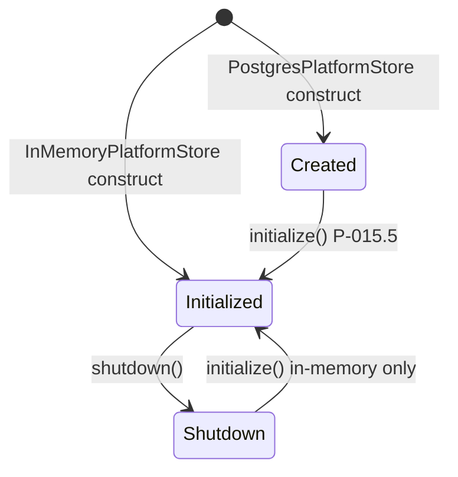

# PlatformStore Architecture

**Mission:** P-015.4 — Enterprise Platform Store Abstraction  
**Authority:** [ADR-007 Production Persistence Strategy](../../11_Governance/ADR/ADR-007-Production-Persistence-Strategy.md)  
**Implementation:** `lib/platform/store/`  
**Status:** Implemented (InMemory) · PostgreSQL scaffold (P-015.5)

---

## Purpose

`PlatformStore` is the **single persistence abstraction** for the ORION Platform. It replaces direct coupling to `InMemoryHcmStore` and ad-hoc store singletons with a governed lifecycle, health reporting, transaction boundaries, and provider selection aligned to ADR-007.

Domain repositories continue to receive **HCM backing** via `platformStore.getHcmBacking()` until PostgreSQL adapters land in P-015.5.

---

## Architecture

```
┌─────────────────────────────────────────────────────────────┐
│                     PlatformStoreFactory                     │
│              loadStoreConfiguration() · create()             │
└──────────────────────────┬──────────────────────────────────┘
                           │
         ┌─────────────────┴─────────────────┐
         ▼                                   ▼
┌─────────────────────┐           ┌─────────────────────┐
│ InMemoryPlatformStore│           │ PostgresPlatformStore│
│ (GA dev · RC · tests)│           │ (scaffold P-015.4)   │
└──────────┬──────────┘           └─────────────────────┘
           │
           │ getHcmBacking()
           ▼
┌─────────────────────┐
│   HcmStoreBacking   │  ← InMemoryHcmStore today
└──────────┬──────────┘
           │
           ▼
┌─────────────────────┐
│ HCM Repositories    │  Facade → Service → Repository
└─────────────────────┘
```

### Layering Rules

| Layer | Responsibility |
|-------|----------------|
| **PlatformStore** | Provider selection · lifecycle · health · transactions |
| **HcmStoreBacking** | Domain entity maps (transitional — PostgreSQL in P-015.5) |
| **Repositories** | Domain persistence contracts · org isolation |
| **Services / Facade** | Business logic — no store imports |

---

## PlatformStore Interface

| Capability | Method | Notes |
|------------|--------|-------|
| Provider | `provider` | `memory` · `postgres` · `sqlite` |
| Configuration | `configuration` | From env or explicit |
| Initialize | `initialize()` | Connect pools · validate |
| Shutdown | `shutdown()` | Release resources |
| Transactions | `getTransactionManager()` | Reuses `lib/persistence` TransactionManager |
| HCM backing | `getHcmBacking()` | Domain accessor |
| Health | `getHealth()` · `checkHealth()` | ADR-011 integration |
| Migrations | `getMigrationReadiness()` | P-015.5 schema work |

---

## Provider Model

| Provider | Implementation | Environment | GA |
|----------|----------------|-------------|-----|
| **InMemory** | `InMemoryPlatformStore` | development · CI · RC | Yes (dev/RC) |
| **PostgreSQL** | `PostgresPlatformStore` scaffold | staging · production | P-015.5 |
| **SQLite** | Same scaffold path | development/CI optional | P-015.5 optional |

### Environment Variables (ADR-010)

| Variable | Values | Default |
|----------|--------|---------|
| `ORION_STORE_ADAPTER` | `memory` · `postgres` · `sqlite` | `memory` |
| `ORION_DATABASE_URL` | Connection string | — |

**Production rule:** `ORION_STORE_ADAPTER=memory` throws at configuration load time.

---

## Lifecycle



1. **Factory** — `PlatformStoreFactory.create()` or `getDefaultPlatformStore()`
2. **Initialize** — In-memory auto-initializes; PostgreSQL throws until P-015.5
3. **Wiring** — `createHcmWiring(platformStore)` seeds and binds repositories
4. **Health** — `/api/health` includes `platform_store` check
5. **Shutdown** — graceful pool close (future)

---

## Dependency Injection

```typescript
import { getDefaultPlatformStore } from "@/lib/platform/store";
import { createHcmWiring } from "@/lib/hcm/createHcmWiring";

const platformStore = getDefaultPlatformStore();
const wiring = createHcmWiring(platformStore);
```

Tests inject isolated stores:

```typescript
const store = new InMemoryPlatformStore({ hcmStore: new InMemoryHcmStore() });
const wiring = createHcmWiring(store);
```

---

## Migration Strategy (P-015.5)

| Phase | Action |
|-------|--------|
| **P-015.4** ✅ | PlatformStore abstraction · InMemory provider · HCM wiring via `getHcmBacking()` |
| **P-015.5** | PostgreSQL schema migrations · `PostgresPlatformStore.initialize()` · swap default adapter |
| **Post-GA** | CRM · Decisions · Data Platform adopt PlatformStore domain accessors |

**Rollback:** Set `ORION_STORE_ADAPTER=memory` in non-production only; production requires ADR-approved migration down scripts.

---

## Health Model

`PlatformStoreHealthReport` fields:

| Field | Description |
|-------|-------------|
| `status` | `healthy` · `degraded` · `unhealthy` · `not_initialized` |
| `provider` | Active StoreProvider |
| `initialized` | Lifecycle flag |
| `migrationReady` | Schema migration availability |
| `message` | Human-readable summary |

Integrated into `HealthStatusService` as check name `platform_store`.

---

## Related Documents

| Document | Location |
|----------|----------|
| ADR-007 | [ADR-007](../../11_Governance/ADR/ADR-007-Production-Persistence-Strategy.md) |
| P-015.2 Plan | [P-015.2 Implementation Plan](../../00_Governance/P-015.2-Production-Readiness-Implementation-Plan.md) |
| ES-036 | [ES-036 Persistence](../../02_Engineering/ES-036-Database-Persistence-Architecture.md) |
| HCM wiring | [createHcmWiring.ts](../../../lib/hcm/createHcmWiring.ts) |

---

*ORION Enterprise Platform · PlatformStore Architecture · Mission P-015.4 · August 2026*
