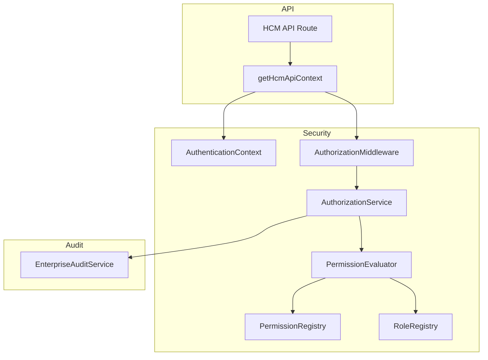

# Enterprise Identity & RBAC

**Mission:** P-015.6 — Enterprise Identity & Role-Based Access Control  
**Status:** Implemented  
**ADRs:** [ADR-008](../../11_Governance/ADR/ADR-008-Enterprise-Identity-Authentication-Strategy.md) · [ADR-009](../../11_Governance/ADR/ADR-009-Role-Based-Access-Control.md)

---

## Overview

ORION Enterprise GA security is delivered through a **two-layer RBAC model**:

| Layer | Scope | Implementation |
|-------|-------|----------------|
| **Layer 1 — Platform RBAC** | Executive Shell · module navigation · platform APIs | Existing `getPermissionsForRole()` + middleware route access |
| **Layer 2 — Domain RBAC** | REST API mutation/read authorization | `lib/platform/security/` + domain catalogs (`lib/hcm/auth/`) |

**Not in GA scope (post-GA roadmap):** OAuth2, OIDC, SSO, LDAP, MFA, ABAC engines, cloud IAM.

---

## Architecture



### Security principles

- **Default deny** — unknown or unmapped permissions are rejected
- **Least privilege** — role profiles grant minimum required permissions
- **Organization isolation** — cross-org access denied except `super_admin` (audited)
- **Explicit assignment** — permissions composed from platform + organization + domain profiles
- **Role inheritance** — permission registry supports inherited grants
- **Auditability** — denials and elevated cross-org access recorded

---

## Module Layout

| Path | Responsibility |
|------|----------------|
| `lib/platform/security/IdentityContext.ts` | Session-derived identity model |
| `lib/platform/security/AuthenticationContext.ts` | Auth state + fail-closed mode |
| `lib/platform/security/IdentityProvider.ts` | Local identity provider contract |
| `lib/platform/security/Permission.ts` | Permission code model |
| `lib/platform/security/Role.ts` | Platform, organization, HCM role profiles |
| `lib/platform/security/PermissionRegistry.ts` | Registered permissions + inheritance |
| `lib/platform/security/RoleRegistry.ts` | Role → permission assignments |
| `lib/platform/security/PermissionEvaluator.ts` | Effective permission evaluation |
| `lib/platform/security/AuthorizationService.ts` | Authorization engine |
| `lib/platform/security/AuthorizationMiddleware.ts` | API middleware helpers |
| `lib/platform/security/SecurityHealthService.ts` | Security health reporting |
| `lib/platform/security/security-audit.ts` | Enterprise audit integration |
| `lib/hcm/auth/` | HCM route → permission catalog |

---

## Role Hierarchy

### Platform roles

| Role | Purpose |
|------|---------|
| System Administrator | Full platform control |
| Platform Administrator | Tenant and user administration |
| Support Engineer | Operational support access |
| Developer | Engineering integrations |
| Auditor | Read-only audit/compliance access |

### Organization roles

| Role | Purpose |
|------|---------|
| Organization Owner | Tenant ownership |
| Organization Administrator | Full org administration |
| Department Manager | Department operations |
| Supervisor | Team supervision |
| Employee | Standard workforce user |
| Guest | Limited read-only access |

### HCM domain profiles

| Profile | Typical permissions |
|---------|---------------------|
| HR Administrator | Employee, org, employment, recruitment, onboarding write |
| HR Manager | HR read/write (limited admin) |
| Recruiter | Recruitment pipeline |
| Payroll Administrator | Payroll write |
| Payroll Manager | Payroll read + time approve |
| Learning Manager | Talent/learning write |

Platform `RoleSlug` values map to these profiles via `RoleRegistry.resolveEffectivePermissions()`.

---

## Permission Model

Permission codes use **`domain:resource:action`** format:

```
hcm:employee:read
hcm:employee:write
hcm:time:approve
platform:audit:read
```

HCM REST routes resolve required permissions via `resolveHcmRoutePermission(method, pathname)`.

Mutating routes without catalog coverage resolve to **default deny**.

---

## Authorization Lifecycle

1. **Authenticate** — session resolved from HTTP-only cookie (`getServerSession()`)
2. **Build identity** — `IdentityContext` from session (never from request body)
3. **Resolve permission** — route catalog or explicit permission argument
4. **Evaluate** — platform module access + domain permission + org boundary
5. **Allow or deny** — 401 (unauthenticated) / 403 (forbidden)
6. **Audit** — denials and cross-org super-admin operations recorded

### Fail-closed mode

| Environment | Behavior |
|-------------|----------|
| Production (`NODE_ENV=production`) | Fail-closed enabled — no session = 401 |
| Development | Fallback executive context when `ORION_AUTH_FAIL_CLOSED=false` |
| Explicit override | `ORION_AUTH_FAIL_CLOSED=true|false` |

---

## ServiceContext Integration

Authorized API handlers receive `ServiceContext` from `getHcmApiContext(request)`:

```typescript
const { context } = await getHcmApiContext(request);
// context.organizationId, userId, role — from session only
```

Domain services and repositories **do not** perform authorization — they continue to accept `ServiceContext` for org scoping only.

---

## Health Monitoring

`SecurityHealthService` reports:

- Fail-closed mode status
- Permission registry size
- Default deny policy active

Integrated into observability as **`platform_security`** health check.

---

## Extension Guidelines

### Adding a new domain (Finance, CRM, Hospitality)

1. Define domain permission codes (`finance:ledger:post`)
2. Register definitions via domain bootstrap (mirror `lib/hcm/auth/index.ts`)
3. Add route catalog mapping API operations → permissions
4. Invoke `AuthorizationMiddleware` at API boundary
5. Add domain integration tests

**Do not** embed domain logic in `lib/platform/security/`.

### Future SSO roadmap

`IdentityProvider` interface supports post-GA `OidcProvider` implementation without changing authorization evaluation.

---

## Version History

| Version | Date | Changes |
|---------|------|---------|
| 1.0 | 2026-08-01 | P-015.6 initial enterprise RBAC implementation |

---

*ORION Platform · docs/Platform/Security/*
