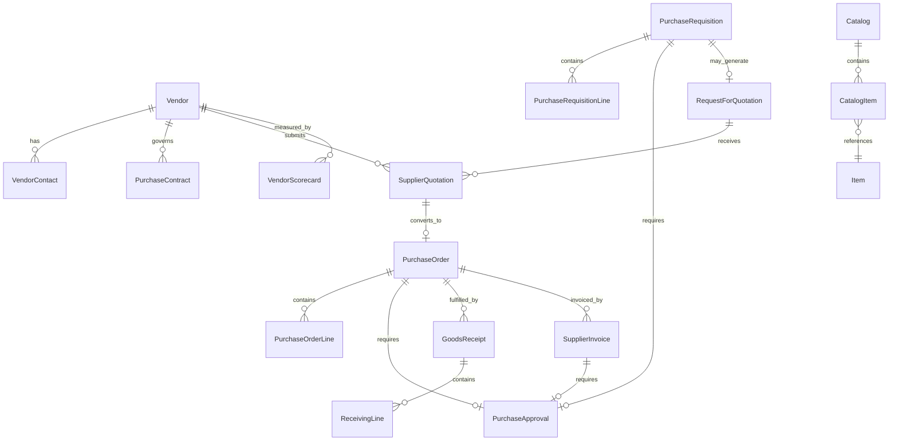
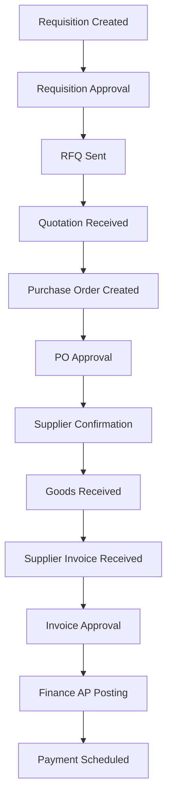
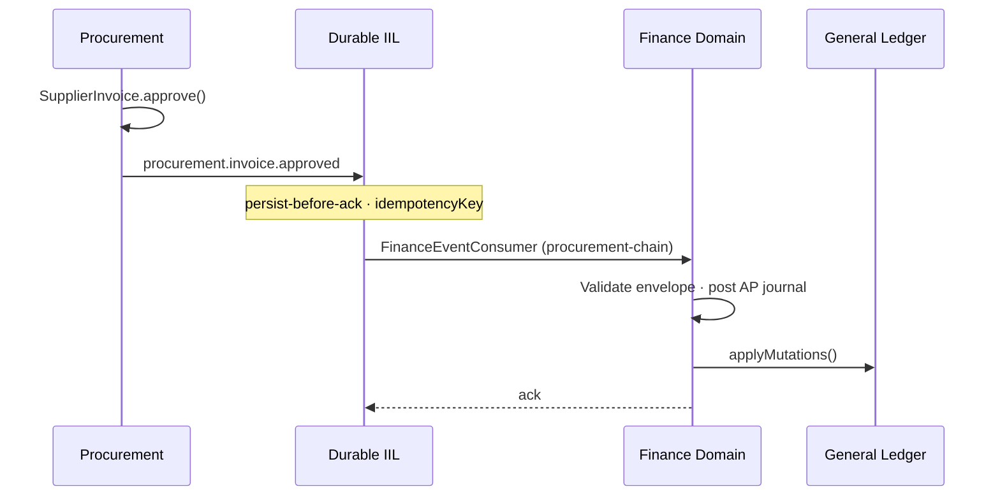
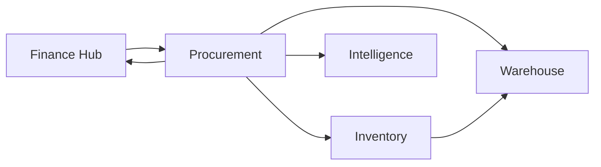

# Procurement Reference Domain Strategy

**Document ID:** PROC-REF-STRAT-001  
**Mission:** P-010.1 — Procurement Enterprise Domain Strategy  
**Program:** P-010 — ORION Enterprise Procurement (Wave 3)  
**Version:** 1.0  
**Status:** Ratified — Constitutional Procurement Blueprint  
**Classification:** Enterprise Architecture · Procurement Domain · Governance  
**Authority:** Procurement Domain Lead · Chief Enterprise Architect · Architecture Review Board  
**Effective Date:** 5 August 2026  
**Planning Horizon:** 2026–2031  
**Architecture Baseline:** v2.0 Multi-Domain Baseline ([P-016.7](../00_Governance/P-016.7-Enterprise-Readiness-Update.md) @ `e73bc16`)

**Constitutional References:** [P-014.1 Domain Strategy](../00_Governance/P-014.1-Enterprise-Domain-Strategy.md) · [P-014.2 Capability Matrix](../00_Governance/P-014.2-Enterprise-Capability-Matrix.md) · [P-014.3 Integration Architecture](../00_Governance/P-014.3-Enterprise-Integration-Architecture.md) · [P-014.4 Reference Architecture](../00_Governance/P-014.4-Enterprise-Reference-Architecture.md) · [CRM Reference Domain Architecture](../CRM/CRM-Reference-Domain-Architecture.md) · [Finance Domain Blueprint](../Finance/Blueprints/D-007_Finance_Domain_Blueprint.md)

**ADR Compliance:** [ADR-013](../11_Governance/ADR/ADR-013-Durable-Intelligent-Integration-Layer.md) · [ADR-014](../11_Governance/ADR/ADR-014-Cross-Domain-Event-Contracts.md) · [ADR-015](../11_Governance/ADR/ADR-015-Domain-Service-Boundaries.md) · [ADR-020](../11_Governance/ADR/ADR-020-Versioning-and-Domain-Compatibility.md)

**Scope:** Architecture only — no production code · no implementation authorization  
**Audience:** Procurement engineering · platform engineering · certification · ARB · executive planning

> **Constitutional statement:** This document is the **blueprint for every future Procurement engineering mission**. Procurement is formally established as ORION's **fourth Enterprise Domain** — following HCM (Reference), Finance (Hub), and CRM (Core Commercial). All Wave 3 Procurement work MUST replicate the HCM reference pattern and comply with enterprise integration law.

---

## 1. Enterprise Vision

### 1.1 Mission

Procurement is ORION's **authoritative source-to-pay domain** — the single source of truth for suppliers, purchase lifecycle, vendor contracts, requisitions, purchase orders, receiving, and supplier invoices. Procurement publishes governed monetary and operational facts to Finance (Accounts Payable and General Ledger), Inventory (stock increase), and Warehouse (receiving and storage). Intelligence consumes read-only projections for spend analysis and vendor performance.

### 1.2 Vision Statement

Every procurement decision in ORION flows through a **governed, auditable, event-driven lifecycle** from requisition to payment — with Finance holding monetary truth, Inventory holding stock truth, and Procurement holding commercial purchase truth.

### 1.3 Strategic Position

| Dimension | v2.0 Baseline (Aug 2026) | P-010.1 Target (Architecture) | v2.1 Engineering Target |
|-----------|--------------------------|-------------------------------|-------------------------|
| **Domain status** | Planned (P-014.1) | **Fourth Enterprise Domain — ratified** | Gate 1–4 complete |
| **Persistence** | Not started | PlatformStore specified | PostgreSQL certified |
| **Integration** | Planned events only | Canonical catalogue defined | Finance + Inventory chains |
| **Facade** | Not started | `procurementFacade` specified | Composition root wired |
| **Commercial bundle** | HCM + Finance + CRM | Architecture for operational ERP | Gate 7 path |

**Positioning:** Procurement completes the **operational ERP core** alongside Finance and CRM — enabling design partners to manage workforce cost, revenue, and spend within a single Executive Operating System.

---

## 2. Business Objectives

| # | Objective | Success Measure | Horizon |
|---|-----------|-----------------|---------|
| **BO1** | **Authoritative purchase lifecycle** | Single owner for requisition → PO → receipt → invoice | v2.1 |
| **BO2** | **Finance integration** | `procurement.invoice.approved` → AP journal certified | v2.1 |
| **BO3** | **Inventory synchronization** | `procurement.goods.received` → stock increase certified | v2.2 |
| **BO4** | **Supplier master governance** | Vendor registry with org isolation and audit | v2.1 |
| **BO5** | **Approval governance** | Workflow-bound requisition and PO approvals with RBAC | v2.1 |
| **BO6** | **Spend intelligence** | Authoritative Brief signals from certified events | v2.2 |
| **BO7** | **Reference replication** | HCM checklist 100% at Gate 4 | v2.1 |
| **BO8** | **Gate 7 certification** | Procurement domain GO alongside Inventory | v2.1 |

---

## 3. Business Capability Map

| Capability Group | Capabilities | Domain Owner | v2.0 | v2.1 Target |
|------------------|--------------|--------------|------|-------------|
| **Supplier Management** | Vendor master · qualification · performance · contracts | **Procurement** | ⏳ Not started | Authoritative |
| **Sourcing** | RFQ · quotation comparison · catalog | **Procurement** | ⏳ Not started | Authoritative |
| **Requisitioning** | Purchase requisition · approval routing | **Procurement** | ⏳ Not started | Authoritative |
| **Ordering** | Purchase order · supplier confirmation · amendments | **Procurement** | ⏳ Not started | Authoritative |
| **Receiving** | Goods receipt · partial receipt · returns | **Procurement** *(process)* · Inventory *(stock)* | ⏳ Not started | Event handoff |
| **Invoicing** | Supplier invoice · three-way match · approval | **Procurement** *(capture)* · **Finance** *(posting)* | ⏳ Not started | Canonical chain |
| **Contracts** | Purchase contract · terms · renewal | **Procurement** | ⏳ Not started | Authoritative |
| **Catalog** | Item catalog · supplier catalog · punch-out *(future)* | **Procurement** | ⏳ Not started | Authoritative |
| **Spend Analytics** | Spend by category · vendor · department | Intelligence *(read)* | ⏳ Not started | Event projections |
| **Accounts Payable** | AP sub-ledger · payment scheduling | **Finance** | ✅ Wave A partial | Finance consumer |
| **Stock Management** | On-hand · movements · valuation | **Inventory** *(future)* | ⏳ Not started | Consumer |
| **Storage & Movement** | Bin location · put-away · transfer | **Warehouse** *(future)* | ⏳ Not started | Consumer |

**Rule:** Procurement owns the **purchase process and supplier relationship**. Finance owns **monetary posting**. Inventory owns **stock quantities**. Warehouse owns **physical storage locations and movements**.

---

## 4. Reference Domain Position

### 4.1 ORION Enterprise Domain Sequence

| # | Domain | Classification | Role | Status (P-016.7) |
|---|--------|----------------|------|------------------|
| 1 | **HCM** | Reference Domain | Workforce truth · replication template | ✅ RC1 certified |
| 2 | **Finance** | Core Domain · Hub | Monetary truth · journal posting | ✅ Gate 5 CONDITIONAL GO |
| 3 | **CRM** | Core Domain | Commercial revenue truth | ✅ Gate 5 CONDITIONAL GO |
| 4 | **Procurement** | **Supporting → Enterprise Domain** | **Spend and supplier truth** | **Architecture ratified (P-010.1)** |
| 5 | Inventory | Supporting Domain | Stock truth | ⏳ Post-Procurement |
| 6 | Warehouse | Supporting Domain | Storage truth | ⏳ Post-Inventory |
| 7 | Hospitality | Vertical | Industry operations | ◐ Prototype |
| 8 | Manufacturing | Future Domain | Production | ⏳ v3.0 |

### 4.2 Domain Relationship Matrix

| Partner Domain | Relationship | Integration Pattern | Procurement Role | Partner Role |
|----------------|--------------|---------------------|------------------|--------------|
| **Finance** | Downstream monetary consumer | IIL async · Finance ACL | Publish invoice approved · PO committed | AP journal · GL posting |
| **Inventory** | Downstream stock consumer | IIL async | Publish goods received | Stock increase · valuation |
| **Warehouse** | Operational handoff | IIL async · query (sparse) | Publish receiving intent | Put-away · bin assignment |
| **CRM** | Indirect · no direct writes | — | No direct integration v2.1 | Commercial customer separate from vendor |
| **Hospitality** | Indirect · future | IIL async (v2.2+) | Publish PO for property supplies | Folio-adjacent procurement |
| **Manufacturing** | Future MRP handoff | IIL async (v3.0) | Consume material requirements | Publish PO for raw materials |
| **Intelligence** | Read-only consumer | Projections | Publish spend events | Analytics · Brief · recommendations |
| **Platform** | Foundation provider | Facade · Store · IIL · RBAC | Consume all platform services | No business aggregates |

### 4.3 Dependency Law

```
Finance (sub-ledger ready) → Procurement Gate 5 authorization
Procurement (PO + receipt events) → Inventory Gate 5 authorization
Inventory (stock events) → Warehouse Gate 5 authorization
```

Procurement MUST NOT begin Gate 5 implementation until **FIN-R-001** (GL PostgreSQL) closure plan is accepted OR an explicit ARB waiver for AP-only sub-ledger posting is recorded.

---

## 5. Domain Model

### 5.1 Aggregate Catalog

| Aggregate | Root Entity | Bounded Context | Authoritative Owner |
|-----------|-------------|-----------------|---------------------|
| **Supplier** | `Vendor` | Supplier Management | ✅ Procurement |
| **Supplier Contact** | `VendorContact` | Supplier Management | ✅ Procurement |
| **Catalog** | `Catalog` | Sourcing | ✅ Procurement |
| **Catalog Item** | `CatalogItem` | Sourcing | ✅ Procurement |
| **Item** | `Item` *(master reference)* | Sourcing | ✅ Procurement *(commercial)* · Inventory *(stock)* |
| **Purchase Requisition** | `PurchaseRequisition` | Requisitioning | ✅ Procurement |
| **Purchase Approval** | `PurchaseApproval` | Requisitioning · Ordering | ✅ Procurement |
| **RFQ** | `RequestForQuotation` | Sourcing | ✅ Procurement |
| **Quotation** | `SupplierQuotation` | Sourcing | ✅ Procurement |
| **Purchase Order** | `PurchaseOrder` | Ordering | ✅ Procurement |
| **Purchase Contract** | `PurchaseContract` | Contracts | ✅ Procurement |
| **Goods Receipt** | `GoodsReceipt` | Receiving | ✅ Procurement *(document)* · Inventory *(stock effect)* |
| **Receiving** | `ReceivingLine` | Receiving | ✅ Procurement |
| **Supplier Invoice** | `SupplierInvoice` | Invoicing | ✅ Procurement *(capture)* · Finance *(posted state)* |
| **Vendor Performance** | `VendorScorecard` | Supplier Management | ✅ Procurement *(source)* · Intelligence *(projection)* |

### 5.2 Entity Relationship Overview



### 5.3 Aggregate Invariants (Constitutional)

| Aggregate | Invariants |
|-----------|------------|
| **PurchaseRequisition** | Org-scoped · approval before PO conversion · immutable after PO created |
| **PurchaseOrder** | Must reference approved requisition or contract · supplier required · currency required |
| **GoodsReceipt** | Cannot exceed PO line quantity (cumulative) · partial receipts allowed |
| **SupplierInvoice** | Three-way match against PO and receipt before Finance publish · idempotent by invoice number + vendor |
| **Vendor** | Unique vendor code per organization · inactive vendors cannot receive new POs |
| **PurchaseContract** | Valid date range · linked catalog or item scope |

### 5.4 Value Objects

| Value Object | Used By | Notes |
|--------------|---------|-------|
| `Money` | All monetary aggregates | `{ amount, currencyCode }` — Finance validates at posting |
| `ApprovalDecision` | Requisition · PO · Invoice | `{ approverId, decision, timestamp, comment }` |
| `DeliverySchedule` | PO lines | Expected delivery date · partial flag |
| `MatchResult` | SupplierInvoice | PO · receipt · invoice line matching |
| `VendorRating` | VendorScorecard | Composite score · not authoritative for posting |

---

## 6. Business Workflows

### 6.1 Source-to-Pay Lifecycle



| Stage | Domain | Workflow Binding | Event Published |
|-------|--------|------------------|---------------|
| Requisition | Procurement | `procurement.requisition.approve` | `procurement.requisition.created` · `procurement.requisition.approved` |
| RFQ | Procurement | — | `procurement.rfq.sent` |
| Quotation | Procurement | — | `procurement.quotation.received` |
| Purchase order | Procurement | `procurement.po.approve` | `procurement.purchaseorder.created` · `procurement.purchaseorder.approved` |
| Supplier confirm | Procurement | — | *(internal state — optional future event)* |
| Goods receipt | Procurement → Inventory | — | `procurement.goods.received` |
| Invoice | Procurement → Finance | `procurement.invoice.approve` | `procurement.invoice.received` · `procurement.invoice.approved` |
| AP posting | Finance | Finance ACL | Finance consumes · posts journal |

### 6.2 Workflow Matrix

| Workflow | Trigger Entity | Platform Engine | RBAC Permission |
|----------|---------------|-----------------|-----------------|
| Requisition approval | PurchaseRequisition | `procurement.requisition.approve` | `procurement.requisition.approve` |
| PO approval | PurchaseOrder | `procurement.po.approve` | `procurement.purchaseorder.approve` |
| Invoice approval | SupplierInvoice | `procurement.invoice.approve` | `procurement.invoice.approve` |
| RFQ dispatch | RequestForQuotation | `procurement.rfq.send` | `procurement.rfq.create` |
| Vendor onboarding | Vendor | `procurement.vendor.onboard` | `procurement.vendor.create` |
| Contract renewal | PurchaseContract | `procurement.contract.renew` | `procurement.contract.manage` |

### 6.3 Exception Paths

| Exception | Handling | Event |
|-----------|----------|-------|
| Requisition rejected | Return to requester · audit trail | `procurement.requisition.rejected` *(v2.2)* |
| PO cancelled | Close open lines · notify supplier | `procurement.purchaseorder.cancelled` *(v2.2)* |
| Partial receipt | Update PO line received qty | `procurement.goods.received` (partial payload) |
| Invoice mismatch | Block approval · workflow exception | No Finance publish until resolved |
| Vendor deactivated | Block new POs · existing POs complete | `procurement.vendor.updated` |

---

## 7. Cross-Domain Integration

### 7.1 Procurement → Finance

**Pattern:** Asynchronous IIL · Finance inbound processor · AP sub-ledger journal



| Event | Finance Action | Target Accounts *(indicative)* |
|-------|----------------|-------------------------------|
| `procurement.invoice.approved` | AP accrual journal | Dr Expense/Asset · Cr AP (2100) |
| `procurement.purchaseorder.approved` | Commitment register *(optional v2.2)* | Encumbrance · deferred |

**Rule:** Finance NEVER reads Procurement repositories. Procurement NEVER writes Finance journals directly.

### 7.2 Procurement → Inventory

| Event | Inventory Action | Consistency |
|-------|------------------|-------------|
| `procurement.goods.received` | Increase stock · record movement | Eventual |
| `procurement.purchaseorder.approved` | Expected receipt projection *(v2.2)* | Eventual |

**Payload requirements:** `itemId` · `quantity` · `unitOfMeasure` · `warehouseId` *(optional v2.1)* · `purchaseOrderId` · `goodsReceiptId`

### 7.3 Procurement → Warehouse

| Event | Warehouse Action | Notes |
|-------|------------------|-------|
| `procurement.goods.received` | Create receiving task · put-away | Warehouse consumes same event as Inventory |
| Query: PO delivery schedule | Approved PO lookup via facade | Sparse synchronous — ADR approval required |

### 7.4 Procurement → Intelligence

| Projection | Source Events | Output |
|------------|---------------|--------|
| Spend by category | `procurement.invoice.approved` | Brief KPI tile |
| Vendor performance | `procurement.goods.received` · invoice timeliness | Vendor scorecard projection |
| PO pipeline | `procurement.purchaseorder.*` | Operational dashboard |
| Budget variance | Invoice + Finance budget | Cross-domain projection *(Finance authority)* |

**Rule:** Intelligence is **read-only**. AI provides recommendations only — no authoritative mutations.

### 7.5 Integration Prohibition Matrix

| Pattern | Allowed | Forbidden |
|---------|---------|-----------|
| Procurement publishes → Finance consumes | ✅ | — |
| Procurement publishes → Inventory consumes | ✅ | — |
| Finance reads Procurement repository | — | ❌ ADR-015 |
| Inventory writes Procurement PO | — | ❌ ADR-015 |
| Shared PostgreSQL table | — | ❌ Constitutional |
| Synchronous cross-domain mutation | — | ❌ Default forbidden |

---

## 8. Canonical Events

All cross-domain Procurement events MUST comply with [ADR-014](../11_Governance/ADR/ADR-014-Cross-Domain-Event-Contracts.md) · `eventVersion: 1` per [ADR-020](../11_Governance/ADR/ADR-020-Versioning-and-Domain-Compatibility.md).

**Status:** Catalog only — no implementation in P-010.1.

### 8.1 Envelope (Required)

| Field | Procurement Value Example |
|-------|----------------------------|
| `canonicalEventType` | `procurement.purchaseorder.approved` |
| `eventVersion` | `1` |
| `idempotencyKey` | `{orgId}:procurement-workspace:procurement-po-{poId}-approved-v1` |
| `organizationId` | Tenant scope |
| `sourceDomain` | `procurement` |
| `sourceService` | `procurement-workspace` |
| `entityType` | `purchaseorder` |
| `entityId` | PO UUID |
| `correlationId` | Workflow correlation |
| `causationId` | Prior event reference *(optional)* |
| `payload` | Versioned schema body |

### 8.2 Event Catalog (Version 1)

| Event Type | Version | Publisher Trigger | Primary Consumer | Priority |
|------------|---------|-------------------|------------------|----------|
| `procurement.requisition.created` | 1 | Requisition submit | Intelligence · Workflow | P2 |
| `procurement.requisition.approved` | 1 | Approval complete | Intelligence | P2 |
| `procurement.rfq.sent` | 1 | RFQ dispatch | Intelligence | P3 |
| `procurement.quotation.received` | 1 | Supplier quote logged | Intelligence | P3 |
| `procurement.purchaseorder.created` | 1 | PO draft finalized | Intelligence | P2 |
| `procurement.purchaseorder.approved` | 1 | PO approval complete | **Finance** · Intelligence | **P1** |
| `procurement.goods.received` | 1 | Receipt posted | **Inventory** · Warehouse · Intelligence | **P0** |
| `procurement.invoice.received` | 1 | Invoice captured | Intelligence | P2 |
| `procurement.invoice.approved` | 1 | Three-way match + approval | **Finance** | **P0** |
| `procurement.vendor.created` | 1 | Vendor onboard | Intelligence · Search | P2 |
| `procurement.vendor.updated` | 1 | Vendor master change | Intelligence | P3 |
| `procurement.contract.created` | 1 | Contract executed | Intelligence | P2 |

### 8.3 Payload Sketches *(non-normative · for P-010.2)*

**`procurement.invoice.approved`**

| Field | Required | Notes |
|-------|----------|-------|
| `invoiceId` | ✅ | Supplier invoice aggregate ID |
| `purchaseOrderId` | ✅ | Linked PO |
| `vendorId` | ✅ | Supplier reference |
| `amount` | ✅ | Total invoice amount |
| `currencyCode` | ✅ | ISO 4217 |
| `periodId` | ◐ | Finance fiscal period hint |
| `lineItems` | ✅ | `{ itemId, quantity, unitPrice, accountId }[]` |

**`procurement.goods.received`**

| Field | Required | Notes |
|-------|----------|-------|
| `goodsReceiptId` | ✅ | Receipt aggregate ID |
| `purchaseOrderId` | ✅ | Source PO |
| `lines` | ✅ | `{ itemId, quantityReceived, unitOfMeasure }[]` |
| `receivedAt` | ✅ | ISO timestamp |
| `warehouseId` | ◐ | Required when Warehouse domain active |

### 8.4 Future Events (Not Version 1)

| Event Type | Target Release | Notes |
|------------|----------------|-------|
| `procurement.requisition.rejected` | v2.2 | Workflow exception |
| `procurement.purchaseorder.cancelled` | v2.2 | PO lifecycle |
| `procurement.contract.renewed` | v2.2 | Contract management |
| `procurement.payment.scheduled` | v2.2 | Finance outbound coordination |

---

## 9. Security Model

### 9.1 RBAC Architecture

Procurement MUST implement fail-closed RBAC mirroring HCM and CRM patterns ([ADR-009](../11_Governance/ADR/ADR-009-Platform-RBAC-Architecture.md)).

| Permission Category | Examples | Enforcement |
|--------------------|----------|-------------|
| **Vendor** | `procurement.vendor.read` · `.create` · `.update` · `.deactivate` | Domain authorization service |
| **Requisition** | `procurement.requisition.create` · `.approve` · `.cancel` | Route + workflow |
| **Purchase Order** | `procurement.purchaseorder.create` · `.approve` · `.amend` | Route + workflow |
| **Receiving** | `procurement.goods.receive` · `.reverse` | Service layer |
| **Invoice** | `procurement.invoice.create` · `.approve` | Route + workflow + Finance gate |
| **Contract** | `procurement.contract.read` · `.manage` | Domain authorization |
| **Admin** | `procurement.admin` · `procurement.configuration.manage` | Org admin only |

### 9.2 Organization Isolation

- Every aggregate carries `organizationId` — enforced at repository and API layers
- Cross-tenant access returns `ORGANIZATION_MISMATCH` — no default context
- Vendor codes unique per organization — not globally unique

### 9.3 Approval Hierarchy

| Approval Type | Rule |
|---------------|------|
| Requisition | Amount thresholds · cost centre · category delegation |
| Purchase Order | Separate from requisition when amount exceeds threshold |
| Invoice | Three-way match required · separate approver from PO creator |
| Financial authorization | Materiality limits align with Finance posting rules |

### 9.4 Audit

| Event Category | Audit Requirement |
|----------------|-------------------|
| Vendor master changes | Immutable audit trail · who/when/what |
| Approval decisions | Stored on aggregate + platform audit |
| Cross-domain publishes | IIL envelope + lineage correlation |
| Failed Finance posts | Dead letter + operational alert |

### 9.5 Data Classification

| Data Class | Examples | Handling |
|------------|----------|------------|
| **Commercial** | PO amounts · contract terms | Internal · org-scoped |
| **PII** | Vendor contact details | Encrypted at rest *(platform)* · masked in logs |
| **Financial** | Invoice amounts | ADR-014 envelope · Finance consumer only |

---

## 10. Platform Services

Procurement MUST consume platform capabilities from [P-014.2](../00_Governance/P-014.2-Enterprise-Capability-Matrix.md) — never reimplement.

| Platform Service | Procurement Usage | Reference Pattern |
|------------------|-------------------|-------------------|
| **PlatformStore** | All aggregate persistence | HCM · CRM · Finance |
| **PostgreSQL persistence** | `ProcurementEntityPersister` Map-wrapper | CRM P-008.17 |
| **Composition root** | `createProcurementWiring()` → `procurementFacade` | CRM P-008.18 |
| **Durable IIL** | Canonical event publish + subscribe | ADR-013 |
| **RBAC** | Permission catalog · fail-closed API context | CRM P-008.13 |
| **Workflow Engine** | Approval bindings · state machines | HCM · CRM |
| **Transaction Manager** | Posting UoW for receipt + invoice | Finance |
| **Observability** | Health · metrics · domain SLOs | Platform GA-001 |
| **Certification** | Gate 1–7 evidence · doc tests | ES-096 |
| **Intelligence** | Brief provider · spend projections | Read-only |
| **Search** | Vendor · PO inquiry *(v2.2)* | Platform index |
| **Documents** | Contract attachments *(P-010.4)* | Platform storage |

### 10.1 Target Composition Root

```
PlatformStore
  → getProcurementBacking() → ProcurementStoreBacking
  → createProcurementRepositories()     [domain repos]
  → ProcurementCanonicalEventPublisher  [ADR-014 outbound]
  → RequisitionService / PurchaseOrderService / …
  → procurementFacade
```

### 10.2 Public Facade Contract

All external access via `@/lib/procurement` public exports only — no repository imports across package boundaries (ADR-015).

---

## 11. Integration Architecture

### 11.1 Constitutional Integration Law

| Law | Procurement Implication |
|-----|-------------------------|
| **L1 — Single Source of Truth** | Procurement owns PO · vendor · requisition — not Finance or Inventory |
| **L2 — No Direct Repository Access** | Finance consumes events — never imports `ProcurementRepository` |
| **L3 — Platform Capabilities Only** | No custom message bus · no embedded auth |
| **L4 — Facade-Only Domain Access** | `@/lib/procurement` exports only |
| **L5 — IIL-Only Integration** | All cross-domain state via canonical events |
| **L6 — Finance Hub** | All monetary posting through Finance ACL |
| **L7 — AI Read-Only** | Spend recommendations require human approval for PO/invoice |

### 11.2 Enterprise Reference Chain Target

Procurement aims to become the **third certified inbound chain to Finance** (after HCM and CRM):

```
Procurement Publisher
  → Durable IIL (ADR-013)
  → FinanceEventConsumer (procurement-chain)
  → FinanceInboundProcessor
  → Posting Pipeline → General Ledger
```

### 11.3 Inventory Synchronization Model

```
procurement.goods.received
  → InventoryEventConsumer
  → StockMovementService
  → Inventory aggregate mutation
```

Eventual consistency — Inventory MUST implement idempotent consumption keyed on `goodsReceiptId`.

### 11.4 Warehouse Synchronization Model

```
procurement.goods.received
  → WarehouseEventConsumer
  → ReceivingTaskService
  → Put-away workflow
```

Warehouse and Inventory consume the **same event** with independent idempotency keys scoped to their domain processing.

---

## 12. Implementation Roadmap

### Phase I — Architecture *(P-010.1 – P-010.4)*

| Mission | Deliverable | Gate | Target |
|---------|-------------|------|--------|
| **P-010.1** | Domain strategy *(this document)* | — | ✅ Aug 2026 |
| **P-010.2** | Engineering specification · domain model doc | Gate 1 | 2026 Q4 |
| **P-010.3** | Integration contracts · event schemas | Gate 2 | 2026 Q4 |
| **P-010.4** | Platform foundation architecture | Gate 3 | 2027 Q1 |

**Exit criteria:** ARB ratification · ADR-014 catalog entries drafted · dependency on Finance documented.

### Phase II — Engineering Foundation *(P-010.5 – P-010.9)*

| Mission | Deliverable | Gate | Target |
|---------|-------------|------|--------|
| P-010.5 | Platform foundation · PlatformStore backing | Gate 3 | 2027 Q1 |
| P-010.6 | Repository infrastructure · PostgreSQL persister | Gate 3 | 2027 Q1 |
| P-010.7 | Composition root · `procurementFacade` | Gate 4 | 2027 Q1 |
| P-010.8 | RBAC · permission catalog · fail-closed API | Gate 4 | 2027 Q2 |
| P-010.9 | Canonical event publisher skeleton | Gate 4 | 2027 Q2 |

**Exit criteria:** Typecheck · build · composition root tests · restart survival tests.

### Phase III — Business Services *(P-010.10 – P-010.18)*

| Mission | Deliverable | Priority |
|---------|-------------|----------|
| P-010.10 | Vendor master · supplier management | P1 |
| P-010.11 | Purchase requisition + approval | P1 |
| P-010.12 | RFQ · quotation | P2 |
| P-010.13 | Purchase order lifecycle | P1 |
| P-010.14 | Goods receipt | P0 |
| P-010.15 | Supplier invoice + three-way match | P0 |
| P-010.16 | Purchase contracts | P2 |
| P-010.17 | Catalog management | P2 |
| P-010.18 | Workflow event emission | P1 |

**Exit criteria:** Business services wired through composition root · unit/integration tests per aggregate.

### Phase IV — Certification *(P-010.19 – P-010.22)*

| Mission | Deliverable | Target |
|---------|-------------|--------|
| P-010.19 | Finance procurement consumer | 2027 Q3 |
| P-010.20 | Inventory goods receipt consumer | 2027 Q4 |
| P-010.21 | Gate 5 enterprise certification | 2027 Q3 |
| P-010.22 | Gate 7 operational ERP bundle | 2028 Q1 |

**Exit criteria:** `procurement.invoice.approved` → Finance GL mutation certified · restart replay · org isolation · GA-001 procurement scenarios.

---

## 13. Version Roadmap

| Version | Procurement Scope | Platform Dependency | Gate |
|---------|-------------------|---------------------|------|
| **v2.0** | Architecture only (P-010.1) | HCM · Finance · CRM chains live | — |
| **v2.1** | Full source-to-pay · Finance AP chain | FIN-R-001 closed · ADR-014 registry | Gate 7 |
| **v2.2** | Inventory + Warehouse integration · contracts | Inventory domain live | Gate 7+ |
| **v3.0** | Manufacturing MRP · advanced sourcing · partner catalog | SCM orchestration | Enterprise suite |

### 13.1 v2.1 Procurement Exit Criteria

| Criterion | Evidence |
|-----------|----------|
| Vendor · requisition · PO · receipt · invoice aggregates | Repository tests |
| `procurement.invoice.approved` → Finance posting | Integration test suite |
| PostgreSQL restart survival | GA-001 procurement scenario |
| RBAC on all REST routes | Security certification |
| Canonical events only for cross-domain | ADR-014 compliance tests |
| Gate 5 score ≥ 75 | Certification scorecard |

---

## 14. Enterprise Readiness

### 14.1 Prerequisites

| Prerequisite | Status (P-016.7) | Required Before |
|--------------|-------------------|-----------------|
| Finance Gate 5 Wave A | ✅ CONDITIONAL GO | Phase III |
| Finance AP posting path extensible | ✅ Architecture ready | P-010.19 |
| FIN-R-001 GL PostgreSQL | ❌ Open | Gate 5 certification |
| ADR-014 event registry | ❌ Not populated | Gate 2 exit |
| Durable IIL (ADR-013) | ✅ Implemented | Phase II |
| CRM → Finance reference chain | ✅ Certified | Pattern template |
| Platform RBAC framework | ✅ HCM · Finance · CRM | Phase II |
| Inventory domain architecture | ⏳ Not started | Phase IV (Inventory consumer) |

### 14.2 Dependencies



### 14.3 Initial Risk Register *(Architecture)*

| ID | Risk | Severity | Mitigation | Target Mission |
|----|------|----------|------------|----------------|
| **PROC-R-001** | Finance GL not PostgreSQL-durable (FIN-R-001) | High | Coordinate P-009.12 before Gate 5 | P-010.21 |
| **PROC-R-002** | Inventory domain not yet architected | Medium | Define Inventory strategy before goods receipt consumer | P-010.20 |
| **PROC-R-003** | Three-way match complexity | Medium | Phased match rules · manual override workflow | P-010.15 |
| **PROC-R-004** | ADR-014 registry absent | Medium | Draft schemas in P-010.3 | P-010.3 |
| **PROC-R-005** | Vendor master vs CRM party overlap | Low | Explicit boundary — vendor ≠ customer | P-010.2 |
| **PROC-R-006** | Budget validation on PO approval | Medium | Reuse Finance budget stage pattern | P-010.19 |

### 14.4 Success Metrics

| Metric | Target (v2.1) |
|--------|---------------|
| Source-to-pay cycle time | Measurable end-to-end via event lineage |
| Finance posting success rate | ≥ 99.9% on valid invoices |
| Idempotent replay safety | Zero duplicate journals on restart |
| Cross-domain test coverage | ≥ 15 integration tests |
| Gate 5 readiness score | ≥ 75/100 |
| REST routes with RBAC | 100% |

### 14.5 Wave 3 Official Start

**P-010.1 ratifies Wave 3 — Procurement Program.** Next authorized mission: **P-010.2 — Procurement Engineering Specification**.

---

## 15. Executive Summary

P-010.1 formally establishes **Procurement as ORION's fourth Enterprise Domain** — the authoritative source-to-pay bounded context for suppliers, purchase lifecycle, contracts, receiving, and supplier invoices.

| Assessment | Verdict |
|------------|---------|
| **P-010.1 domain strategy mission** | **GO** |
| **Constitutional alignment (P-014 · ADR-013–015 · ADR-020)** | **GO** |
| **Procurement as fourth enterprise domain (architecture)** | **GO** |
| **Wave 3 program authorization** | **GO** |
| **P-010.2 engineering specification authorization** | **GO** |
| **Gate 5 implementation authorization** | **CONDITIONAL GO** — FIN-R-001 · ADR-014 registry |
| **Production Procurement authorization** | **NO-GO** — Phase II–IV not started |

**Strategic imperatives:**

1. **Replicate the HCM reference pattern** — facade · repository · PlatformStore · RBAC · IIL catalogue.
2. **Finance is the monetary hub** — `procurement.invoice.approved` publishes; Finance posts AP journals.
3. **Inventory owns stock** — Procurement publishes `procurement.goods.received`; Inventory mutates quantities.
4. **One authoritative owner per aggregate** — no shared databases · no cross-domain repositories.
5. **Events before analytics** — Intelligence consumes projections; AI recommends only.

**Enterprise domain sequence confirmed:** HCM (Reference) → Finance (Hub) → CRM (Commercial) → **Procurement (Source-to-Pay)** → Inventory → Warehouse.

Wave 3 officially begins. Ready for **P-010.2**.

---

*Procurement Reference Domain Strategy · P-010.1 · Constitutional blueprint · Architecture only · No implementation*
