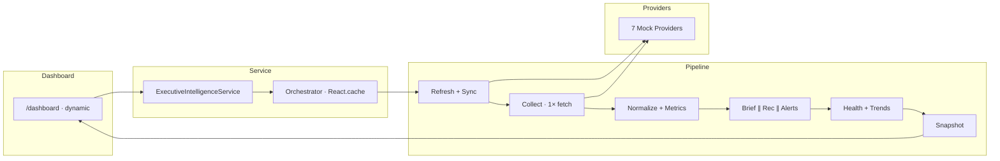

# ORION v0.4.0-alpha — Release Notes

| Field | Value |
|-------|-------|
| **Version** | v0.4.0-alpha |
| **Codename** | Executive Intelligence Foundations |
| **Release Date** | 25 July 2026 |
| **Status** | Alpha · Internal |
| **Git Baseline** | `main` @ `cc4a282` (+ local uncommitted changes) |
| **Programme** | [ES-061 — v0.4 Master Development Plan](../02_Engineering/ES-061-ORION-v0.4-Master-Development-Plan.md) |
| **Sprint** | [ES-062 — Sprint 4 Implementation Plan](../02_Engineering/ES-062-Sprint-4-Implementation-Plan.md) |
| **Classification** | Internal · Pre-production |

---

## Executive Summary

ORION **v0.4.0-alpha** is the first alpha cut of the v0.4 Business Intelligence programme. It delivers the **Sprint 4 intelligence foundation**: a Provider Framework, rule-driven Brief / Recommendation / Alert engines, a 10-stage Intelligence Orchestrator, the **`/dashboard` Executive Dashboard**, a **Vitest test suite**, and **post-audit performance optimizations** (single provider fetch per pipeline, parallel engine stages, dynamic dashboard rendering).

This alpha is suitable for **internal validation and architecture review**. It is **not** production-ready. Legacy Mission 17B intelligence paths remain active on `/advisor` and CRM surfaces; widget registry, REST API, production authentication, CI gates, and M9 sprint acceptance are outstanding.

**Alpha readiness grade: B− — solid internal demo; legacy consolidation and CI gates required before beta.**

| Dimension | Assessment |
|-----------|------------|
| Feature completeness (Sprint 4 core) | **~45%** of ES-063 WBS |
| Build / lint / type safety | **Pass** |
| Unit tests (local) | **Pass** · 84 tests · ~88% coverage |
| Architecture | **Dual-stack** — orchestrator + legacy bus |
| Pipeline performance (mock) | **Optimized** · 1× provider fetch · parallel engines |
| Production readiness | **Not ready** |
| Recommended audience | Engineering · Founder review · internal demo |

---

## Major Features

### 1. Intelligence Orchestrator (ES-065)

A governed 10-stage dashboard pipeline coordinates provider refresh, data collection, normalization, metrics, brief generation, recommendations, alerts, business health, trends, and snapshot assembly.

- **Entry point:** `executiveIntelligenceService.getDashboardSnapshot()`
- **Pipeline:** `lib/orchestrator/PipelineRunner.ts`
- **Observability:** execution logging, stage metrics, engine registry
- **Optimization:** stages 5–7 run in parallel; shared `ExecutionContext` contributions; `React.cache()` request dedup

### 2. Provider Framework (ES-060)

Seven mock workspace providers supply dashboard contributions through a unified provider contract.

- Finance · CRM · Marketing · Hospitality · Commerce · Calendar · Email
- Registry, manager, health reporting, and factory registration
- `fetchProviderContributions()` in `lib/providers/provider-data.ts`

### 3. Sprint 4 Intelligence Engines

| Engine | Spec | Module |
|--------|------|--------|
| Executive Brief Engine | ES-028 | `lib/intelligence/brief/` |
| Recommendation Engine | ES-029 | `lib/intelligence/recommendations/` |
| Alert Engine | ES-030 | `lib/intelligence/alerts/` |

All three engines use **configuration-driven rules**, prioritization, and typed output models. Alert panel exposes Critical, Recent, Resolved sections with counts. Engines accept **pre-fetched provider contributions** when called from the orchestrator.

### 4. Executive Dashboard (ES-022 partial)

New route **`/dashboard`** renders a server-side executive surface:

- Platform health score with driver breakdown
- Four workspace KPI metric cards (Finance, Hospitality, CRM, Marketing)
- Executive brief narrative
- Ranked recommendations (≤ 6)
- Alert panel with severity grouping
- Executive task list

**Rendering:** `export const dynamic = "force-dynamic"` — fresh intelligence per request (not build-time static).

### 5. Executive Intelligence Service

Unified service facade (`ExecutiveIntelligenceService`) exposes orchestrator-backed dashboard access and individual engine accessors for future API and widget consumers.

### 6. Quality & Audit Artifacts

| Artifact | ID | Detail |
|----------|-----|--------|
| [Engineering Audit](../03_Quality/Engineering-Audit-Report.md) | QA-001 | 33 findings · grade B− |
| [Performance Audit](../03_Quality/Performance-Audit.md) | QA-002 | Pre-optimization baseline · P0 remediated |
| [Sprint 4 Testing Summary](../03_Quality/Sprint-4-Testing-Summary.md) | QA-003 | 84 tests · ~88% coverage |

### 7. Sprint 4 Test Suite

Vitest + React Testing Library covering providers, engines, orchestrator, service layer, and dashboard components.

```bash
npm run test           # 84 tests
npm run test:coverage  # ~88% line coverage on Sprint 4 scope
```

### 8. Pipeline Performance Optimizations (post-audit)

| Optimization | Module |
|--------------|--------|
| Single provider fetch per pipeline | `provider-data.ts` · `skipConnect` after stage 1 |
| Shared aggregation helpers | `lib/intelligence/shared/provider-aggregation.ts` |
| Context-aware engine APIs | Brief · Recommendation · Alert engines |
| Parallel stages 5–7 | `PipelineRunner.ts` |
| Single daily brief generation | Brief stage derives dashboard brief via formatter |
| Request-scoped cache | `React.cache()` in `Orchestrator.ts` |
| Dynamic dashboard | `app/(platform)/dashboard/page.tsx` |
| Client boundary reduction | `CommandCenterHeader` → Server Component |

---

## Architecture

### Data flow (alpha — optimized)



### Dual-stack note

| Stack | Entry | Consumers |
|-------|-------|-----------|
| **Sprint 4 (new)** | `ExecutiveIntelligenceService` → Orchestrator | `/dashboard` |
| **Mission 17B (legacy)** | `intelligence-bus.ts` → `pipeline.ts` | `/advisor`, CRM cards, platform metrics |

Decision recorded: [DL-2026-002](../10_Decisions/decisions/DL-2026-002-Sprint-4-Intelligence-Orchestrator.md).

### Key directories

| Path | Purpose |
|------|---------|
| `lib/orchestrator/` | Pipeline stages, execution context, metrics, logging |
| `lib/providers/` | Provider framework, `provider-data.ts`, mock implementations |
| `lib/intelligence/shared/` | Shared provider aggregation helpers |
| `lib/intelligence/brief/` | Executive Brief Engine |
| `lib/intelligence/recommendations/` | Recommendation Engine |
| `lib/intelligence/alerts/` | Alert Engine |
| `lib/intelligence/ExecutiveIntelligenceService.ts` | Service facade |
| `components/dashboard/` | Executive dashboard widgets |
| `app/(platform)/dashboard/` | Dashboard route (dynamic) |
| `tests/` | Vitest suite · fixtures · setup |
| `types/` | Sprint 4 intelligence, alert, brief, orchestrator, provider types |

---

## Implemented Modules

| Module | Spec | Status | Notes |
|--------|------|--------|-------|
| Provider Framework | ES-060 | **Delivered** | Mock providers only |
| Executive Brief Engine | ES-028 | **Delivered** | Sprint 4 module |
| Recommendation Engine | ES-029 | **Delivered** | Rule engine · scoring |
| Alert Engine | ES-030 | **Delivered** | Rules · history · panel |
| Intelligence Orchestrator | ES-065 | **Delivered** | 10-stage pipeline · optimized |
| Executive Dashboard | ES-022 | **Partial** | Route + widgets · dynamic · no registry |
| Business Health | ES-032 | **Partial** | Orchestrator stage · 4 drivers |
| Trend Engine | ES-031 | **Partial** | Aggregation stage only |
| Executive Intelligence Service | ES-065 | **Delivered** | Facade layer |
| Sprint 4 Test Suite | ES-054 | **Partial** | Local Vitest · CI not wired |
| Widget Registry | ES-022 | **Not delivered** | — |
| REST API v1 | ES-035 | **Not delivered** | — |
| Production Auth | ES-037 | **Not delivered** | Placeholder session |
| CI/CD | ES-055 | **Not delivered** | Manual build/lint/test |
| Executive Copilot | ES-039 | **Not delivered** | Placeholder UI only |

**Sprint 4 task completion:** ~19% Done · ~45% Partial · M9 not met ([ES-064](../02_Engineering/ES-064-Sprint-4-Engineering-Task-Catalogue.md)).

---

## Known Limitations

### Functional

- **`/dashboard` is not the default landing page** — `/advisor` remains primary navigation target
- **No widget registry** — dashboard layout is hard-coded, not ES-022 registry-driven
- **Mock data only** — all provider contributions are in-memory mocks; no live integrations
- **No REST API** — intelligence outputs are not exposed via `/api/v1/`
- **Advisor inconsistency** — Advisor/Command Center use legacy pipeline; metrics may differ from `/dashboard`
- **No explainability UI** — recommendations lack reasoning/evidence display on dashboard
- **No chart widgets** — Trend Engine output not visualized

### Operational

- **No CI pipeline** — tests and build gates are manual
- **No production authentication** — placeholder session only
- **No health endpoint** — `/api/health` not implemented
- **No release tag** — this alpha is documented but not tagged in git

### Quality gates not met

- M9 Sprint 4 acceptance ([ES-063](../02_Engineering/ES-063-Sprint-4-Work-Breakdown-Structure.md))
- RR-018 Release Record
- Founder ES-022 sign-off (S4T-105)
- QA sign-off (S4T-104)

---

## Technical Debt

Consolidated from [Engineering Audit](../03_Quality/Engineering-Audit-Report.md) and [Technical Debt Register](../09_Standards/Technical_Debt_Register.md).

| ID | Priority | Item | Alpha status |
|----|----------|------|--------------|
| C-01 | Critical | Dual intelligence architectures (legacy + Sprint 4) | **Open** · beta migration |
| C-02 | Critical | Circular deps: aggregator ↔ engines | **Mitigated** · `provider-data.ts` + shared aggregators |
| C-03 | Critical | Redundant provider fetches per pipeline | **Resolved** · 1× fetch in stage 2 |
| TD-001 | High | Finance static data bypass | **Open** |
| TD-002 | High | CRM static data bypass | **Open** |
| H-01 | High | Duplicate aggregation logic | **Mitigated** · `provider-aggregation.ts` |
| H-02 | High | Duplicate type definitions | **Open** |
| M-01 | Medium | `buildDashboardSnapshotFromProviders()` dead export | **Open** |
| M-02 | Medium | `executive-intelligence-mock.ts` orphaned | **Open** |
| M-03 | Medium | Next.js middleware → proxy deprecation warning | **Open** |

**Estimated consolidation effort before beta:** 3–5 engineering days (legacy migration + widget registry + CI).

---

## Performance

Source: [Performance Audit Report](../03_Quality/Performance-Audit.md) · post-optimization state.

| Metric | Pre-audit | Alpha (optimized) | Grade |
|--------|-----------|-------------------|-------|
| Provider fetches per pipeline | ~49 | **7** (1× fan-out) | Improved |
| `connectAll()` calls per pipeline | ~8 | **1** | Improved |
| Pipeline architecture | Sequential redundant stages | Parallel 5–7 · shared context | Improved |
| `/dashboard` rendering | Static prerender (`○`) | **Dynamic** (`ƒ`) | Improved |
| Request-level caching | None | **`React.cache()`** | Improved |
| `/dashboard` first-load JS (uncompressed) | ~533 KB | ~533 KB | Shared baseline unchanged |
| Dashboard rerenders (client) | None post-SSR | None post-SSR | Good |

**Performance grade: B− (alpha)** — pipeline optimized for mock providers; bundle baseline and legacy dual-stack remain beta targets.

### Beta performance targets

| Target | Alpha | Beta target |
|--------|-------|-------------|
| Provider fetches per load | **7** | **7** (maintain) |
| Pipeline p95 (real providers) | Not measured | **< 500 ms** |
| Dashboard TTFB (dynamic) | Enabled | **< 300 ms** p95 |
| First-load JS (gzip) | ~533 KB uncompressed | **< 200 KB** gzip |

---

## Testing Status

| Area | Status | Detail |
|------|--------|--------|
| **Vitest runner** | Configured | `npm run test` · `npm run test:coverage` |
| **Test files** | 20 files | Providers · engines · orchestrator · dashboard |
| **Tests passing** | **84 / 84** | Verified 25 July 2026 |
| **Line coverage** | **88.05%** | Sprint 4 scope · 80% threshold met |
| **CI integration** | **Not wired** | ES-055 Phase B not met |
| **E2E tests** | **None** | Playwright not configured |
| **QA sign-off** | **Not obtained** | S4T-104 open |

See [Sprint 4 Testing Summary](../03_Quality/Sprint-4-Testing-Summary.md).

### Verification matrix (alpha)

| Check | Result |
|-------|--------|
| Build | **PASS** |
| Lint | **PASS** |
| TypeScript strict | **PASS** |
| Unit tests (local) | **PASS** · 84 tests |
| Coverage (Sprint 4 scope) | **PASS** · 88% lines |
| CI automated gate | **NOT CONFIGURED** |
| Manual `/dashboard` smoke | **Recommended** |

---

## Next Sprint

**Target:** v0.4.0-beta · Sprint 4 completion · M9 acceptance

### P0 — Must complete before beta

| # | Work item | Reference |
|---|-----------|-----------|
| 1 | Migrate Advisor to orchestrator · remove static bypass | S4-034 · S4T-022 · C-01 |
| 2 | Widget registry foundation | S4-013–S4-018 · S4T-004–S4T-005 |
| 3 | CI/CD Phase A–B · wire Vitest | S4-043–S4-044 · S4T-080 |
| 4 | Standalone Trend Engine (ES-031) | S4-028 · S4T-060–S4T-068 |
| 5 | Type system consolidation | Engineering Audit H-01 · H-02 |
| 6 | `/dashboard` in sidebar navigation | S4-009 · S4T-014 |

### P1 — Beta stretch

| # | Work item | Reference |
|---|-----------|-----------|
| 7 | REST API `/api/v1/` foundation | S4-049–S4-056 |
| 8 | Production authentication ADR + implementation | S4-039–S4-041 |
| 9 | Recommendation explainability UI | S4T-041 · S4T-047 |
| 10 | RR-018 Release Record | S4-107 · S4T-090 |
| 11 | Bundle analyzer + client JS reduction | Performance Audit BS-01 |
| 12 | Dashboard `loading.tsx` + Suspense sections | Performance Audit DR-01 |

### P2 — v0.4.0 GA candidates

- Executive Copilot MVP (ES-039 · ES-057)
- Phase 1 integrations (Stripe, PMS, Google Ads)
- Legacy Mission 17B deprecation ADR
- TD-001 / TD-002 remediation

---

## Migration Notes

### For engineers

1. **New dashboard entry point** — use `executiveIntelligenceService.getDashboardSnapshot()` for executive dashboard data; do not import engines directly from UI components.

2. **Legacy path unchanged** — `/advisor`, CRM insight cards, and `platform-metrics.ts` still use `intelligence-bus.ts`. Do not assume `/dashboard` and Advisor show identical data until migration completes.

3. **Provider contributions** — fetch via `lib/providers/provider-data.ts`; aggregation via `lib/intelligence/shared/provider-aggregation.ts`.

4. **Types** — Sprint 4 canonical types are in `types/intelligence.ts`, `types/alerts.ts`, `types/brief.ts`, `types/recommendations.ts`, `types/orchestrator.ts`, `types/providers.ts`.

5. **Testing** — run `npm run test:coverage` before beta; coverage scope is defined in `vitest.config.ts`.

### For product / demo

- Navigate to **`/dashboard`** for the orchestrator-fed executive view (live per request)
- Default app landing remains **`/advisor`**
- Data is **mock** — not live business integrations
- Do not demo as production-ready intelligence

### Breaking changes (alpha)

None for existing routes. `/dashboard` is additive. No API contract changes.

---

## Readiness Assessment

### Alpha release criteria

| Criterion | Required for alpha | Status |
|-----------|-------------------|--------|
| Sprint 4 core modules compile | Yes | **Met** |
| `/dashboard` route functional | Yes | **Met** |
| Orchestrator produces `DashboardSnapshot` | Yes | **Met** |
| Build + lint pass | Yes | **Met** |
| Local test suite passes | Yes | **Met** |
| Known limitations documented | Yes | **Met** |
| No production deployment | Yes | **Met** |
| M9 sprint acceptance | No (beta gate) | **Not met** |
| CI green on PR | No (beta gate) | **Not met** |

### Overall readiness

| Release stage | Verdict | Blockers |
|---------------|---------|----------|
| **v0.4.0-alpha** | **Approved for internal use** | Documentation complete · no tag required |
| v0.4.0-beta | **Not ready** | CI · legacy migration · widget registry · M9 |
| v0.4.0 GA | **Not ready** | Auth · API · integrations · TD remediation |

### Sign-off (alpha documentation only)

| Role | Decision | Date |
|------|----------|------|
| Engineering | Alpha scope documented | 2026-07-25 |
| Founder | Pending | — |
| Chief Architect | Pending | — |

---

## References

| Document | Location |
|----------|----------|
| Release Index | [docs/releases/README.md](./README.md) |
| Release Checklist | [v0.4.0-alpha-Release-Checklist.md](./v0.4.0-alpha-Release-Checklist.md) |
| Sprint 4 Implementation Plan | [ES-062](../02_Engineering/ES-062-Sprint-4-Implementation-Plan.md) |
| Sprint 4 WBS | [ES-063](../02_Engineering/ES-063-Sprint-4-Work-Breakdown-Structure.md) |
| Sprint 4 Task Catalogue | [ES-064](../02_Engineering/ES-064-Sprint-4-Engineering-Task-Catalogue.md) |
| Executive Intelligence Architecture | [ES-065](../02_Engineering/ES-065-Executive-Intelligence-Architecture.md) |
| Engineering Audit | [Engineering-Audit-Report.md](../03_Quality/Engineering-Audit-Report.md) |
| Performance Audit | [Performance-Audit.md](../03_Quality/Performance-Audit.md) |
| Testing Summary | [Sprint-4-Testing-Summary.md](../03_Quality/Sprint-4-Testing-Summary.md) |
| CHANGELOG | [CHANGELOG.md](../06_Releases/CHANGELOG.md) |
| Decision Log | [DL-2026-002](../10_Decisions/decisions/DL-2026-002-Sprint-4-Intelligence-Orchestrator.md) |

---

ORION v0.4.0-alpha — Executive Intelligence Foundations

*Internal alpha · Not for production deployment · No git tag applied*
